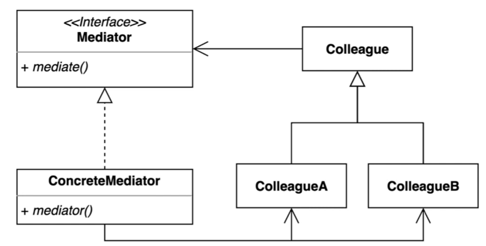
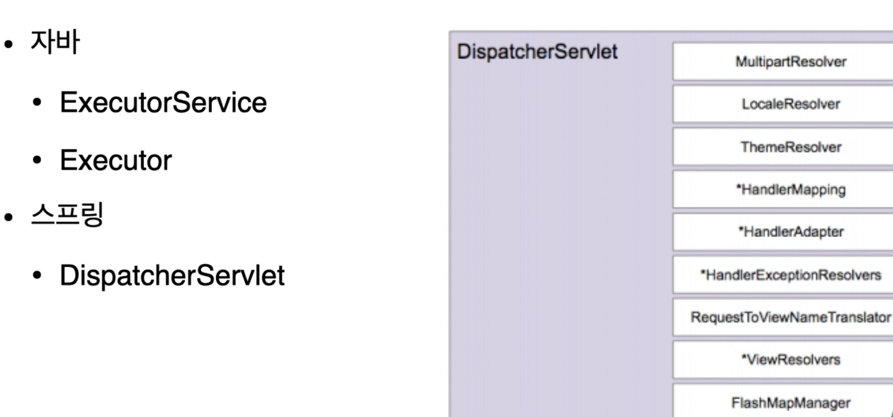

## 1. intro

의사소통이 필요할 때 직접 하는게 아니라 관리소에 연락

관제탑이 비행기들을 관리한다. 비행기 끼리 의사소통하는게 아니라.



- 여러 컴포넌트간의 결합도를 중재를 통해 낮출 수 있다.


고정적인 모양이 중요한건 아니다. 중재자 패턴의 한 모양이라고 보는게 타당하다.

현재 컬리그가 데이이터를참조하고 있고, concreteMediator 가 colleague를 참조하고 있음

현재는 게스트가 클리닝서비스를 참조하고 있다 (colleague 가 colleague를 참조함)


## 2. impelment

mediator : FrontDesk

### 변경 전

- Guest와 Restaurant 는 서로 비지니스적인 관계가 있으면서 CleaningService에 이를 해결해 달라고 요청한다. CleaningService는 앞에 두 class정보를  인자로 받으면서 처리하고, Guest와 Restaurant는 서로의 class정보를 가지고 있으면서 CleningService까지 가지고있어 모두 서로에게 밀접하다.
- 이를 해결하기 위해 중재자인 FrontDesk를 생성한다. 모든 요청은 중재자에 요청하게 된다. 중재자는 모든 요청 class에대한 정보가 있고, 요청자인 Colleague 들은 중재자 정보를 갖고 있다.’
- Colleague 들은 서로의 class정보를 모른다.

```java
public class Hotel {

    public static void main(String[] args) {
        Guest guest = new Guest();
        guest.getTower(3);
        guest.dinner();

        Restaurant restaurant = new Restaurant();
        restaurant.clean();
    }
}
public class CleaningService {
    public void clean(Gym gym) {
        System.out.println("clean " + gym);
    }

    public void getTower(Guest guest, int numberOfTower) {
        System.out.println(numberOfTower + " towers to " + guest);
    }

    public void clean(Restaurant restaurant) {
        System.out.println("clean " + restaurant);
    }
}
public class Guest {
    
        private Restaurant restaurant = new Restaurant();
    
        private CleaningService cleaningService = new CleaningService();
    
        public void dinner() {
            restaurant.dinner(this);
        }
    
        public void getTower(int numberOfTower) {
            cleaningService.getTower(this, numberOfTower);
        }
    
    }
public class Restaurant {

    private CleaningService cleaningService = new CleaningService();
    public void dinner(Guest guest) {
        System.out.println("dinner " + guest);
    }

    public void clean() {
        cleaningService.clean(this);
    }
}
```

### 변경 후

- Coleague인 Restaurant, Guest, CleaningService 는 서로의 class 정보를 모르지만, 중재자인 frontDesk 는 참조한다.
- 중재자인 frontDesk는 Coleague 의 요청에대한 처리를 진행한다.

```java
public class FrontDesk {

    private CleaningService cleaningService = new CleaningService();

    private Restaurant restaurant = new Restaurant();

    public void getTowers(Guest guest, int numberOfTowers) {
        cleaningService.getTowers(guest.getId(), numberOfTowers);
    }

    public String getRoomNumberFor(Integer guestId) {
        return "1111";
    }

    public void dinner(Guest guest, LocalDateTime dateTime) {
        restaurant.dinner(guest.getId(), dateTime);
    }
}
public class CleaningService {

    private FrontDesk frontDesk = new FrontDesk();

    public void getTowers(Integer guestId, int numberOfTowers) {
        String roomNumber = this.frontDesk.getRoomNumberFor(guestId);
        System.out.println("provide " + numberOfTowers + " to " + roomNumber);
    }
}
public class Guest {

    private Integer id;

    private FrontDesk frontDesk = new FrontDesk();

    public void getTowers(int numberOfTowers) {
        this.frontDesk.getTowers(this, numberOfTowers);
    }

    private void dinner(LocalDateTime dateTime) {
        this.frontDesk.dinner(this, dateTime);
    }

    public Integer getId() {
        return id;
    }

    public void setId(Integer id) {
        this.id = id;
    }
}
```


## 3. Strength and Weakness

여러 객체들이 소통하는 방법을 캡슐화하는 패턴

### 장점

- 컴포턴트 코드를 변경하지 않고 새로운 중재자를 만들어 사용할 수 있다.
- 각각의 컴포넌트 코드를 보다 간결하게 유지할 수 있다.

### 단점

- 중재자 역할을 하는 클래스의 복잡도와 결합도가 증가한다.


## 4. API example




- 대표적으로 스프링의 DispatcherServlet이 중재자 역할을 하는데, 나중에 mvc 강의 때 보면 될듯

```java
public class MediatorInSpring {

    public static void main(String[] args) {
        DispatcherServlet dispatcherServlet;
    }
}
```