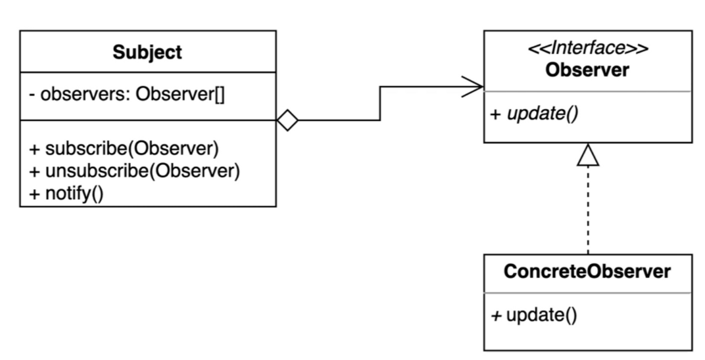
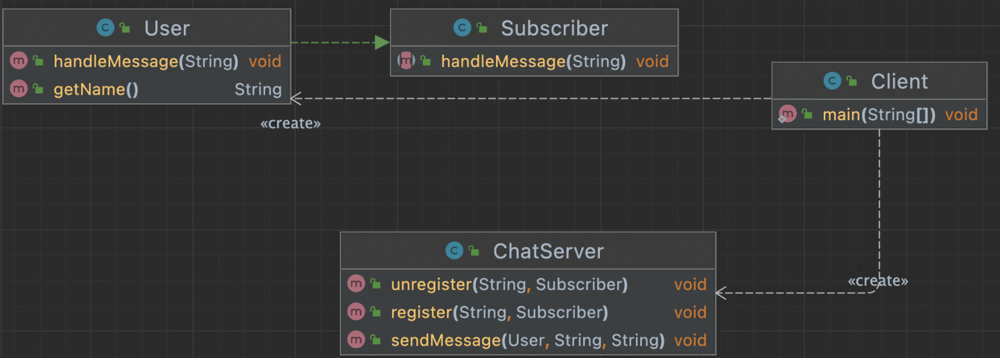
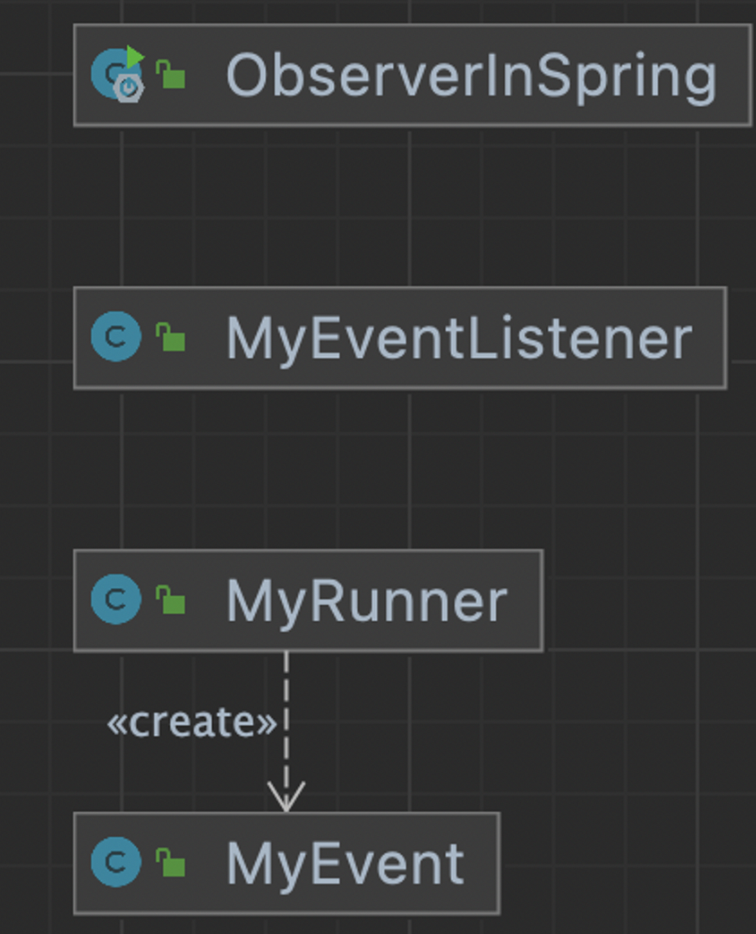

## 1. intro

publish subscribe pattern 을 쉽게 구현할수 있다.

주기적으로 가져오는 거 폴링



다수의 객체가 특정객체 상태변화를 감지하고 알림을 받는 패턴

- 발행(publish) , 구독(subscribe) 패턴을 구현할 수 있다.


subject : 상태가  변경되면 옵저버가 제공하는걸

이벤트가 발생했을때


## 2. implement

### 변경 전

- sendMessage() 한 내용을 명시적으로 getMessage()해야 메시지를 가져올 수 있다.
- 데이터가 변경이 되던 안되던 클라이언트가 명시적으로 요청해서 가져온다.
- 변경되었을 때만 가져오고 싶은 경우, 옵저버 패턴을 사용할 수 있다.

```java
public class Client {

    public static void main(String[] args) {
        ChatServer chatServer = new ChatServer();

        User user1 = new User(chatServer);
        user1.sendMessage("디자인패턴", "이번엔 옵저버 패턴입니다.");
        user1.sendMessage("롤드컵2021", "LCK 화이팅!");

        User user2 = new User(chatServer);
        System.out.println(user2.getMessage("디자인패턴"));

        user1.sendMessage("디자인패턴", "예제 코드 보는 중..");
        System.out.println(user2.getMessage("디자인패턴"));
    }
}
public class ChatServer {

    private Map<String, List<String>> messages;

    public ChatServer() {
        this.messages = new HashMap<>();
    }

    public void add(String subject, String message) {
        if (messages.containsKey(subject)) {
            messages.get(subject).add(message);
        } else {
            List<String> messageList = new ArrayList<>();
            messageList.add(message);
            messages.put(subject, messageList);
        }
    }

    public List<String> getMessage(String subject) {
        return messages.get(subject);
    }
}
public class User {

    private ChatServer chatServer;

    public User(ChatServer chatServer) {
        this.chatServer = chatServer;
    }

    public void sendMessage(String subject, String message) {
        chatServer.add(subject, message);
    }

    public List<String> getMessage(String subject) {
        return chatServer.getMessage(subject);
    }
}
```

### 변경 후




observer : subscriber

concrete observer : user

subject : ChatServer

1. Subject인 ChatServer를 생성하고, register()한다.
   - name으로 채팅 방이 구분되어 hashMap에 생성된다.
2. sendMessage() 하면, register() 되어있는 방에 메시지가 전송되는데, subscriber에 정의된 handlemessage를 통해 등록된 모든 concrete observer(User)에 알려지게된다.

```java
public class Client {

    public static void main(String[] args) {
        ChatServer chatServer = new ChatServer();
        User user1 = new User("keesun");
        User user2 = new User("whiteship");

        chatServer.register("오징어게임", user1);
        chatServer.register("오징어게임", user2);

        chatServer.register("디자인패턴", user1);

        chatServer.sendMessage(user1, "오징어게임", "아.. 이름이 기억났어.. 일남이야.. 오일남");
        chatServer.sendMessage(user2, "디자인패턴", "옵저버 패턴으로 만든 채팅");

        chatServer.unregister("디자인패턴", user2);

        chatServer.sendMessage(user2, "디자인패턴", "옵저버 패턴 장, 단점 보는 중");
    }
}
public interface Subscriber {

    void handleMessage(String message);
}
public class User implements Subscriber {

    private String name;

    public User(String name) {
        this.name = name;
    }

    public String getName() {
        return name;
    }

    @Override
    public void handleMessage(String message) {
        System.out.println(message);
    }
}
public class ChatServer {

    private Map<String, List<Subscriber>> subscribers = new HashMap<>();

    public void register(String subject, Subscriber subscriber) {
        if (this.subscribers.containsKey(subject)) {
            this.subscribers.get(subject).add(subscriber);
        } else {
            List<Subscriber> list = new ArrayList<>();
            list.add(subscriber);
            this.subscribers.put(subject, list);
        }
    }

    public void unregister(String subject, Subscriber subscriber) {
        if (this.subscribers.containsKey(subject)) {
            this.subscribers.get(subject).remove(subscriber);
        }
    }

    public void sendMessage(User user, String subject, String message) {
        if (this.subscribers.containsKey(subject)) {
            String userMessage = user.getName() + ": " + message;
            this.subscribers.get(subject).forEach(s -> s.handleMessage(userMessage));
        }
    }

}
```


## 3. Strength and Weakness

다수의 객체가 특정 객체 상태 변화를 감지하고 알림을 받는 패턴

### 장점

- 상태를 변경하는 객체(publisher)와 변경을 감지하는 객체(subscriber)의 관계를 느슨하게 유지할 수 있다.
- subject의 상태변경을 주기적으로 조회하지 않고 자동으로 감지할 수 있다.
- 런타임에 옵저버를 추가하거나 제거할 수 있다.

### 단점

- 복잡도가 증가한다.
- 다수의 Observer객체를 등록이후 해지 않는다면 memory leak이 발생할 수 있다.
  - WeakReference
    - 해쉬맵에 적용하면, 다른곳에서 참조하지 않으면 제거해준다.
    - 이것보다는 몇시적으로 해제해주는게 좋다.


## 4. API example

**Observer (deprecate java 9)**

체인지를 안하고 노티피케이션을 하면 기능 동작이 안됨.

한번 체인지하고 여러번 노티피케이션을 못함

**PropertyCahngeListener, PropertyChangeSupport**

- observer에 비해 유연하게 사용이 가능하다.
- 클래스 이름으로 봣을때, 설정값 등을 관리하는 목적으로 사용이 되는 것 같다.

```java
public class PropertyChangeExample {

    static class User implements PropertyChangeListener {

        @Override
        public void propertyChange(PropertyChangeEvent evt) {
            System.out.println(evt.getNewValue());
        }
    }

    static class Subject {
        PropertyChangeSupport support = new PropertyChangeSupport(this);

        public void addObserver(PropertyChangeListener observer) {
            support.addPropertyChangeListener(observer);
        }

        public void removeObserver(PropertyChangeListener observer) {
            support.removePropertyChangeListener(observer);
        }

        public void add(String message) {
            support.firePropertyChange("eventName", null, message);
        }
    }

    public static void main(String[] args) {
        Subject subject = new Subject();
        User observer = new User();
        subject.addObserver(observer);
        subject.add("자바 PCL 예제 코드");
        subject.removeObserver(observer);
        subject.add("이 메시지는 볼 수 없지..");
    }

}
```

**Flow (java 9)**

- Publisher, Subscriber, Subscription

```java
public class FlowInJava {

    public static void main(String[] args) throws InterruptedException {
        Flow.Publisher<String> publisher = new SubmissionPublisher<>();

        Flow.Subscriber<String> subscriber = new Flow.Subscriber<String>() {

            private Flow.Subscription subscription;

            @Override
            public void onSubscribe(Flow.Subscription subscription) {
                System.out.println("sub!");
                this.subscription = subscription;
                this.subscription.request(1);
            }

            @Override
            public void onNext(String item) {
                System.out.println("onNext called");
                System.out.println(Thread.currentThread().getName());
                System.out.println(item);
            }

            @Override
            public void onError(Throwable throwable) {
            }

            @Override
            public void onComplete() {
                System.out.println("completed");
            }
        };

        publisher.subscribe(subscriber);

        ((SubmissionPublisher)publisher).submit("hello java");

        System.out.println("이게 먼저 출력될 수도 있습니다.");
    }
}
```

비동기적으로 처리를 하기위해  SubmissionPublisher 를 사용한다.

백프래셔(?)로 처리량을 조절할 수 도 있다.

기타 공부 라이브러리 : Rx java, reactor


## 5. API example (spring)




- @EventListener 를 이용해서 스프링에 이벤트를 등록할 수 있다.
  - ApplicationEventPublisher 의 publishEvent() 를 통해 등록된 이벤트를 실행할 수 있다.
  - 아래는 스프링이 비침투 코드를 지향하기에 이벤트등록 코드가 최대한 java로 쓰여졌는데, 이전코드에는 이벤트등록을 위해 스프링코드를 상속받아서 사용했었다. (토비스프링 혹은 스프링강좌에서 자세하게 공부하자)

```java
@SpringBootApplication
public class ObserverInSpring {

    public static void main(String[] args) {
        SpringApplication app = new SpringApplication(ObserverInSpring.class);
        app.setWebApplicationType(WebApplicationType.NONE);
        app.run(args);
    }

}
@Component
public class MyRunner implements ApplicationRunner {

    private ApplicationEventPublisher publisher;

    public MyRunner(ApplicationEventPublisher publisher) {
        this.publisher = publisher;
    }

    @Override
    public void run(ApplicationArguments args) throws Exception {
        publisher.publishEvent(new MyEvent("hello spring event"));
    }
}
@Component
public class MyEventListener {

    @EventListener(MyEvent.class)
    public void onApplicationEvent(MyEvent event) {
        System.out.println(event.getMessage());
    }
}
public class MyEvent {

    private String message;

    public MyEvent(String message) {
        this.message = message;
    }

    public String getMessage() {
        return message;
    }
}
public class ObserverInJava {

    static class User implements Observer {
        @Override
        public void update(Observable o, Object arg) {
            System.out.println(arg);
        }
    }

    static class Subject extends Observable {
        public void add(String message) {
            setChanged();
            notifyObservers(message);
        }
    }

    public static void main(String[] args) {
        Subject subject = new Subject();
        User user = new User();
        subject.addObserver(user);
        subject.add("Hello Java, Observer");
    }

}
```