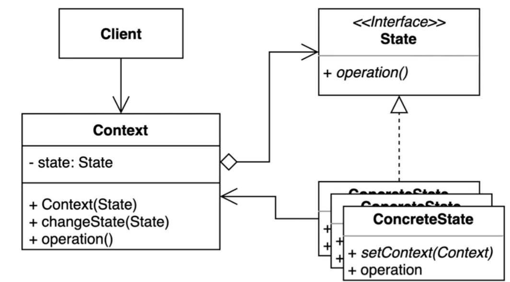
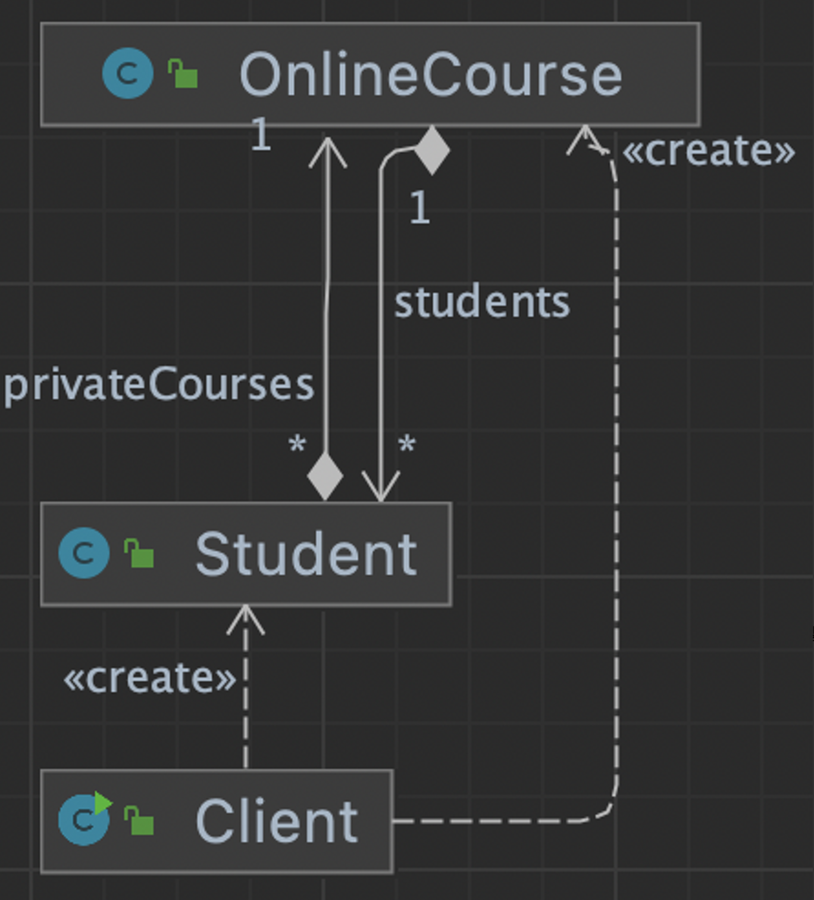
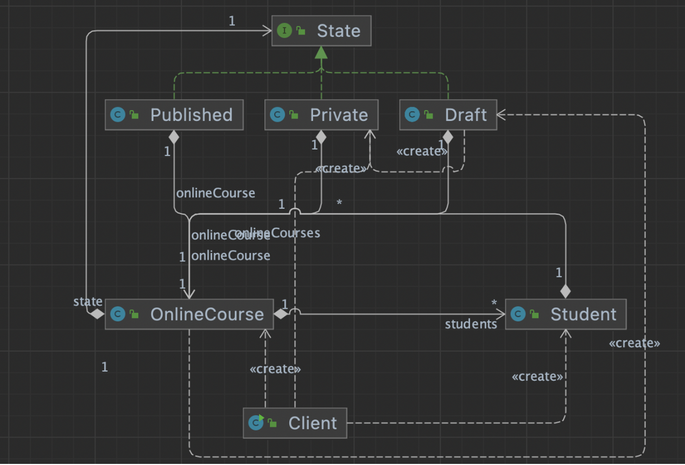

## 1. intro



- 상태에 특화된 행동들을 분리해 낼 수 있으며, 새로운 행동을 추가하더라도 다른 행동에 영향을 주지 않는다.


## 2. implement

### 변경  전




- 학생, 온라인강좌를 생성하고, 학생이 온라인 강좌를 등록하고, 온라인강좌는 리뷰에 학생을 등록할 수 있다.
- 온라인강좌는 DRAFT, PUBLISHED, PRIVATE 의 상태코드를 가지며 상태코드에 따라 리뷰작성, 온라인강좌등록의 기능이 달라진다.

```java
public static void main(String[] args) {
        Student student = new Student("whiteship");
        OnlineCourse onlineCourse = new OnlineCourse();

        Student keesun = new Student("keesun");
        keesun.addPrivateCourse(onlineCourse);

        onlineCourse.addStudent(student);
        onlineCourse.changeState(OnlineCourse.State.PRIVATE);

        onlineCourse.addStudent(keesun);

        onlineCourse.addReview("hello", student);

        System.out.println(onlineCourse.getState());
        System.out.println(onlineCourse.getStudents());
        System.out.println(onlineCourse.getReviews());
    }
```

- addReview(), addStudent() 내부에 상태값에 따라 처리하는 로직이 복잡하게 if else로 처리되어 있다.
- 이렇게 if else 로 로직이 복잡하게 전개되어 있으면 테스트코드도 덩달아 복잡해진다.

```java
public class OnlineCourse {

    public enum State {
        DRAFT, PUBLISHED, PRIVATE
    }

    private State state = State.DRAFT;

    private List<String> reviews = new ArrayList<>();

    private List<Student> students = new ArrayList<>();

    public void addReview(String review, Student student) {
        if (this.state == State.PUBLISHED) {
            this.reviews.add(review);
        } else if (this.state == State.PRIVATE && this.students.contains(student)) {
            this.reviews.add(review);
        } else {
            throw new UnsupportedOperationException("리뷰를 작성할 수 없습니다.");
        }
    }

    public void addStudent(Student student) {
        if (this.state == State.DRAFT || this.state == State.PUBLISHED) {
            this.students.add(student);
        } else if (this.state == State.PRIVATE && availableTo(student)) {
            this.students.add(student);
        } else {
            throw new UnsupportedOperationException("학생을 해당 수업에 추가할 수 없습니다.");
        }

        if (this.students.size() > 1) {
            this.state = State.PRIVATE;
        }
    }

    public void changeState(State newState) {
        this.state = newState;
    }

    public State getState() {
        return state;
    }

    public List<String> getReviews() {
        return reviews;
    }

    public List<Student> getStudents() {
        return students;
    }

    private boolean availableTo(Student student) {
        return student.isEnabledForPrivateClass(this);
    }

}
```

### 변경 후




- Context에 해당하는 OnlineCourse의 상태처리를 요하는 함수들은, Status에 기능을 위임하도록 하였다.

```java
public class OnlineCourse {

    private State state = new Draft(this);

    private List<Student> students = new ArrayList<>();

    private List<String> reviews = new ArrayList<>();

    public void addStudent(Student student) {
        this.state.addStudent(student);
    }

    public void addReview(String review, Student student) {
        this.state.addReview(review, student);
    }

    public State getState() {
        return state;
    }

    public List<Student> getStudents() {
        return students;
    }

    public List<String> getReviews() {
        return reviews;
    }

    public void changeState(State state) {
        this.state = state;
    }
}
```

- State, ConcreteState 를 각각 구현하였다.
- Context의 분기를 처리하는, 개선을 요하는 함수를 State의 함수로 정의하면 된다.
- 상태 별로 클래스를 정의하여 로직이 더 간단해 졌다.

```java
public interface State {

    void addReview(String review, Student student);

    void addStudent(Student student);
}
public class Private implements State {

    private OnlineCourse onlineCourse;

    public Private(OnlineCourse onlineCourse) {
        this.onlineCourse = onlineCourse;
    }

    @Override
    public void addReview(String review, Student student) {
        if (this.onlineCourse.getStudents().contains(student)) {
            this.onlineCourse.getReviews().add(review);
        } else {
            throw new UnsupportedOperationException("프라이빗 코스를 수강하는 학생만 리뷰를 남길 수 있습니다.");
        }
    }

    @Override
    public void addStudent(Student student) {
        if (student.isAvailable(this.onlineCourse)) {
            this.onlineCourse.getStudents().add(student);
        } else {
            throw new UnsupportedOperationException("프라이빛 코스를 수강할 수 없습니다.");
        }
    }
}
public class Published implements State {

    private OnlineCourse onlineCourse;

    public Published(OnlineCourse onlineCourse) {
        this.onlineCourse = onlineCourse;
    }

    @Override
    public void addReview(String review, Student student) {
        this.onlineCourse.getReviews().add(review);
    }

    @Override
    public void addStudent(Student student) {
        this.onlineCourse.getStudents().add(student);
    }
}
public class Draft implements State {

    private OnlineCourse onlineCourse;

    public Draft(OnlineCourse onlineCourse) {
        this.onlineCourse = onlineCourse;
    }

    @Override
    public void addReview(String review, Student student) {
        throw new UnsupportedOperationException("드래프트 상태에서는 리뷰를 남길 수 없습니다.");
    }

    @Override
    public void addStudent(Student student) {
        this.onlineCourse.getStudents().add(student);
        if (this.onlineCourse.getStudents().size() > 1) {
            this.onlineCourse.changeState(new Private(this.onlineCourse));
        }
    }
}
```

- `this.onlineCourse.getReviews().add(review);` 와같이 닷(.) 연산이 세번이상 등장한 것은 냄새에 해당한다고 한다.
- 해당 자료형의 위치가 타당한지 검토가 필요하다. 변경하여 2개 이하로 줄여야 한다.


## 3. Strength and Weakness

객체 내부 상태 변경에 따라 객체의 행동이 달라지는 패턴.

### 장점

- 상태에 따른 동작을 개별 클래스로 옮겨서 관리할 수 있다.
- 기존의 특정 상태에 따른 동작을 변경하지 않고 새로운 상태에 다른 동작을 추가할 수 있다.
- 코드복잡도를 줄일 수 있다.

### 단점

- 복잡도가 증가한다.

### 연습 중 개선필요 및 느낀점

Context를 처음 생성할 때, Status를 인자로 받아올 수 없다.

Status가 Context 인스턴스를 인자로 생성해야 하기 때문이다.

그래서 Context 내부에 Status 맴버변수에 임의로 인스턴스를 생성하고 시작해야한다.

→ 방안을 찾아보자.
