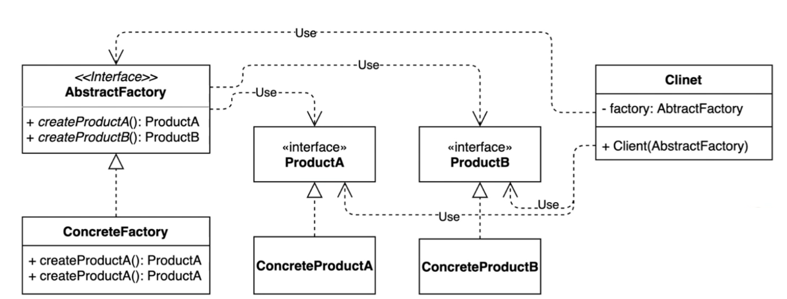
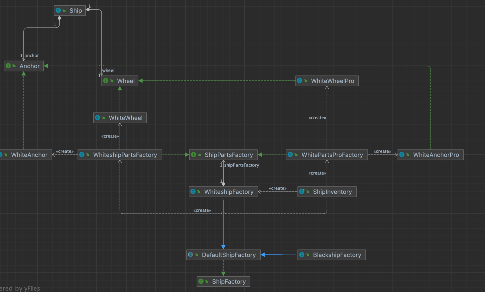
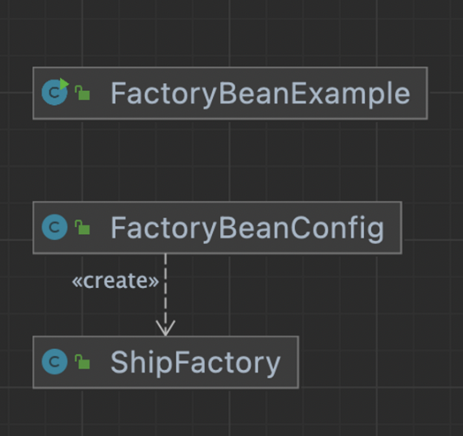

## 1. intro


서로 관련있는 여러 객체를 만들어주는 인터페이스.

- 구체적으로 어떤 클래스의 인스턴스를(concrete product)를 사용하는지 감출 수 있다.




## 2. implement



1. 제품 anchor, wheel 인터페이스를 만들고, 이를 상속하는 제품(concrete class)를 만든다. 팩토리(whiteshipPartsFactory)에서 실제 제품(WhiteWheel, WhiteAnchor)을 생성하는 코드를 만든다.
2. 제품이 변경될 수 있으므로, 팩토리를 추상화하여 추상팩토리(ShipPartFactory)를 만들어준다.
   1. 제품 인스턴스를 실제 생성하는 client(WhiteShipFactory)에서는 추상팩토리(ShipPartFactory) 에서 제품을 생성해주는 method만 호출하면 되므로, 제품이 변경되더라도 코드가 변경되지 않는다.
   2. 새로운 제품을 만들기 위해 팩토리(WhitePartProFactory) 와, 팩토리에서 실제 제품(WhiteWheelPro, WhiteAnchorPro)을 생성하는 코드를 작성해줄 수 있다.

- client code
  - 기존 : 제품 anchor, wheel 을 생성할 때, concrete object를 직접 작성해주어서, 제품군이 변경될 때마다 코드를 변경해 주어야 했다.
  - 변경안 : 이러한 concrete object 를 생성해주는 팩토리를 만들고, 이를 추상화 해서 추상팩토리를 만든다.
  - 변경후 : 제품군에 대한 추상화된 인터페이스 코드만 작성해주면, client code 는 더이상 변경하지 않아도 된다.

```java
// before code
public class WhiteshipFactory extends DefaultShipFactory {

    @Override
    public Ship createShip() {
        Ship ship = new Whiteship();
        ship.setAnchor(new WhiteAnchor());
        ship.setWheel(new WhiteWheel());
        return ship;
    }
}
// after code
public class WhiteshipFactory extends DefaultShipFactory {

    private ShipPartsFactory shipPartsFactory;

    public WhiteshipFactory(ShipPartsFactory shipPartsFactory) {
        this.shipPartsFactory = shipPartsFactory;
    }

    @Override
    public Ship createShip() {
        Ship ship = new Whiteship();
        ship.setAnchor(shipPartsFactory.createAnchor());
        ship.setWheel(shipPartsFactory.createWheel());
        return ship;
    }
}
```

- 팩토리패턴 + 추상팩토리패턴 사용 예제

```java
public class ShipInventory {

    public static void main(String[] args) {
        ShipFactory shipFactory = new WhiteshipFactory(new WhiteshipPartsFactory());
        Ship ship = shipFactory.createShip();
        System.out.println(ship.getAnchor().getClass());
        System.out.println(ship.getWheel().getClass());

        ShipFactory shipFactory2 = new WhiteshipFactory(new WhitePartsProFactory());
        Ship ship2 = shipFactory2.createShip();
        System.out.println(ship2.getAnchor().getClass());
        System.out.println(ship2.getWheel().getClass());
    }
}
```


## 3. interface with implement

- 모양과 효과는 비슷하지만
  - 둘 다 구체적인 객체 생성과적을 추상화한 인터페이스를 제공한다.
- 관점이 다르다.
  - 팩토리 메소드 패턴은 팩토리를 구현하는 방법(inheritance) 에 초첨을 둔다
  - 추상팩토리 패턴은 팩토리를 사용하는 방법(composition)에 초점을 둔다.
- 목적
  - 팩토리매소드 패턴은 구체적인 객체생성과정을 하위 또는 구체적인 클래스로 옮기는 것이 목적이다.
  - 추상팩토리패턴은 관련있는 여러객체를 구체적인 클래스에 의존하지 않고 만들수 있게 해주는 것이 목적이다.


## 4. Strength and Weakness

- 자바 라이브러리
  - javax.xml.xpath.XPathFactory@newInstance()
  - javax.xml.transform.TransformerFactory@newInstance()
  - javax.xml.parsers.DocumentBuilderFactory#newInstance()
- 스프링
  - FactoryBean과 그 구현체


### DocumentBuilder

```java
public class DocumentBuilderFactoryExample {

    public static void main(String[] args) throws ParserConfigurationException, IOException, SAXException {
        DocumentBuilderFactory factory = DocumentBuilderFactory.newInstance();
        DocumentBuilder builder = factory.newDocumentBuilder();
        Document document = builder.parse(new File("src/main/resources/config.xml"));
        System.out.println(document.getDocumentElement());
    }
}
```


### spring FactoryBean




- ClassPathXmlApplicationContext

```java
public class ShipFactory implements FactoryBean<Ship> {

    @Override
    public Ship getObject() throws Exception {
        Ship ship = new Whiteship();
        ship.setName("whiteship1111");
        return ship;
    }

    @Override
    public Class<?> getObjectType() {
        return Ship.class;
    }
}

public class FactoryBeanExample {
    public static void main(String[] args) {
        ApplicationContext applicationContext = new ClassPathXmlApplicationContext("config.xml");
        Ship whiteship = applicationContext.getBean("whiteship", Ship.class);
        System.out.println(whiteship.getName());
    }
}
```

- factory에 등록할 객체에 FactoryBean<Ship> 을 implements 해서, 생성할 객체를 override해서 정의해두면, spring에서 xml 이던, java 이던 bean 으로 정의해 놓은 class를 factory 에서 찾아서 인스턴스를 생성한다.
- AnnotationConfigApplicationContext

```java
@Configuration
public class FactoryBeanConfig {

    @Bean
    public ShipFactory shipFactory() {
        return new ShipFactory();
    }
}

	public class FactoryBeanExample {
    public static void main(String[] args) {
        ApplicationContext applicationContext = new AnnotationConfigApplicationContext(FactoryBeanConfig.class);
        Ship bean = applicationContext.getBean(Ship.class);
        System.out.println(bean);
    }
}
```

- java 소스에 bean을 생성할 객체를 정의하면,
- spring에서 프로젝트 시작 시 생성함.