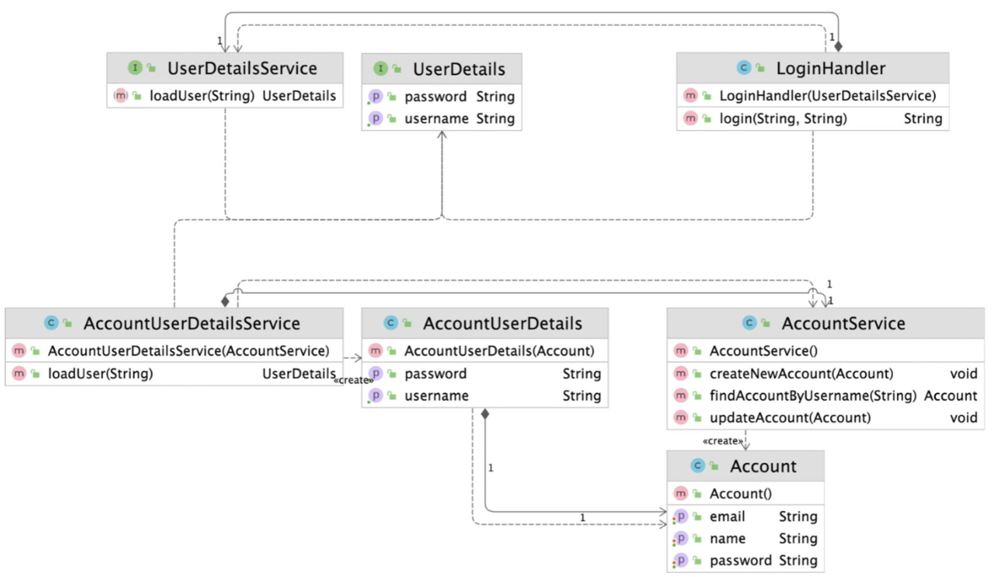

## 1. intro


기존 코드를 클라이언트가 사용하는 인터페이스의 구현체로 바꿔주는 패턴

- 클라이언트가 사용하는 인터페이스를 따르지 않는 기존 코드를 재사용할 수 있게 해준다.

client가 정의된 인터페이스를 사용할 수 없을 때, 사용가능하도록 어댑터를 만들어준다.


## 2. implement


client : App.java

Target : [security.LoginHandler.java](http://security.LoginHandler.java)

Adapter : AccountUserDetails.java, AccountuserDetailsService.java

Adaptee : AccountService.java, Account.java

- UserDetailsService userDetailsService = new AccountUserDetailsService(accountService)
  - AccountUserDetailsService class 라는 어댑터에
  - accountService 라는 adaptee 를 인자로 입력하여
  - userDetailsService 라는 타겟 인터페이스를 리턴받는다.
- 어댑터는 원래 구현이 안되어 있는 상황에서
  1. security 패키지에 있는 타입을 사용하고 싶다.
  2. security 패키지는 내가 변경할 수 없는 코드이다.
  3. 내가 갖고 있는 코드도 변경할 수 없는 코드이다.
  4. 위의 두 개를 연결해주기 위해 adapter를 구현한다.
  5. client 에서 아래 코드와 같이 사용한다.

```java
public static void main(String[] args) {
        AccountService accountService = new AccountService();
        UserDetailsService userDetailsService = new AccountUserDetailsService(accountService);
        LoginHandler loginHandler = new LoginHandler(userDetailsService);
        String login = loginHandler.login("keesun", "keesun");
        System.out.println(login);
    }
```

1. 어댑터를 만들 때에 타겟인터페이스를 implemets 받는다. (UserDetailsService)
2. 인자로 어뎁티를 받는다. (AccountService)
3. override 함수를 통해서 원하는 타입으로 변경 후 리턴하도록 코딩한다.

```java
public class AccountUserDetailsService implements UserDetailsService {

    private AccountService accountService;

    public AccountUserDetailsService(AccountService accountService) {
        this.accountService = accountService;
    }

    @Override
    public UserDetails loadUser(String username) {
        return new AccountUserDetails(accountService.findAccountByUsername(username));
    }
}
```

- 어뎁티 코드를 변경 가능하고, 객체지향 패턴을 딱히 따르지 않아도 되는 상황이라면, 어뎁티 class 에 타겟 인터페이스를 implements 받아서 사용해도 된다.


## 3. Strength and Weakness




### 장점

- 기존코드를 변경하지 않고 원하는 인터페이스 구현체를 만들어 재활욜 할 수 있다. (개방폐쇄원칙 open closed principle)
- 기존코드가 하던 일과 특정 인터페이스 구현체로 변환하는 작업을 각기다른클래스로 분리하여 관리할 수 있다. (단일책임 원칙)

### 단점

- 새 클래스가 생겨 복잡도가 증가할 수 있다.
- 경우에 따라서는 기존코드가 해당 인터페이스를 구현하도록 수정하는것이 좋은 선택이 될 수 있다.


## 4. API example

실무에서 어떻게 쓰이나?

자바

- java.util.Arrays#asList(T...)
- java.util.Collections#list(Enumeration), java.util.Collections#enumeration()
- java.io.InputStreamReader(InputStream)
- java.io.OutputStreamWrite(OutputStream)

스프링

- HandlerAdapter: 우리가 작성하는 다양한 형태의 핸들러 코드를 스프링 MVC가 실행할 수 있는 형태로 변환해주는 어댑터용 인터페이스.


### java library

- 아래 예제들을 보면, 인자(adaptee)를 함수(adapter)안에 넣으면, 결과(target interface)타입을 리턴하는 패턴을 어댑터 패턴이라고 할 수 있다.

```java
public class AdapterInJava {

    public static void main(String[] args) {
        // collections
				// ex1)
        List<String> strings = Arrays.asList("a", "b", "c");

        // Collections.enumeration : adaptor
        // strings : adaptee
        // Enumeration : target interface
        Enumeration<String> enumeration = Collections.enumeration(strings);
        ArrayList<String> list = Collections.list(enumeration);

        // io
        try(InputStream is = new FileInputStream("input.txt");
            InputStreamReader isr = new InputStreamReader(is);
            BufferedReader reader = new BufferedReader(isr)) {
            while(reader.ready()) {
                System.out.println(reader.readLine());
            }
        } catch (IOException e) {
            throw new RuntimeException(e);
        }
    }
}
```

### spring

- mvc 패턴에 핸들러라는 개념이 있는데, 이에 대한 내용이다.

```java
public class AdapterInSpring {

    public static void main(String[] args) {
        DispatcherServlet dispatcherServlet = new DispatcherServlet();
        HandlerAdapter handlerAdapter = new RequestMappingHandlerAdapter();
    }
}
```

- 핸들러는 아래와 같이 구현할 수 있다.
  - 핸들러는 아래내용 을 포함안 여러가지 형태로 구현할  수 있다.

```java
@Controller
public class HelloController {

    @GetMapping("/hello")
    public String hello() {
        return "hi";
    }
}
```

- DispatcherServlet파일에서 doDispatch() 를 보면
- getHandlerAdapter() 를 통해 핸들러를 찾아온다. HandlerAdapter는 인터페이스로 추상화되어 있는데, 여러종륭의 어댑터를 구현하기 위한 인터페이스이다.
- HandlerAdapter 타입의 어댑터를 통해서 타겟 인터페이스인 mv(model and view)를 리턴받게 되는데, 이러한 패턴을 어댑터 패턴이라 할 수 있다.

```java
protected void doDispatch(HttpServletRequest request, HttpServletResponse response) throws Exception {

...
HandlerAdapter ha = this.getHandlerAdapter(mappedHandler.getHandler());
...
mv = ha.handle(processedRequest, response, mappedHandler.getHandler());
...
}

```

protected HandlerAdapter getHandlerAdapter(Object handler) throws ServletException { if (this.handlerAdapters != null) { Iterator var2 = this.handlerAdapters.iterator();

```
    while(var2.hasNext()) {
        HandlerAdapter adapter = (HandlerAdapter)var2.next();
        if (adapter.supports(handler)) {
            return adapter;
        }
    }
}

```

** DispatcherServlet 파일은 추후 스프링 공부할  때 정동필요

