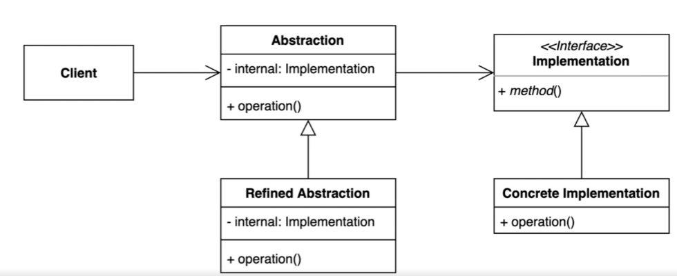
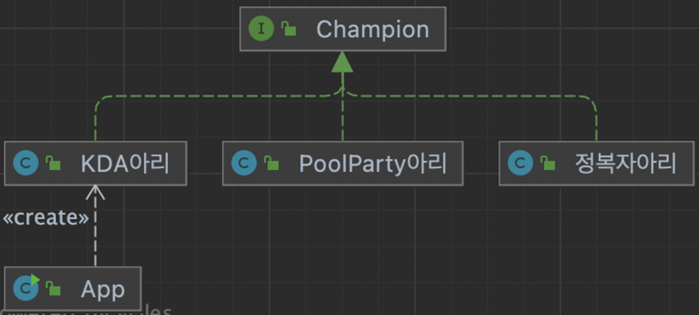
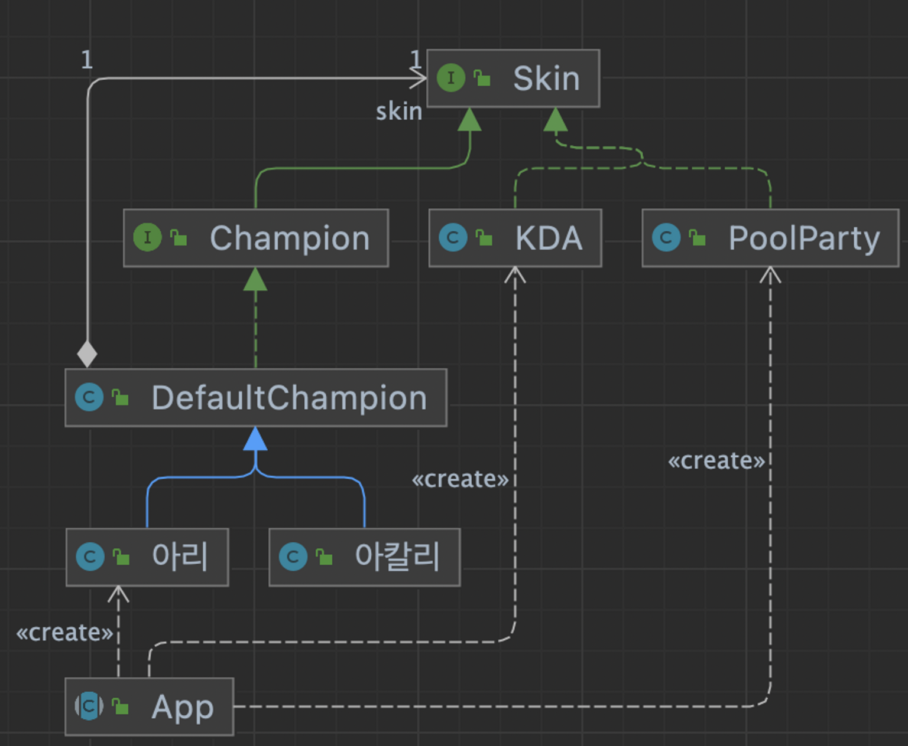
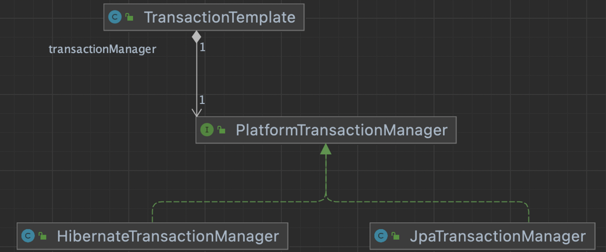

## 1. intro




추상적인 것과 구체적인 것을 분리하여 연결하는 패턴

- 하나의 계층 구조일 때 보다 각기 나누었을 때 독립적인 계층 구조로 발전시킬 수 있다.


## 2. implement

### 변경 전




- 기존에는, 챔피언이라는 타입에 스킨이라는 정보가 포함되어 있었다.
- 그래서 A 스킨이 있는 상황에서 챔피언이 하나 늘어나면, A스킨 * 챔피언 만큼의 추가 속성이 필요했다.
- 그래서 스킨이라는 정보를 분리해서 챔피언 안에 브릿지로 스킨타입을 넣어놓는다면, 스킨이늘어나거나 챔피언이 늘어날 때, 독립적으로 각각의 코드만을 관리할 수 있게 될 것이다.

### 변경 후




- client : App
- Abstractioin : Champion
- Refined Abstraction : DefaultChampion
- Implementation : Skin
- Concrete Implementation : Kda, PoolParty
- 브릿지인 스킨 정보를 챔피언을 생성할 때 인자로 넣는 형태로 구현이 된다.
- 클라이언트에 concrete class 가 포함되어 보이지만, DI 등을 통해 추상적인 형태로 충분히 변경할 수 있을것이다.

```java
public abstract class App  {

    public static void main(String[] args) {
        Champion kda아리 = new 아리(new KDA());
        kda아리.skillQ();
        kda아리.skillW();

        Champion poolParty아리 = new 아리(new PoolParty());
        poolParty아리.skillR();
        poolParty아리.skillW();
    }
}
```

## 3. Strength and Weakness


장점

- 추상적인 코드를 구체적인 코드변경 없이도 독립적으로 확장할 수 있다.

단점

- 계층구조가 늘어나 복잡도가 증가할 수 있다.


## 4. API example

1. Connection, Statement, PreparedStatement, ResultSet은 브릿지패턴의 abstract 에 해당한다.
   1. db driver 가 변경된다고 해서 이 코드들이 변경되지 않는다.
2. Driver (Class.forName ("org.h2.Driver");) 는 브릿지 패턴의 concrete implementation 에 해당한다.
   1. `org.h2.Driver` 를 인자로 실제 드라이버를 등록한 후, 이후코드에서 작업하는 형식으로 진행된다.

```java
public class JdbcExample {

    public static void main(String[] args) throws ClassNotFoundException {
        Class.forName ("org.h2.Driver");

        try (Connection conn = DriverManager.getConnection ("jdbc:h2:mem:~/test", "sa","")) {

            String sql =  "CREATE TABLE  ACCOUNT " +
                    "(id INTEGER not NULL, " +
                    " email VARCHAR(255), " +
                    " password VARCHAR(255), " +
                    " PRIMARY KEY ( id ))";

            Statement statement = conn.createStatement();
            statement.execute(sql);

//            PreparedStatement statement1 = conn.prepareStatement(sql);
//            ResultSet resultSet = statement.executeQuery(sql);
        } catch (SQLException e) {
            throw new RuntimeException(e);
        }
    }
public class Driver implements java.sql.Driver, JdbcDriverBackwardsCompat {
...
}
```

### logging 퍼사드

- Logger, LoggerFactory 는 어떤 로거를 쓰더라도변경되지 않고 사용한다.
- client 에서 어떤 로거를 사용할 지 정해서 사용할수 있는 브릿지 패턴이다.

```java
public class Slf4jExample {

    private static Logger logger = LoggerFactory.getLogger(Slf4jExample.class);

    public static void main(String[] args) {
        logger.info("hello logger");
    }
}
```

- logging 퍼사드 : 로거를 감쌓아서 만들어주는 api 를 이른다.

### Spring

- MailSender, PlatformTransactionManager : implementation
- JavaMailSenderImpl, JdbcTransactionManager : concrete implementation

```java
public class BridgeInSpring {

    public static void main(String[] args) {
        MailSender mailSender = new JavaMailSenderImpl();

        PlatformTransactionManager platformTransactionManager = new JdbcTransactionManager();
    }
}
```

- 브릿지패턴의 abstract class  : TransactionTemplate
- 브릿지패턴의 implementation : PlatformTransactionManager

```java
public class TransactionTemplate extends DefaultTransactionDefinition implements TransactionOperations, InitializingBean {
    protected final Log logger = LogFactory.getLog(this.getClass());
    @Nullable
    private PlatformTransactionManager transactionManager;
..
}
```




