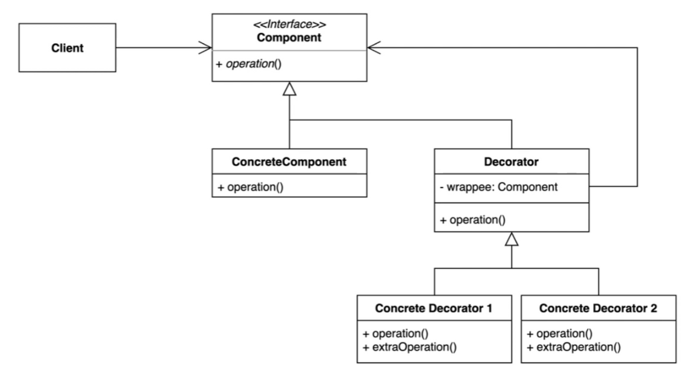
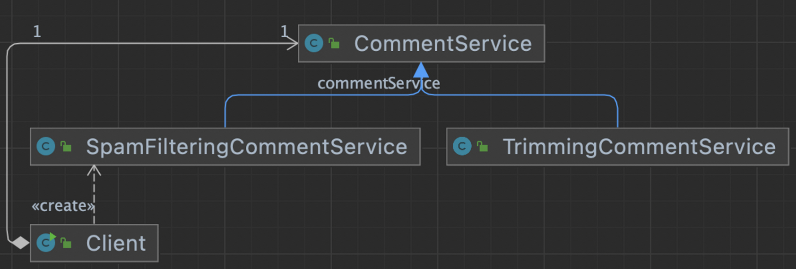
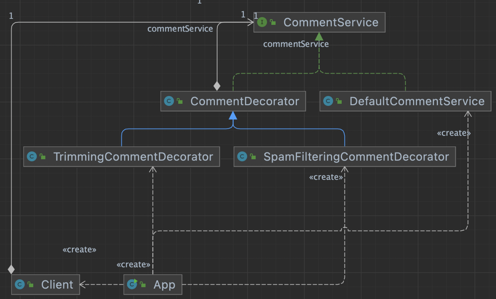

## 1. intro



기존 코드를 변경하지 않고 부가기능을 추가하는 패턴

- 상속이 아닌 위임을 사용해서 보다 유연하게(런타임에) 부가기능을 추가하는 것도 가능하다.


## 2. implement

### 변경 전

### 

- spam 과 Trim 기능을 둘 다 적용하려면, 새로운 함수 혹은 class를 정의해서 client단에서 조합으로 로직을 추가해야 한다.

```java
public class Client {

    private CommentService commentService;

    public Client(CommentService commentService) {
        this.commentService = commentService;
    }

    private void writeComment(String comment) {
        commentService.addComment(comment);
    }

    public static void main(String[] args) {
        Client client = new Client(new SpamFilteringCommentService());
        client.writeComment("오징어게임");
        client.writeComment("보는게 하는거 보다 재밌을 수가 없지...");
        client.writeComment("<http://whiteship.me>");
    }

}
```

### 변경 후



- client에서 spam과, trim 적용에 대한 조합(분기처리)를 해야 하는것은 동일하지만, 두 기능을 동시에 해야 하는 조합에 대해서는 따로 처리하지 않아도 된다.
- ConcreteComponent : DefaultDommentService
- Decorator : CommentDecorator
- ConcreteDecorator : Trimming~ , Spam ~
- Compoment : CommentService

### 코드

```java
public class App {

    private static boolean enabledSpamFilter = true;

    private static boolean enabledTrimming = true;

    public static void main(String[] args) {
        CommentService commentService = new DefaultCommentService();

        if (enabledSpamFilter) {
            commentService = new SpamFilteringCommentDecorator(commentService);
        }

        if (enabledTrimming) {
            commentService = new TrimmingCommentDecorator(commentService);
        }

        Client client = new Client(commentService);
        client.writeComment("오징어게임");
        client.writeComment("보는게 하는거 보다 재밌을 수가 없지...");
        client.writeComment("<http://whiteship.me>");
    }
}
public class Client {

    private CommentService commentService;

    public Client(CommentService commentService) {
        this.commentService = commentService;
    }

    public void writeComment(String comment) {
        commentService.addComment(comment);
    }
}
public interface CommentService {

    void addComment(String comment);
}
public class CommentDecorator implements CommentService {

    private CommentService commentService;

    public CommentDecorator(CommentService commentService) {
        this.commentService = commentService;
    }

    @Override
    public void addComment(String comment) {
        commentService.addComment(comment);
    }
}
public class SpamFilteringCommentDecorator extends CommentDecorator {

    public SpamFilteringCommentDecorator(CommentService commentService) {
        super(commentService);
    }

    @Override
    public void addComment(String comment) {
        if (isNotSpam(comment)) {
            super.addComment(comment);
        }
    }

    private boolean isNotSpam(String comment) {
        return !comment.contains("http");
    }
}
public class TrimmingCommentDecorator extends CommentDecorator {

    public TrimmingCommentDecorator(CommentService commentService) {
        super(commentService);
    }

    @Override
    public void addComment(String comment) {
        super.addComment(trim(comment));
    }

    private String trim(String comment) {
        return comment.replace("...", "");
    }
}
public class DefaultCommentService implements CommentService {
    @Override
    public void addComment(String comment) {
        System.out.println(comment);
    }
}
```


## 3. Strength and Weakness

장점

- 새로운 클래스를 만들지 않고 기존기능을 조합할 수 있다.
- 컴파일 타임이 아닌 런타임에 동적으로 기능을 변경할 수 있다.

단점

- 데코레이터를 조합하는 코드가 복잡할 수 있다.


1. 단일책임원칙
2. 모든 조합에 대한 정적인 코드를 작성할 필요가 없다.


## 4. API example

### Collection

- `checkedList()` : 인자로 전달된 인스턴스 타입 이외의 기능은 사용할 수 없도록 데코레이터패턴으로 적용된다.
- `unmodifiableList()` : 해당 인스턴스는 변경기능이 사용안되도록 데코레이터 패턴에 의해 적용된다.

```java
public static void main(String[] args) {
        // Collections가 제공하는 데코레이터 메소드
        ArrayList list = new ArrayList<>();
        list.add(new Book());

        List books = Collections.checkedList(list, Book.class);

//        books.add(new Item());

        List unmodifiableList = Collections.unmodifiableList(list);
        list.add(new Item());
        unmodifiableList.add(new Book());

        // 서블릿 요청 또는 응답 랩퍼
        HttpServletRequestWrapper requestWrapper;
        HttpServletResponseWrapper responseWrapper;
    }
public static <E> List<E> checkedList(List<E> list, Class<E> type) {
        return (list instanceof RandomAccess ?
                new CheckedRandomAccessList<>(list, type) :
                new CheckedList<>(list, type));
    }
public static <T> List<T> unmodifiableList(List<? extends T> list) {
        if (list.getClass() == UnmodifiableList.class || list.getClass() == UnmodifiableRandomAccessList.class) {
           return (List<T>) list;
        }

        return (list instanceof RandomAccess ?
                new UnmodifiableRandomAccessList<>(list) :
                new UnmodifiableList<>(list));
    }
```

### spring

```java
public class DecoratorInSpring {

    public static void main(String[] args) {
        // 빈 설정 데코레이터
        BeanDefinitionDecorator decorator;

        // 웹플럭스 HTTP 요청 /응답 데코레이터
        ServerHttpRequestDecorator httpRequestDecorator;
        ServerHttpResponseDecorator httpResponseDecorator;
    }
}
```