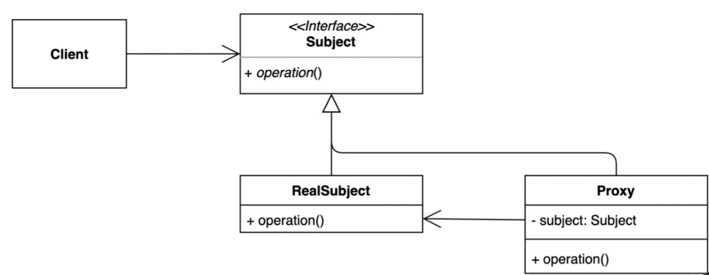

## 1. intro

특정객체에 대한 접근을 제어하거나 기능을 추가할 수 있는 패턴

- 초기화지연, 접근제어, 로깅, 캐싱 등 다양하게 응용해 사용할 수 있다.

원래사용하는 코드 : 리얼서브젝트 - 인터페이스가 없을경우 생성한다.

## 2. implement

## 3. Strength and Weakness

특정 객체에 대한 접근을 제어하거나 기능을 추가할 수 있는 패턴.

### 장점

- 기존 코드를 변경하지 않고 새로운 기능을 추가할 수 있다.
  - open closed principle
- 기존 코드가 해야 하는 일만 유지할 수 있다.
  - single responsibility principle
- 기능 추가 및 초기화 지연 등으로 다양하게 활용할 수 있다.

### 단점

- 코드의 복잡도가 증가한다.

## 4. API example

자바 실행중에 프록시 인스턴스를 동적으로 만드는 방식

