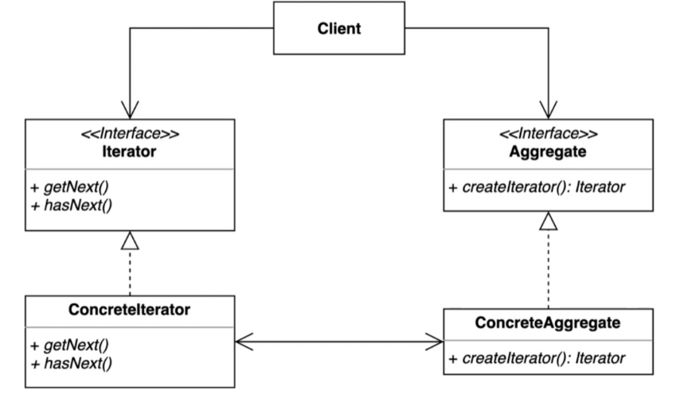
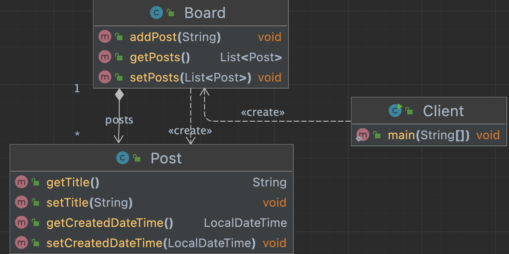
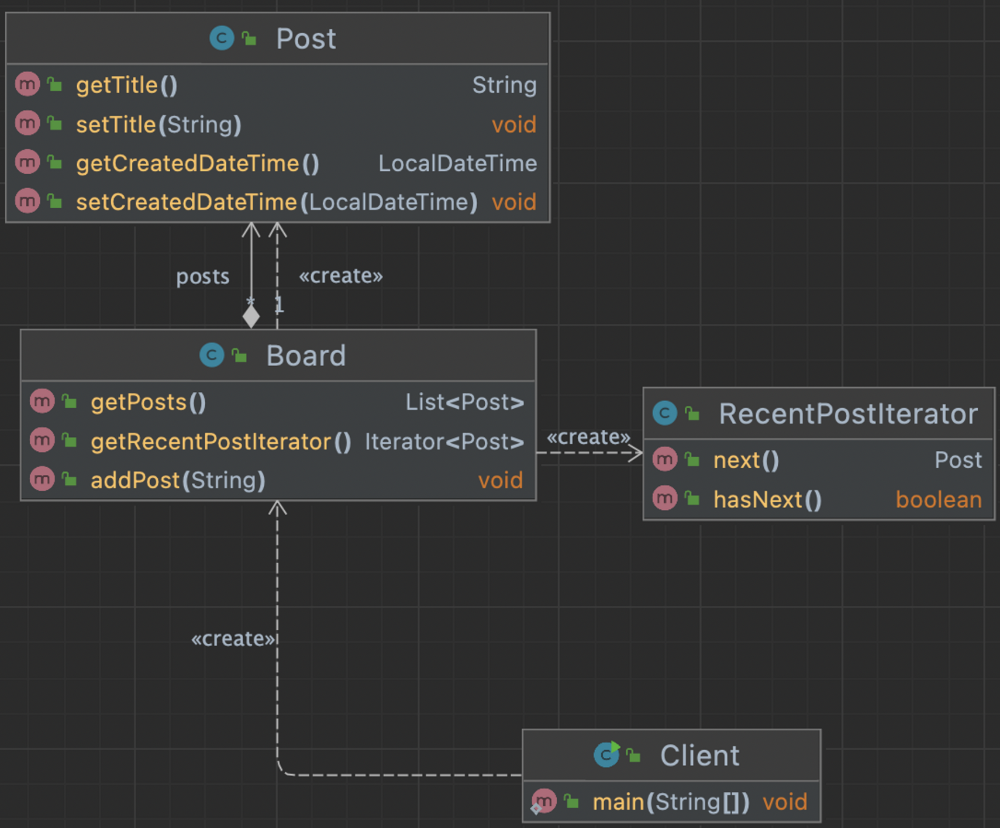

## 1. intro



집합객체를 순회하는 클라이언트 코드를 변경하지 않고 다양한 순회방법을 제공할 수 있다.


Aggregate : Board

- 있을수도 있고 없을수도 있다.


## 2. implement

### 변경 전




- Board 의 Post list 를 반복문을 통해 조회한다.

```java
public class Client {

    public static void main(String[] args) {
        Board board = new Board();
        board.addPost("디자인 패턴 게임");
        board.addPost("선생님, 저랑 디자인 패턴 하나 학습하시겠습니까?");
        board.addPost("지금 이 자리에 계신 여러분들은 모두 디자인 패턴을 학습하고 계신 분들입니다.");

        // TODO 들어간 순서대로 순회하기
        List<Post> posts = board.getPosts();
        for (int i = 0 ; i < posts.size() ; i++) {
            Post post = posts.get(i);
            System.out.println(post.getTitle());
        }

        // TODO 가장 최신 글 먼저 순회하기
        Collections.sort(posts, (p1, p2) -> p2.getCreatedDateTime().compareTo(p1.getCreatedDateTime()));
        for (int i = 0 ; i < posts.size() ; i++) {
            Post post = posts.get(i);
            System.out.println(post.getTitle());
        }
    }

}
```

### 변경 후




- Post에 대한 Iterator class 를 구현하여 사용한다.
- Board 의 Post list 가 어떤 컨테이너로 구현되어 있는 지 상관 없이 hasNext, next로 데이터를 꺼내올 수 있다.

```java
public class RecentPostIterator implements Iterator<Post> {

    private Iterator<Post> internalIterator;

    public RecentPostIterator(List<Post> posts) {
        Collections.sort(posts, (p1, p2) -> p2.getCreatedDateTime().compareTo(p1.getCreatedDateTime()));
        this.internalIterator = posts.iterator();
    }

    @Override
    public boolean hasNext() {
        return this.internalIterator.hasNext();
    }

    @Override
    public Post next() {
        return this.internalIterator.next();
    }
}
public class Client {

    public static void main(String[] args) {
        Board board = new Board();
        board.addPost("디자인 패턴 게임");
        board.addPost("선생님, 저랑 디자인 패턴 하나 학습하시겠습니까?");
        board.addPost("지금 이 자리에 계신 여러분들은 모두 디자인 패턴을 학습하고 계신 분들입니다.");

        // TODO 들어간 순서대로 순회하기
        List<Post> posts = board.getPosts();
        Iterator<Post> iterator = posts.iterator();
        System.out.println(iterator.getClass());

        for (int i = 0 ; i < posts.size() ; i++) {
            Post post = posts.get(i);
            System.out.println(post.getTitle());
        }

        // TODO 가장 최신 글 먼저 순회하기
        Iterator<Post> recentPostIterator = board.getRecentPostIterator();
        while(recentPostIterator.hasNext()) {
            System.out.println(recentPostIterator.next().getTitle());
        }
    }

}
```

- Aggregate 인 Board class 에 Contrete Iterator 를 사용하도록 코드를 짜야 한다.

```java
public class Board {

    List<Post> posts = new ArrayList<>();

    public List<Post> getPosts() {
        return posts;
    }

    public void addPost(String content) {
        this.posts.add(new Post(content));
    }

    public Iterator<Post> getRecentPostIterator() {
        return new RecentPostIterator(this.posts);
    }

}
```


## 3. Strength and Weakness

집합객체 내부구조를 노출시키지 않고 순회하는 방법을 제공하는 패턴.

### 장점

- 집합객체가 가지고 있는 객체들에 손쉽게 접근할 수 있다.
- 일관된 인터페이스를 사용해 여러 형태의 집합구조를 순회할 수 있다.

### 단점

- 클래스가 늘어나고 복잡도가 증가한다.
- 내부 집합구조가 변경될 가능성이 있는지 등을 따져봐서 패턴을 적용할 지 비용을 계산하고 구현해야 한다.


## 4. API example

### Java - Iterator

- Streaming API for XML 에 대해 공부하면 좋다고 하니 날잡고 공부해 보자…
  - 엘리먼트 한줄 당 한개의 인스턴스이므로 메모리를 좀더 차지한다고 생각해야 한다.
  - 일반적으로는 이터레이터 기반 api를 사용하는게 다루기 편해서 좋다.
  - 성능이 필요하면 콘솔기반 api사용을 고려하자

```java
public class IteratorInJava {

    public static void main(String[] args) throws FileNotFoundException, XMLStreamException {
        Enumeration enumeration;
        Iterator iterator;

        Board board = new Board();
        board.addPost("디자인 패턴 게임");
        board.addPost("선생님, 저랑 디자인 패턴 하나 학습하시겠습니까?");
        board.addPost("지금 이 자리에 계신 여러분들은 모두 디자인 패턴을 학습하고 계신 분들입니다.");

//        board.getPosts().iterator().forEachRemaining(p -> System.out.println(p.getTitle()));

        // TODO Streaming API for XML(StAX), 이터레이터 기반의 API
        XMLInputFactory xmlInputFactory = XMLInputFactory.newInstance();
        XMLEventReader reader = xmlInputFactory.createXMLEventReader(new FileInputStream("Book.xml"));

        while (reader.hasNext()) {
            XMLEvent nextEvent = reader.nextEvent();
            if (nextEvent.isStartElement()) {
                StartElement startElement = nextEvent.asStartElement();
                QName name = startElement.getName();
                if (name.getLocalPart().equals("book")) {
                    Attribute title = startElement.getAttributeByName(new QName("title"));
                    System.out.println(title.getValue());
                }
            }
        }
    }
}
```