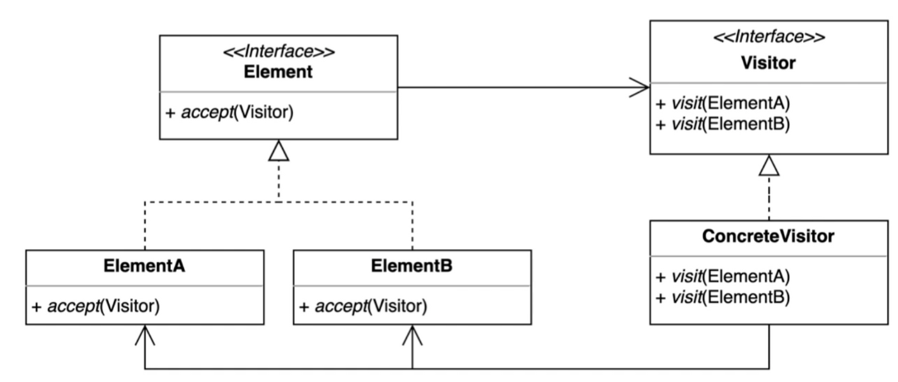
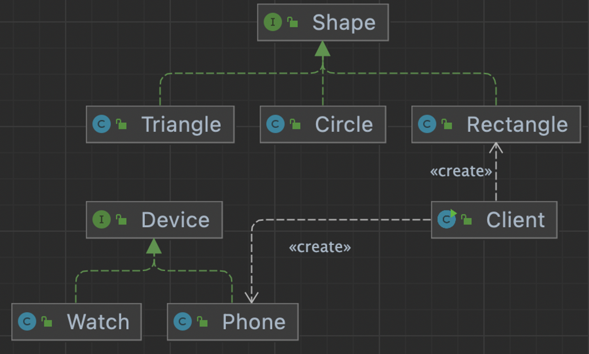
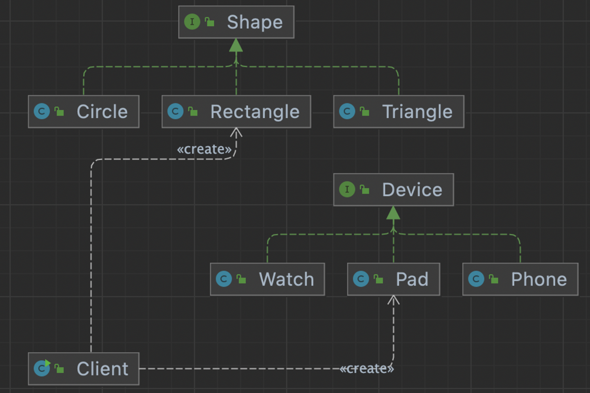
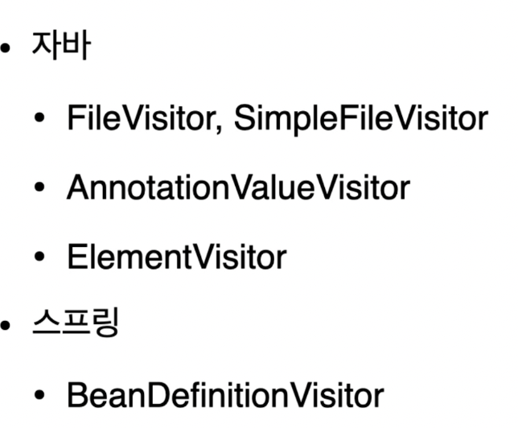

## 1. intro



- 기존코드를 변경하지 않고 새로운 기능을 추가하는 방법

accept 는 더블디스패치를 사용할 수 있는 장치이다.


## 2. implement

### 변경 전




- rectangle이 printTo를 device를 인자로 하여 호출하면,
- 인스턴스를 분기하여 기능을 호출한다.
- Shape가 늘어나면, device 수만큼 타입을 비교해서 기능을 수행하는 로직을 모두 추가해 주어야 하고,
- device가 늘어나면, 모든 Shape 구현클래스에 타입비교 구문을 추가해 주어야 한다.

```java
public class Client {

    public static void main(String[] args) {
        Shape rectangle = new Rectangle();
        Device device = new Phone();
        rectangle.printTo(device);
    }
}
public class Rectangle implements Shape {

    @Override
    public void printTo(Device device) {
        if (device instanceof Phone) {
            System.out.println("print Rectangle to phone");
        } else if (device instanceof Watch) {
            System.out.println("print Rectangle to watch");
        }
    }
}
```

### 변경 후




- rectangle에서 device를 인자로 함수를 호출 할 때, accept 함수가 다시 Pad로 print함수를 호출해서 기능을 호출 하였다.
- 이렇게 추상클래스에 대한 함수를 찾아가는 디스패처를 두번사용 하는걸 더블디스패치 라고 한다.
- 이렇게 하면, Shape 클래스가 늘어나면, 모든 디바이스 장치에 함수가 하나씩 늘어나야 한다.
- 반대로 device 클래스가 늘어나면 추가해야하는 기능은 없다.

```java
public class Client {

    public static void main(String[] args) {
        Shape rectangle = new Rectangle();
        Device device = new Pad();
        rectangle.accept(device);
    }
}
public interface Shape {

    void accept(Device device);

}
public class Rectangle implements Shape {

	 
    @Override
    public void accept(Device device) {
        device.print(this);
    }
}
public class Pad implements Device {
    @Override
    public void print(Circle circle) {
        System.out.println("Print Circle to Pad");
    }

    @Override
    public void print(Rectangle rectangle) {
        System.out.println("Print Rectangle to Pad");
    }

    @Override
    public void print(Triangle triangle) {
        System.out.println("Print Triangle to Pad");
    }
}
```


## 3. Strength and Weakness

장점

- 복잡하게 타입을 비교하면서 로직전개를 안하고, 클래스별로 책임을 가져가면서 (single responsible principle) 을 지킨다.

단점

엘리먼트 변경 /삭제 시 변경할 코드가 몇가지가 잇다. - 하지만 패턴적용 전이 변경할게 더 많음.


## 4. API example




### java

- visitor(SearchFileVisitor)의 함수를 오버로딩 하지않고, 원하는 이름을 사용해도 좋다. (가독성)
- 나중에 분석필요

```java
public class VisitorInJava {

    public static void main(String[] args) throws IOException {
        Path startingDirectory = Path.of("/Users/keesun/workspace/design-patterns");
        SearchFileVisitor searchFileVisitor =
                new SearchFileVisitor("Triangle.java", startingDirectory);
        Files.walkFileTree(startingDirectory, searchFileVisitor);
    }
}
public class SearchFileVisitor implements FileVisitor<Path> {

    private String fileToSearch;
    private Path startingDirectory;

    public SearchFileVisitor(String fileToSearch, Path startingDirectory) {
        this.fileToSearch = fileToSearch;
        this.startingDirectory = startingDirectory;
    }

    @Override
    public FileVisitResult preVisitDirectory(Path dir, BasicFileAttributes attrs) throws IOException {
        return FileVisitResult.CONTINUE;
    }

    @Override
    public FileVisitResult visitFile(Path file, BasicFileAttributes attrs) throws IOException {
        if (fileToSearch.equals(file.getFileName().toString())) {
            System.out.println("found " + file.getFileName());
            return FileVisitResult.TERMINATE;
        }
        return FileVisitResult.CONTINUE;
    }

    @Override
    public FileVisitResult visitFileFailed(Path file, IOException exc) throws IOException {
        exc.printStackTrace(System.out);
        return FileVisitResult.CONTINUE;
    }

    @Override
    public FileVisitResult postVisitDirectory(Path dir, IOException exc) throws IOException {
        if (Files.isSameFile(startingDirectory, dir)) {
            System.out.println("search end");
            return FileVisitResult.TERMINATE;
        }
        return FileVisitResult.CONTINUE;
    }
}
```

### Spring

- bean을 검색할 때 사용
- 자세한건 스프링 분석할 때 보자.

```java
public class VisitorInSpring {

    public static void main(String[] args) {
        BeanDefinitionVisitor beanDefinitionVisitor;
    }
}
```