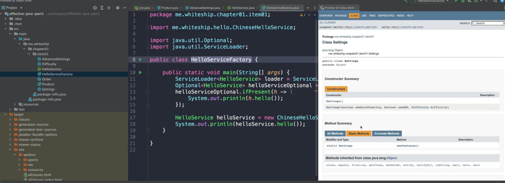

# item01. Consider static factory methods insteads of constructors


## 1. static factory advantages(1)

### 이름을 가질 수 있다.

### after

```java
public class Order {

    private boolean prime;

    private boolean urgent;

    private Product product;

    private OrderStatus orderStatus;

    public static Order primeOrder(Product product) {
        Order order = new Order();
        order.prime = true;
        order.product = product;

        return order;
    }

    public static Order urgentOrder(Product product) {
        Order order = new Order();
        order.urgent = true;
        order.product = product;
        return order;
    }

    public static void main(String[] args) {

        Order order = new Order();
        if (order.orderStatus == OrderStatus.DELIVERED) {
            System.out.println("delivered");
        }
    }

}
```

1. 생성자에 비해 표현을 더 잘 할 수 있다.
   1. 팩토리메소드의 이름으로 표현할 수 있다는 것이다.

## 2. static factory advantages(1)

### 호출될 때마다 인스턴스를 새로 생성하지는 않아도 된다.

- 호출될 따마다 인스턴스를 새로 생성하지 않아도 된다.
- Settings는 getInstance()를 통해 인스턴스를 가져오는데, 하나의 인스턴스만 사용할 수 있도록 컨트롤된다.
  - 생성자가 있다면 통제가 불가능하다
  - 인스턴스가 하나만 있어야 한다고 생각하면 정적메서드로 컨트롤 할 수 있어야 한다.
  - 객체 생성을 팩토리가 컨트롤 하겠다는거다. 클라이언트한테 넘겨주는게 아니고.
  - `플라이웨이트 패턴`을 예로 들 수 있다.

```java
public class Product {

    public static void main(String[] args) {
        Settings settings1 = Settings.getInstance();
        Settings settings2 = Settings.getInstance();

        System.out.println(settings1);
        System.out.println(settings2);

        Boolean.valueOf(false);
        EnumSet.allOf(Difficulty.class);
    }
}
/**
 * 이 클래스의 인스턴스는 #getInstance()를 통해 사용한다.
 * @see #getInstance()
 */
public class Settings {

    private boolean useAutoSteering;

    private boolean useABS;

    private Difficulty difficulty;

    private Settings() {}

    private static final Settings SETTINGS = new Settings();

    public static Settings getInstance() {
        return SETTINGS;
    }

}
```

- `Boolean.valueOf(false)`
- 인자에 따라서 클래스 내부에서 이미 생성해놓은 객체를 사용하게 한다.

```java
Boolean.valueOf(false);

=>

@IntrinsicCandidate
    public static Boolean valueOf(boolean b) {
        return (b ? TRUE : FALSE);
    }

=>
public static final Boolean TRUE = new Boolean(true);
public static final Boolean FALSE = new Boolean(false);
```

## 3. static factory advantages(3,4,5)

public 인터페이스 내부에서 함수로 static 만 있을 때는 public 이다

public class 내부에서 함수로 static만 있을 때는 protected 이다.

### 세번째. 반환타입의 하위 타입 객체를 반환할 수 있는 능력이 있다.

### 네번째. 입력 매개변수에 따라 매번 다른 클래스의 객체를 반환할 수 있다.

### 다섯번째. 정적팩토리 메서드를 작성하는 시점에는 반환할 객체의 클래스가 존재하지 않아도 된다.

인터페이스 기반의 프레임웤을 사용할 수 있게 해준다

- 구현체를 숨길 수 있다.

정적팩토리를 작성하는 시점에 굳이 구현체가 없어도 된다.4

```java
public class HelloServiceFactory {

    public static void main(String[] args) throws ClassNotFoundException, NoSuchMethodException, InvocationTargetException, InstantiationException, IllegalAccessException {
        ServiceLoader<HelloService> loader = ServiceLoader.load(HelloService.class);
        Optional<HelloService> helloServiceOptional = loader.findFirst();
        helloServiceOptional.ifPresent(h -> {
            System.out.println(h.hello());
        });

        HelloService helloService = new ChineseHelloService();
        System.out.println(helloService.hello());

    }

}
```

## 4. static factory disadvantages(1)

### 단점1. 생성자를 private 로 만들어야 한다 → 상속을 허용하지 않는다

- delegate 가져와서 사용할 수 있다.

  - private class를 맴버변수로 가져x와서 직접 사용할 수 있다.
  - 

  ```java
  public class AdvancedSettings {
      Settings settings;
  }
  ```

- 정적팩토리를 제공하면서 굳이 생성자를 막지 않는경우도 있다

  - List.of();
  - new ArrayList<>();

## 5. static factory disadvantages(2)

- 자바독 문서를 보면, 생성자가 일단 없고, 인스턴스를 생성하는 부분을 따로 찾아야 한다.
- 그래서 흔히 사용하느 네이밍 패턴을 제안함
  - of : 매개변수를 받아서 뭔가 만든다.
  - getInstance : 존재하는인스턴스를 가져옴
  - newInstance : 인스턴스를 생성
- 문서화를 하는게 가장 좋다

```java
/**
 * 이 클래스의 인스턴스는 #getInstance()를 통해 사용한다.
 * @see #getInstance()
 */
```

- java doc 생성 방법

  - `$ mvn javadoc:javadoc` # create java document

  - 위치 : target > site > index.html

  - class 주석을 통해 문서화를 하는 툴



