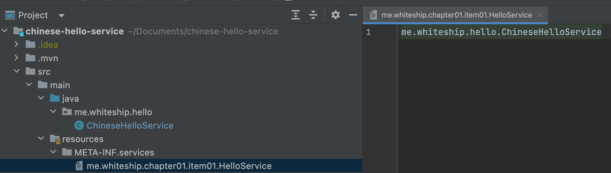

## Service provider framework

- 주요 구성 요소
  - 서비스 제공자 인터페이스 (SPI)와 서비스 제공자 (서비스 구현체)
  - 서비스 제공자 등록 API (서비스 인터페이스의 구현체를 등록하는 방법)
  - 서비스 접근 API (서비스의 클라이언트가 서비스 인터페이스의 인스턴스를 가져올 때 사용하는 API)
- 다양한 변형
  - 브릿지 패턴
  - 의존객체 주입 프레임워크
  - java.util.ServiceLoader


- 서비스제공자 인터페이스

```java
public interface HelloService {

    String hello();

    static String hi() {
        prepareMessage();
        return "hi";
    }

    static private void prepareMessage() {}

    static String hi1() {
        prepareMessage();
        return "hi";
    }

    static String hi2() {
        prepareMessage();
        return "hi";
    }

    default String bye() {
        return "bye";
    }
}
```

### spring

- 서비스 제공자 등록 api
  - configuration이라는 애노테이션을 사용한 클래스를 정의하고
  - Bean이라는 메소드로 서비스구현체를 등록한다

```java
@Configuration
public class AppConfig {

    @Bean
    public HelloService helloService() {
        return new ChineseHelloService();
    }

}
```

- 서비스 접근 API

```java
public class App {

    public static void main(String[] args) {
        ApplicationContext applicationContext = new AnnotationConfigApplicationContext(AppConfig.class);
        HelloService helloService = applicationContext.getBean(HelloService.class);
        System.out.println(helloService.hello());
    }
}
```

### java

- 서비스 제공자 등록 api



- 서비스 접근 API

```java
public class HelloServiceFactory {

    public static void main(String[] args) throws ClassNotFoundException, NoSuchMethodException, InvocationTargetException, InstantiationException, IllegalAccessException {
        ServiceLoader<HelloService> loader = ServiceLoader.load(HelloService.class);
        Optional<HelloService> helloServiceOptional = loader.findFirst();
        helloServiceOptional.ifPresent(h -> {
            System.out.println(h.hello());
        });
    }

}
```

