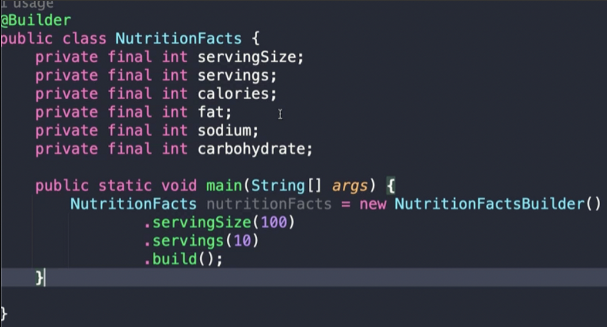
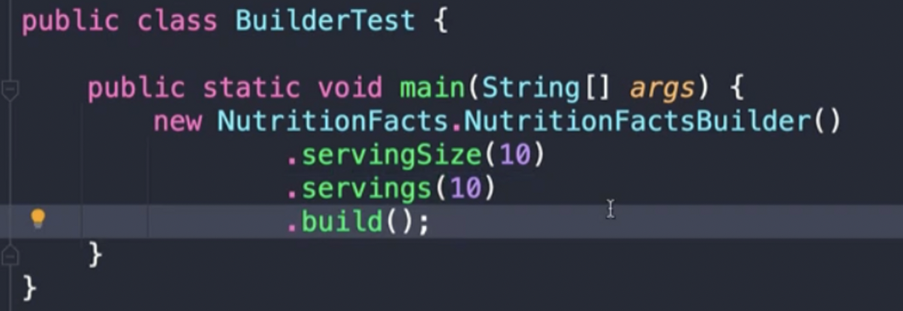
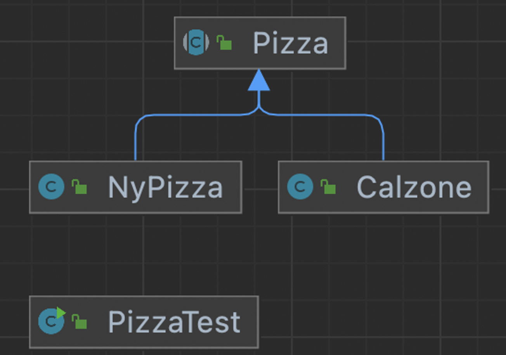

# item02. Consider a builder when faced with many constructor parameters


## 1. Constructor chaining and Java beans

### 정적 팩터리와 생성자에 선택적 매개변수가 많을 때 고려할 수 있는 방안

- 대안1: 점층적 생성자 패턴 또는 생성자 체이닝
  - 매개변수가 늘어나면 클라이언트 코드를 작성하거나 읽기 어렵다.
- 대안2: java beans pattern
  - 완전한 객체를 만드려면 메서드를 여러번 호출해야 한다. (일관성x)
  - 클래스를 불변으로 만들 수 없다.


강제할수 있는점에서 생성자가 좋다.

**점층적 생성자 패턴**

생성자들이 중복이 많다.

→ this() 로 다른 생성자를 호출해 줄 수 있다.

문제점 : 인스턴스를 만들 때 어떤 파라메터를 줘야할지를 모른다.

1. 자바빈즈 패턴

- 자바 표준스펙 중 하나다 get/set 정의

→ 기본생성자를 생성하고 나서, set으로 값들을 주입해줘야 한다면

→ 어디까지 세팅을 해줘야하는지 선택이기 때문에 일관성이 깨진다.

1. 혼용

불변객체로 만들기가 어렵다.

→ setter를 주게되면 불변객체로 만들 수 없다.


## 2. Builder

### 권장하는 방법: builder pattern

- 플루언트 API 또는 메서드 체이닝을 한다.
- 계층적으로 설계된 클래스와 함께 사용하기 좋다.
- 점층적 생성자보다 클라이언트 코드를 읽고 쓰기가 훨씬 간결하고, 자바빈즈보다 안전하다.


플루언트api, 체이닝 같은말

생성자 패턴, 자바빈즈패턴의 장점을 가지고 있다.

불변객체를 가질 수 있다.

안전하다

단점

중복코드와 코드복잡도가 있다.

### 롬복




**장점** : 간결하다

**단점1** : 외부에서 `NutritionFacts`를 new 로 생성할때, 모든 맴버변수를 파라메터로 받을 수 있음 (노출됨)

```
     → 아래 `@AllArgsConstructor` 로 조정할 수 있다.
```





@Builder : 컴파일 시점에 애노테이션프로세서가 클래스를 만듬

**단점2** : 필수값을 지정할 수 없다.

→ 이전에는 생성자파라메터로 필수값을 지정후, 선택값을 set 했는데, `@Builder` 에는 그런 기능은 없다.

**@Builder 이름**

: `Builder` 의 이름을 정해서 `new Builder( .. )` 로 사용할 수 있다.


## 3. Hierarchical Builder



- ```
  abstract static class Builder<T extends Builder<T>>
  ```

  - Builder<T>의 자식객체인 T 에 대해서 타입을 가질 수 있다.

- addTopping()의 리턴타입이 T, self()를 리턴하고 있는데,

  - 일반적인 빌더패턴에서 return (this); 를 하지만, 여기서 안하는 이유는 계층형에서는 부모 타입을 리턴하게 되기 때문이다.

    - return (this) 코드

      ```java
              public Builder<T> addTopping(Topping topping) {
                  toppings.add(Objects.requireNonNull(topping));
                  return this;
              }
      ```

  - 이렇게 되면, builder를 사용하는 쪽에서는 자식클래스로 형변환을 해주어야 하고, 빌더를 만드는 와중에 자식클래스에서 정의한 함수를 사용 못한다.

  - 그러므로, 자식클래스의 타입을 반환하도록 self()를 만들어 사용하는게 좋다,

```java
public abstract class Pizza {
    public enum Topping { HAM, MUSHROOM, ONION, PEPPER, SAUSAGE }
    final Set<Topping> toppings;

    abstract static class Builder<T extends Builder<T>> {
        EnumSet<Topping> toppings = EnumSet.noneOf(Topping.class);
        public T addTopping(Topping topping) {
            toppings.add(Objects.requireNonNull(topping));
            return self();
        }

        abstract Pizza build();

        // 하위 클래스는 이 메서드를 재정의(overriding)하여
        // "this"를 반환하도록 해야 한다.
        protected abstract T self();
    }
    
    Pizza(Builder<?> builder) {
        toppings = builder.toppings.clone(); // 아이템 50 참조
    }
}
```

- ```
  public static class Builder extends Pizza.Builder<NyPizza.Builder>
  ```

  - 부모클래스에 정의한 `Builder<T extends Builder<T>>` 형식대로 정의하였다.
  - self() 함수에서 this 를 리턴한다.

```java
public class NyPizza extends Pizza {
    public enum Size { SMALL, MEDIUM, LARGE }
    private final Size size;

    public static class Builder extends Pizza.Builder<NyPizza.Builder> {
        private final Size size;

        public Builder(Size size) {
            this.size = Objects.requireNonNull(size);
        }

        @Override public NyPizza build() {
            return new NyPizza(this);
        }

        @Override protected Builder self() { return this; }
    }

    private NyPizza(Builder builder) {
        super(builder);
        size = builder.size;
    }

    @Override public String toString() {
        return toppings + "로 토핑한 뉴욕 피자";
    }
}
public class Calzone extends Pizza {
    private final boolean sauceInside;

    public static class Builder extends Pizza.Builder<Builder> {
        private boolean sauceInside = false; // 기본값

        public Builder sauceInside() {
            sauceInside = true;
            return this;
        }

        @Override public Calzone build() {
            return new Calzone(this);
        }

        @Override protected Builder self() { return this; }
    }

    private Calzone(Builder builder) {
        super(builder);
        sauceInside = builder.sauceInside;
    }

    @Override public String toString() {
        return String.format("%s로 토핑한 칼초네 피자 (소스는 %s에)",
                toppings, sauceInside ? "안" : "바깥");
    }
}
```

- Pizza class에서 Builder의 정적 추상클래스의 함수 리턴타입이 서브클래스의 타입으로 정의해주어서 new 할 때 타입캐스팅없이 사용할 수 있다.

```java
public class PizzaTest {
    public static void main(String[] args) {
        NyPizza pizza = new NyPizza.Builder(SMALL)
                .addTopping(SAUSAGE)
                .addTopping(ONION).build();

        Calzone calzone = new Calzone.Builder()
                .addTopping(HAM).sauceInside().build();
        
        System.out.println(pizza);
        System.out.println(calzone);
    }
}
```

# 