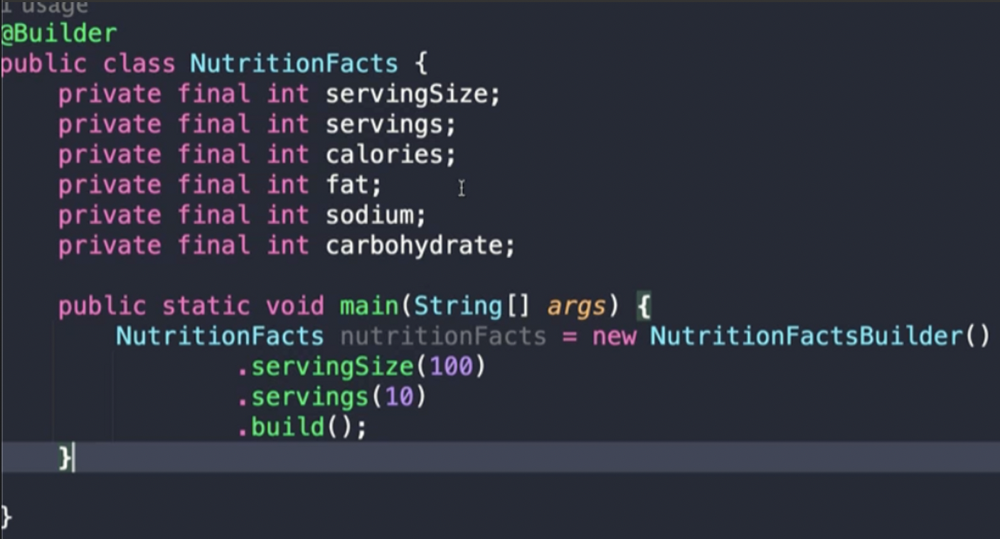
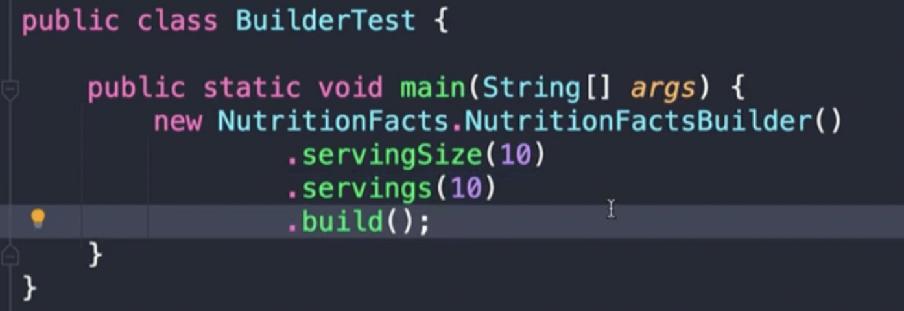
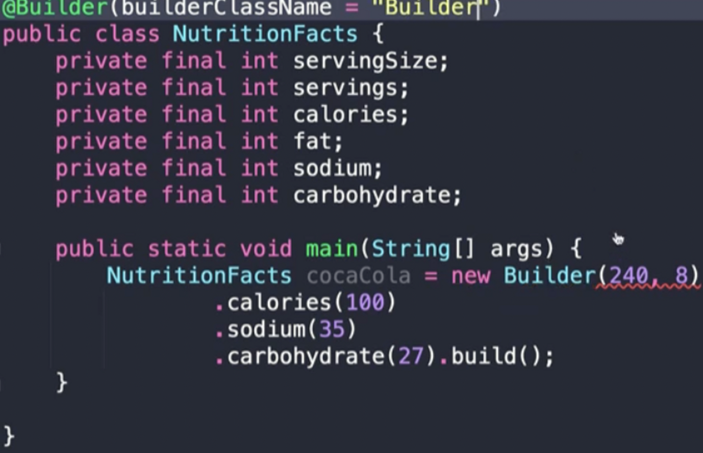
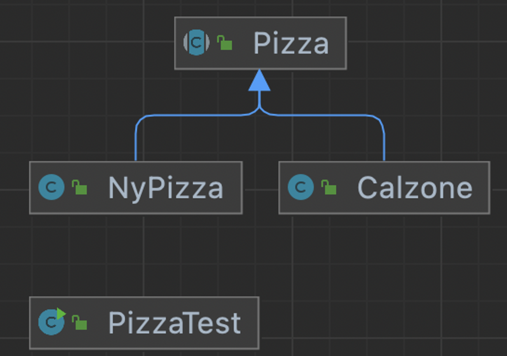

# item02. Consider a builder when faced with many constructor parameters


## 1. Constructor chaining and Java beans

### 정적 팩터리와 생성자에 선택적 매개변수가 많을 때 고려할 수 있는 방안

- 대안1: 점층적 생성자 패턴
  - 매개변수가 늘어나면 클라이언트 코드를 작성하거나 읽기 어렵다.
- 대안2: java beans pattern
  - 완전한 객체를 만드려면 메서드를 여러번 호출해야 한다. (일관성x)
  - 클래스를 불변으로 만들 수 없다.


### 점층적 생성자 패턴

- 필요한 속성을 필수적으로 담아야 하므로 일관성이 있다.

- 생성자들이 중복이 많다. (this() 로 다른 생성자를 호출해 보완해 줄 수 있다.)

- 인스턴스를 만들 때(호출 할 때) 어떤 파라메터를 줘야할지를 알 수 없다.

- 매개변수가 많아지만 클라이언트 코드를 작성하거나 읽기 어렵다.
  - 클라이언트가 실수로 매개변수의 순서를 바꿔 건네줘도 컴파일러는 알아채지 못하고, 결국 런타임에 엉뚱한 동작을 하게된다 **(아이템 51)**

~~~java
public NutritionFacts(int servingSize, int servings) {
    this(servingSize, servings, 0);
}

public NutritionFacts(int servingSize, int servings,
                      int calories) {
    this(servingSize, servings, calories, 0);
}

public NutritionFacts(int servingSize, int servings,
                      int calories, int fat) {
    this(servingSize, servings, calories, fat, 0);
}

public NutritionFacts(int servingSize, int servings,
                      int calories, int fat, int sodium) {
    this(servingSize, servings, calories, fat, sodium, 0);
}

public NutritionFacts(int servingSize, int servings,
                      int calories, int fat, int sodium, int carbohydrate) {
    this.servingSize  = servingSize;
    this.servings     = servings;
    this.calories     = calories;
    this.fat          = fat;
    this.sodium       = sodium;
    this.carbohydrate = carbohydrate;
}
~~~


### javabeans pattern

- 자바 표준스펙 중 하나인 get/set을 활용한다.

- 기본생성자를 생성하고 나서, set으로 값들을 주입해주는 방식이다.

~~~java
 public static void main(String[] args) {
      NutritionFacts cocaCola = new NutritionFacts();
      cocaCola.setServingSize(240);
      cocaCola.setServings(8);

      cocaCola.setCalories(100);
      cocaCola.setSodium(35);
      cocaCola.setCarbohydrate(27);
  }
~~~

- 가독성이 좋다.
- 불변객체로 만들기가 어렵다.
  - **setter가 있기 때문에 불변객체로 만들 수 없다.**
- 어디까지 세팅을 해줘야하는지 선택이기 때문에 일관성이 깨진다.
  - 자바빈즈 패턴에서는 클래스를 불변(**아이템19**) 로 만들 수 없다.
  - 대안으로 [freezing](./item02-object-freezing.md) 이 있으나, 실전에선 잘 안쓰인다고 한다.


## 2. Builder

- 점층적 생성자 패턴의 안정성과 자바빈즈 패턴의 가독성을 겸비한 [빌더패턴]( ../../../../../design-pattern/docs/04-builder.md) 이다.
- 클라이언트는 필요한 객체를 직접 만드는 대신, 필수 매개변수만으로 생성자(혹은 정적팩터리) 를 호출해 빌더 객체를 얻는다.
- 그런다음 빌더객체가 제공하는 일종의 세터 메서드들로 원하는 선택 매개변수들을 설정한다.
- 마지막으로 매개변수가 없는 build 메서드를 호출해 드디어 우리에게 필요한 (보통은 불변인)객체를 얻는다.


- 플루언트 API 또는 메서드 체이닝을 한다.
- 계층적으로 설계된 클래스와 함께 사용하기 좋다.
- 점층적 생성자보다 클라이언트 코드를 읽고 쓰기가 훨씬 간결하고, 자바빈즈보다 안전하다.

~~~java
public class NutritionFacts {
    private final int servingSize;
    private final int servings;
    ...

    public static void main(String[] args) {
        NutritionFacts cocaCola = new Builder(240, 8).calories(100).build();
    }

    public static class Builder {
        // 필수 매개변수
        private final int servingSize;
        private final int servings;

        // 선택 매개변수 - 기본값으로 초기화한다.
        private int calories      = 0;
        ...

        public Builder(int servingSize, int servings) {
            this.servingSize = servingSize;
            this.servings    = servings;
        }

        public Builder calories(int val)
        { calories = val;      return this; }
        ...

        public NutritionFacts build() {
            return new NutritionFacts(this);
        }
    }

    private NutritionFacts(Builder builder) {
        servingSize  = builder.servingSize;
        servings     = builder.servings;
        calories     = builder.calories;
        ...
    }
}
~~~

- 필수요소, 선택요소가 분리되어 있을 때 사용 immutable 하게 만들고 싶을 때 사용한다. (안전함)
- 생성자 패턴, 자바빈즈패턴의 장점을 가지고 있다.

- 중복코드와 코드복잡도가 있어 필드 개수가 많을 때, 증가될 것이라 생각될 때 사용하면 좋다.

- 공격에 대비해 이런 불변식을 보장하려면 빌더로부터 매개변수를 복사한 후 해당 객체 필드들도 검사해야 한다(**아이템 50**).
- 검사해서 잘못된 점을 발견하면 어떤 매개변수가 잘못되었는지를 자세히 알려주는 메세지를 담아 IllegalArgumentException 을 던지면 된다 (**아이템75**)


### @Builder by Lombok

- 컴파일 시점에 애노테이션프로세서가 코드를 만들고 검증한다.



**장점** : 간결하다

**단점1** : `NutritionFacts`를 new 로 생성할때, 모든 맴버변수를 파라메터로 받는 생성자 코드가 추가된다. (외부에 노출되어 있다.)

- @AllArgsConstructor 로 access level 을 설정해서 노출을 막을 수 있다.

```
     → 아래 `@AllArgsConstructor` 로 조정할 수 있다.
```




**단점2** : 필수값을 지정할 수 없다.

- build patten에서는 생성자파라메터로 필수값을 지정후, 선택값을 체이닝 할 수 있었지만, `@Builder` 에서는 불가능하다.

**@Builder 이름**

: `Builder` 의 이름을 정해서 `new Builder( .. )` 로 사용할 수 있다.




## 3. Hierarchical Builder

- Pizza.Builder 클래스는 재귀적 타입한정(**아이템 30**) 을 이용하는 제네릭 타입이다. 
- 여기에 추상메서드인 self를 더해 하위 클래스에서는 형변환하지 않고도 메서드 연쇄를 지원할 수 있다.
- self 타입이 없는 자바를 위한 이 우회방법을 시뮬레이터한 셀프타입 관용구라고 한다.
- 빌더패턴은 계층적으로 설계된 클래스와 함께 쓰기에 좋다.
  각 계층의 클래스에 관련 빌더를 맴버로 정의하자.
  추상클래스는 추상빌더를, 구체 클래스는 구체빌더를 갖게 한다.



- ```java
  abstract static class Builder<T extends Builder<T>>
  ```

  - Builder<T>의 자식객체인 T 에 대해서 타입을 가질 수 있다.

- addTopping()의 리턴타입이 T, self()를 리턴하고 있는데,

  - 일반적인 빌더패턴에서 return (this); 를 하지만, 여기서 안하는 이유는 계층형에서는 부모 타입을 리턴하게 되기 때문이다.

    - return (this)

      ```java
      public Builder<T> addTopping(Topping topping) {
          toppings.add(Objects.requireNonNull(topping));
          return this;
      }
      ```

  - 이렇게 되면, builder를 사용하는 쪽에서는 자식클래스로 형변환을 해주어야 하고, 빌더를 만드는 와중에 자식클래스에서 정의한 함수를 사용 못한다.

  - 그러므로, 자식클래스의 타입을 반환하도록 self()를 만들어 사용하는게 좋다,

```java
public abstract class Pizza {
    public enum Topping { HAM, MUSHROOM, ONION, PEPPER, SAUSAGE }
    final Set<Topping> toppings;

    abstract static class Builder<T extends Builder<T>> {
        EnumSet<Topping> toppings = EnumSet.noneOf(Topping.class);
        public T addTopping(Topping topping) {
            toppings.add(Objects.requireNonNull(topping));
            return self();
        }

        abstract Pizza build();

        // 하위 클래스는 이 메서드를 재정의(overriding)하여
        // "this"를 반환하도록 해야 한다.
        protected abstract T self();
    }
    
    Pizza(Builder<?> builder) {
        toppings = builder.toppings.clone(); // 아이템 50 참조
    }
}
```

- ```java
  public static class Builder extends Pizza.Builder<NyPizza.Builder>
  ```

  - 부모클래스에 정의한 `Builder<T extends Builder<T>>` 형식대로 정의하였다.
  - self() 함수에서 this 를 리턴한다.

```java
public class NyPizza extends Pizza {
    public enum Size { SMALL, MEDIUM, LARGE }
    private final Size size;

    public static class Builder extends Pizza.Builder<NyPizza.Builder> {
        private final Size size;

        public Builder(Size size) {
            this.size = Objects.requireNonNull(size);
        }

        @Override public NyPizza build() {
            return new NyPizza(this);
        }

        @Override protected Builder self() { return this; }
    }

    private NyPizza(Builder builder) {
        super(builder);
        size = builder.size;
    }

    @Override public String toString() {
        return toppings + "로 토핑한 뉴욕 피자";
    }
}
public class Calzone extends Pizza {
    private final boolean sauceInside;

    public static class Builder extends Pizza.Builder<Builder> {
        private boolean sauceInside = false; // 기본값

        public Builder sauceInside() {
            sauceInside = true;
            return this;
        }

        @Override public Calzone build() {
            return new Calzone(this);
        }

        @Override protected Builder self() { return this; }
    }

    private Calzone(Builder builder) {
        super(builder);
        sauceInside = builder.sauceInside;
    }

    @Override public String toString() {
        return String.format("%s로 토핑한 칼초네 피자 (소스는 %s에)",
                toppings, sauceInside ? "안" : "바깥");
    }
}
```

- Pizza class에서 Builder의 정적 추상클래스의 함수 리턴타입이 서브클래스의 타입으로 정의해주어서 new 할 때 타입캐스팅없이 사용할 수 있다.

```java
public class PizzaTest {
    public static void main(String[] args) {
        NyPizza pizza = new NyPizza.Builder(SMALL)
                .addTopping(SAUSAGE)
                .addTopping(ONION).build();

        Calzone calzone = new Calzone.Builder()
                .addTopping(HAM).sauceInside().build();
        
        System.out.println(pizza);
        System.out.println(calzone);
    }
}
```

- 하위클래스의 메서드가 상위클래스의 메서드가 정의한 반환 타입이 아닌, 그 하위타입을 반환하는 기능을 공변반환타이핑 (covariant return typing)이라고 한다. 
- 이 기능을 이요하면 클라이언트가 형변환에 신경쓰지 않도록 빌더를 사용할 수 있다.


### vararg (가변인수)

- 생성자로 누릴 수 없는 사소한 이점으로, 빌더를 이용하면 가변인수 매개변수를 여러개 사용할 수 있다. ([vararg][item02-vararg.md])
- 아니면 메서드를 여러번 호출하도록 하고 각 호출 때 넘겨진 매개변수들을 하나의 필드로 모을 수 도 있다.

~~~java
public Builder<T> addTopping(Topping topping) {
    toppings.add(Objects.requireNonNull(topping));
    return this;
}
~~~


### 빌더패턴 단점

- 객체를 만드려면 그에 앞서 빌더부터 만들어져야 한다.
- 빌더 생성 비용이 크지는 않지만 성능에 민감한 상황에서는 문제가 될 수 도 있다.


## immutable

**불변**은 어떠한 변경도 허용하지 않는다

대표적으로 [String 객체](./item02-immutable-string.md)는 한번 만들어지면 절대 값을 바꿀 수 없는 불변 객체다.

한편 **불변식(invariant)**은 프로그램이 실행되는동안 혹은 정해진 기간 동안 반드시 만족해야 하는 조건을 말한다.
다시말해 변경을 허용할 수는 있으나 주어진 조건 내에서만 허용한다는 뜻이다.
예를들어 리스트의 크기는 반드시 0이상이어야 하니, 한순간이라도 음숙밧이 도니다면 불변식이 깨진 것이다.
기간을 표현한느 Period 클래스에서 start 필드의 값은 반드시 end필드의 값보다 앞서야 하므로 역전되면 깨진것이다 (**아이템 50**)
따라서 가변객체에서도 불변식은 존재할 수 있으며 넓게보면 불변은 불변식의 극단적 예이다.


## 정리

생성자나 정적팩터리가 처리해야할 매개변수가 많다면 빌더 패턴을 선택하는게 더 낫다.
매개변수 중 다수가 필수가 아니거나 같은 타입이면 특히 그렇다.
빌더는 점층적 생성자보다 클라이언트 코드를 읽고 쓰기가 훨씬 간결하고 자바빈즈보다 안전하다.


