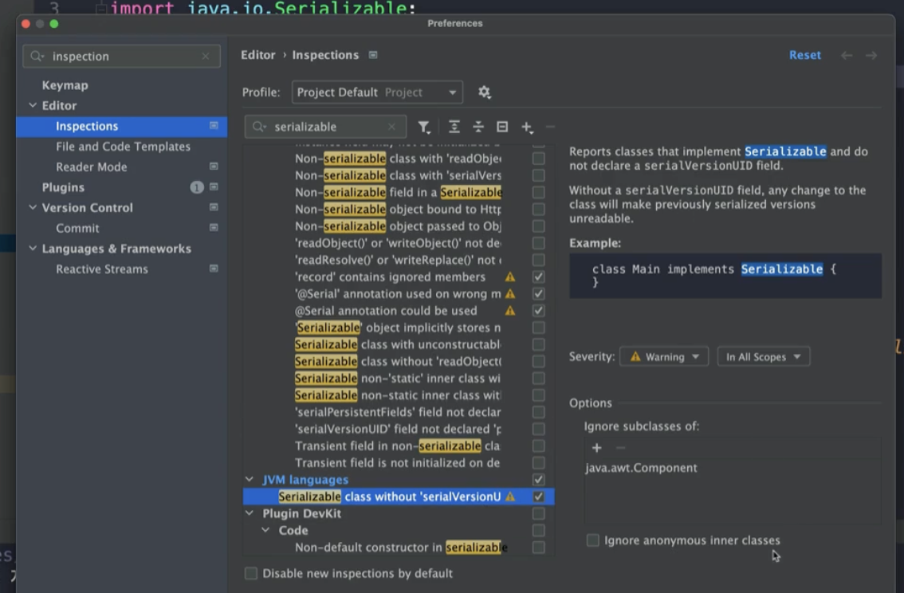

## Serialization

~~~java
public class Book implements Serializable {

    private static final long serialVersionUID = 1L;

    private String isbn;
    private String title;
    private LocalDate published;
    private String name;
    private transient int numberOfSold;
    ...
~~~

- transient 는 직렬화 대상에서 제외한다.
  - 패스워드 같은 민감한 정보를 제외할 수 있다.

~~~java
public class SerializationExample {

    private void serialize(Book book) {
        try (ObjectOutput out = new ObjectOutputStream(new FileOutputStream("book.obj"))) {
            out.writeObject(book);
        } catch (IOException e) {
            throw new RuntimeException(e);
        }
    }

    private Book deserialize() {
        try (ObjectInput in = new ObjectInputStream(new FileInputStream("book.obj"))) {
            return (Book) in.readObject();
        } catch (IOException | ClassNotFoundException e) {
            throw new RuntimeException(e);
        }
    }

    public static void main(String[] args) {
//        Book book = new Book("12345", "이팩티브 자바 완벽 공략", "백기선",
//                LocalDate.of(2022, 3, 21));
//        book.setNumberOfSold(200);

        SerializationExample example = new SerializationExample();
//        example.serialize(book);
        Book deserializedBook = example.deserialize();

//        System.out.println(book);
        System.out.println(deserializedBook);
    }
}
~~~

- 시리얼버전uid 는 명시하지 않으면 런타임에 생성된다.
  - 클래스가 바뀌엇기 때문에 아이디가 바뀐다.

- 직렬화를 해서 저장된 바이트코드파일(.obj ) 을 변형된 클래스 로 역직렬화 하려고 하면 실패한다.

  ~~~
  Caused by: java.io.InvalidClassException: me.whiteship.chapter01.item03.serialization.Book; local class incompatible: stream classdesc serialVersionUID = -2900959438276945523, local class serialVersionUID = 5665474867782462767
  ~~~

  - 클래스정보가 바뀌면 id도 변경된다.

  - 우리가 임의대로 id를 정의하면 클래스 정보가 변경되어도 역직렬화할 수 있다.

    ~~~java
    private static final long serialVersionUID = 1L;
    ~~~

    

