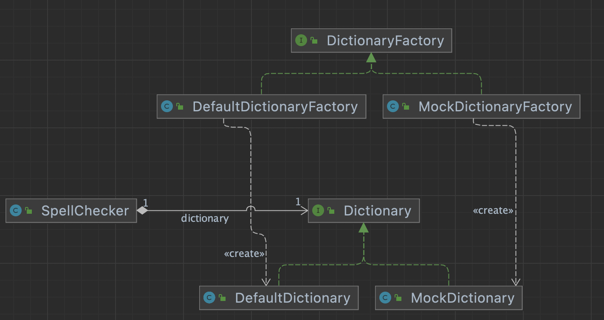

# factory method pattern

- client 코드인 SpellChecker 는 변경되지 않고
- 추가/수정되는 Dictionary Factory, Dictionary 만 코드가 변경된다. (OCP)

~~~java
public interface DictionaryFactory {
    Dictionary getDictionary();
}
~~~

~~~java
public class DefaultDictionaryFactory implements DictionaryFactory {
    @Override
    public Dictionary getDictionary() {
        return new DefaultDictionary();
    }
}

public class MockDictionaryFactory implements DictionaryFactory {
    @Override
    public Dictionary getDictionary() {
        return new MockDictionary();
    }
}
~~~

