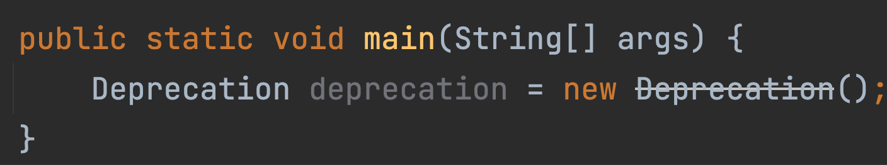
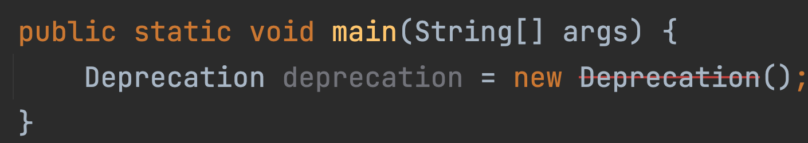
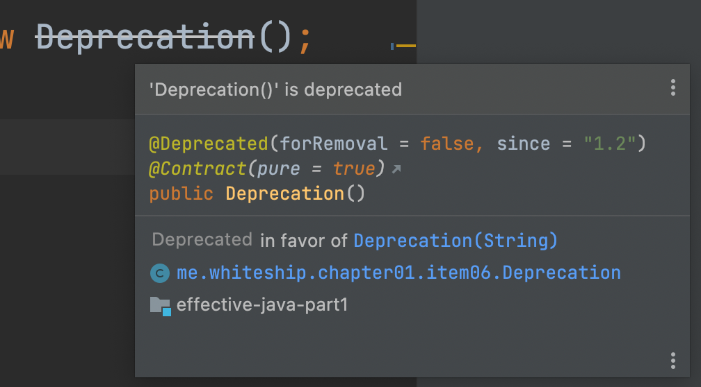
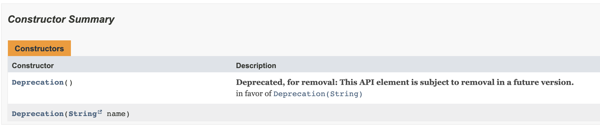
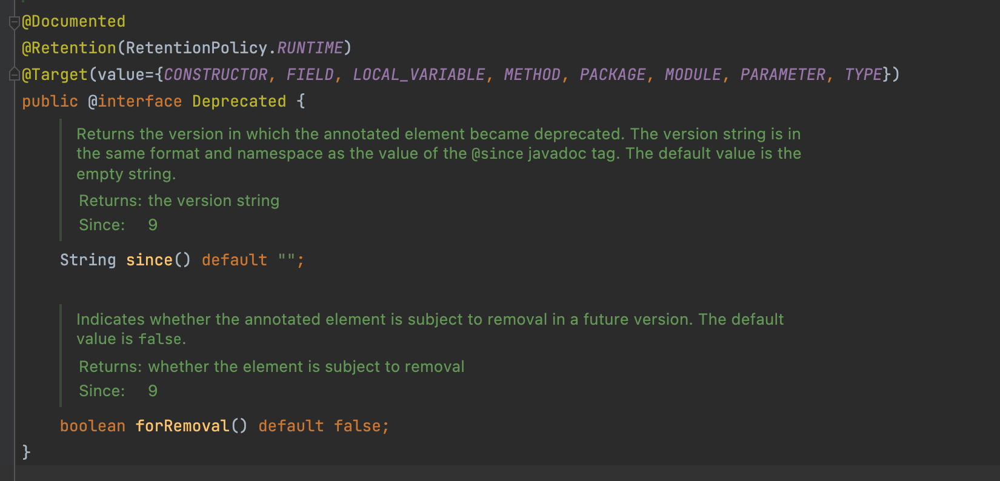
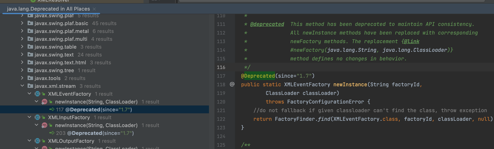

# deprecation

- 사용 자제를 권장하고 대안을 제시하는 방법이 있다. 

@Deprecated : 컴파일시 경고 메시지를 통해 사용 자제를 권장하는 API라는 것을 클라이언트에 알려줄 수 있다.

@deprecated  : 문서화(Javadoc)를 통해 사용자제 이유와 대안을 보여줄 수 있다.

### deprecate 예제

~~~java
public class Deprecation {

    /**
     * @deprecated in favor of
     * {@link #Deprecation(String)}
     */
    @Deprecated(forRemoval = true, since = "1.2")
    public Deprecation() { }

    private String name;

    public Deprecation(String name) {
        this.name = name;
    }
}
~~~

- @Deprecated 된 메서드를 호출하면 취소선이 그어진다. 하지만 사용할 수 있다.

- java9 부터 `forRemoval = true` 를 사용하면, 빨간줄이 그어진다. (강력한 경고)
- 하지만 사용할 순 있다.

- 주석에 @deprecate를 작성하면, intellij에서 힌트로 보여주기도 하고
- javadoc을 만들면 description에 보여진다.

### java api deprecate 예제

