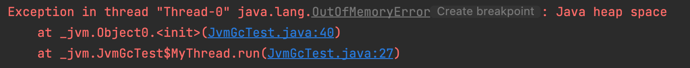

# GC

- 스택영역이 힙영역의 인스턴스와 연결되어 있지 않으면 해당 인스턴스는 GC 대상이 된다.
-  [GC noded](../../../../jvm/gc-structure.md)
-  [GC Monitor noded](../../../../jvm/gc-monitoring.md)

### memory leak test

~~~java
/**
 * JVM - memory leak test
 */
public class JvmGcTest {
    public static void main( String[] args ) throws InterruptedException {
        Thread.sleep(10000);

        MyThread m[]; // = new MyThread()[2];
        int size = 1;
        m = new MyThread[size];
        for (int i = 0 ; i < size ; i++) {
            m[i] = new MyThread();
            m[i].start();
        }
    }
    static class MyThread extends Thread {
        @Override
        public void run() {
            GenericStack<Object0> st = new GenericStack();
            while(true) {
                st.push(new Object0());
            }
        }
    }
}

~~~

~~~java
class Object0 {
    private Integer data[][][][] = null;
    Object0() {
        //data = new Integer[100][100][100][100];
        data = new Integer[20000][20000][20000][20000];
    }
}
~~~

~~~java
class GenericStack<E> {
    private Object[] elements;
    private int size;
    private static final int DEFAULT_INITIAL_CAPACITY = 16;

    @SuppressWarnings("unchecked")
    public GenericStack() {
        elements = new Object[DEFAULT_INITIAL_CAPACITY];
    }

    public void push(E e) {
        ensureCapacity();
        elements[size++] = e;
    }

    public E pop() {
        if(size == 0) {
            throw new EmptyStackException();
        }

        @SuppressWarnings("unchecked")  E result = (E) elements[--size];
        elements[size] = null; // reference release 
      												 // null 안해주면 GC 대상에서 제외된다.
        return result;
    }

    public boolean isEmpty() {
        return size == 0;
    }

    private void ensureCapacity() {
        if(elements.length == size)
            elements = Arrays.copyOf(elements, 2*size+1);
    }
}
~~~

