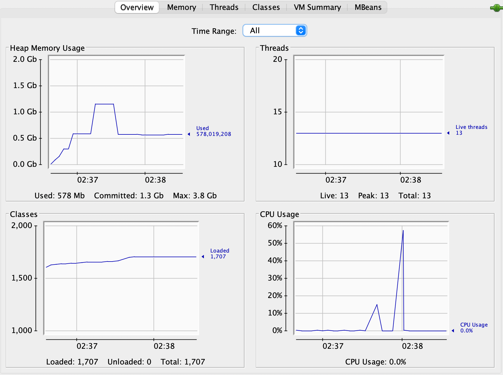

# stack gc test

### java.util.Stack<T>

~~~java
public synchronized E pop() {
    E       obj;
    int     len = size();

    obj = peek();
    removeElementAt(len - 1);

    return obj;
}
~~~

~~~java
public synchronized void removeElementAt(int index) {
    if (index >= elementCount) {
        throw new ArrayIndexOutOfBoundsException(index + " >= " +
                                                 elementCount);
    }
    else if (index < 0) {
        throw new ArrayIndexOutOfBoundsException(index);
    }
    int j = elementCount - index - 1;
    if (j > 0) {
        System.arraycopy(elementData, index + 1, elementData, index, j);
    }
    modCount++;
    elementCount--;
    elementData[elementCount] = null; /* to let gc do its work */
}
~~~

### stack 테스트 결과

- pop() 할때  elements[size] = null; 를 해도 안해도 gc실행하면 메모리가 해제된다. 
  **테스트를 잘못했나..**

~~~
[Full GC (System.gc())  1081504K->559113K(1227776K), 6.1678364 secs]
[GC (System.gc())  566427K->559337K(1227776K), 0.0076213 secs]
[Full GC (System.gc())  559337K->559184K(1227776K), 6.4326184 secs]
~~~

