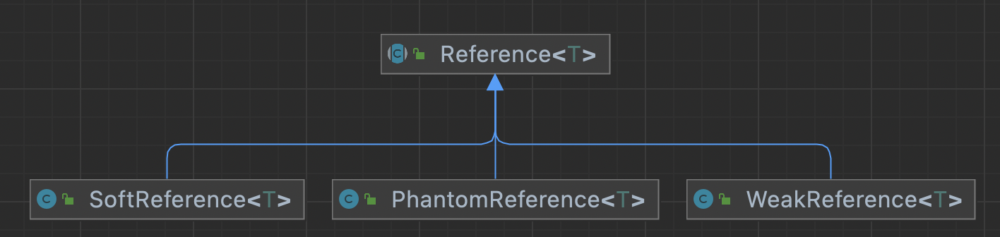

# Reference

- Java의 Reference를 나누어 놓은 이유는 효율적인 GC 처리를 위함이다.
- 개발자는 적절한 Reference 사용하여, GC에 의해 제거될 데이터에 우선순위를 적용하여 좀더 효율적인 메모리 관리를 하기 위해Reference의 종류를 나누어 제공한다.

## Strong Reference

- 스택영역의 변수에 직접 new 를 할당한 경우 strong 하게 연결되어 있다.

~~~java
Object strong = new Object();
strong = null; // strong 결합이 끊어져 gc대상이 된다.
~~~

## Soft Reference

- Strong객체를 인자로 받는 SoftReference 가 존재할 때,
- Strong객체가 strong reference 를 잃고, 시스템이 메모리가 부족하면 gc 대상이 된다.

~~~java
Object strong = new Object();
SoftReference<Object> soft = new SoftReference<>(strong);
strong = null;

System.gc();
Thread.sleep(3000);

System.out.println(soft.get()); // referent not null
~~~

## Weak Reference

- Strong객체를 인자로 받는 WeakReference 가 존재할 때,
- Strong객체가 strong reference 를 잃으면 gc에 의해 해제된다.

~~~java
Object strong = new Object();
WeakReference<Object> weak = new WeakReference<>(strong);
strong = null;

System.gc();
Thread.sleep(3000);

System.out.println(weak.get()); // get(): Reference's referent -> null
~~~

### WeakReference List 주의사항

~~~java
ChatRoom chatRoom = new ChatRoom();
User user1 = new User();
User user2 = new User();
chatRoom.addUser(user1);
chatRoom.addUser(user2);
chatRoom.sendMessage("hello");
user1 = null;

System.gc();
Thread.sleep(5000);
List<WeakReference<User>> users = chatRoom.getUsers();
~~~

- User 레퍼런스를 Null 처리 후 referent 는 null로 변경되었으나
  WeackReference 객체는 그대로 존재함. (**이를 관리하는 리스트를 따로 구현해야 한다.**)

## Phantom Reference

- Strong 결합이 깨져 gc에의해 해제될 경우, PhantomReference는 ReferenceQueue에 입력된다.

~~~java
  BigObject strong = new BigObject();
  ReferenceQueue<BigObject> rq = new ReferenceQueue<>();
  PhantomReference<BigObject> phantom = new PhantomReference<>(strong, rq);
  strong = null;

  System.gc();
  Thread.sleep(3000);

  System.out.println(phantom.isEnqueued());

  Reference<? extends BigObject> reference = rq.poll();

  reference.clear();
~~~

- isEnqueued() : PhantomReference 객체입력여부를 알 수 있다.

### 자원해제 후 작업

- BigObject 가 해제된 후 작업을 처리하도록 래핑클래스를 만들어 활용할 수 있다.

~~~java
public class BigObjectReference<BigObject> extends PhantomReference<BigObject> {
    
    public BigObjectReference(BigObject referent, ReferenceQueue<? super BigObject> q) {
        super(referent, q);
    }

    public void cleanUp() {
        System.out.println("clean up");
    }
}
~~~

~~~java
public static void main(String[] args) throws InterruptedException {
    BigObject strong = new BigObject();
    ReferenceQueue<BigObject> rq = new ReferenceQueue<>();
    BigObjectReference<BigObject> phantom = new BigObjectReference<>(strong, rq);
    strong = null;

    System.gc();

    Thread.sleep(3000L);
  
    System.out.println(phantom.isEnqueued());

    Reference<? extends BigObject> reference = rq.poll();
    BigObjectReference bigObjectCleaner = (BigObjectReference) reference;
    bigObjectCleaner.cleanUp();
    reference.clear();
}
~~~

## Reference

https://luckydavekim.github.io/development/back-end/java/phantom-reference-in-java

