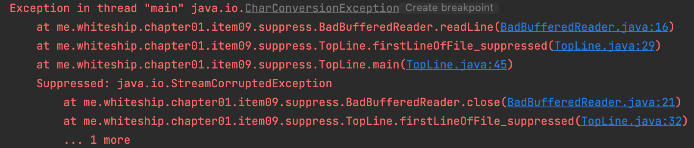

## try-catch with suppresed

~~~java
try (BufferedReader br = new BufferedReader(
        new FileReader(path))) {
    return br.readLine();
}
~~~

-  try-with-resource 의 바이트코드를 살펴보면, catch 로직에서 addSuppress 에 대한 힌트가 나온다.

~~~java
static String firstLineOfFile_suppressed(String path) throws IOException {
    BufferedReader br = new BadBufferedReader(new FileReader(path));

    String var2;
    try {
        var2 = br.readLine();
    } catch (Throwable var5) {
        try {
            br.close();
        } catch (Throwable var4) {
            var5.addSuppressed(var4);
        }

        throw var5;
    }

    br.close();
    return var2;
}
~~~

- addSuppressed 에 의해 예외내용이 스택에 쌓이게 되어 출력시 모든 예외가 출력됨을 알 수 있다.

