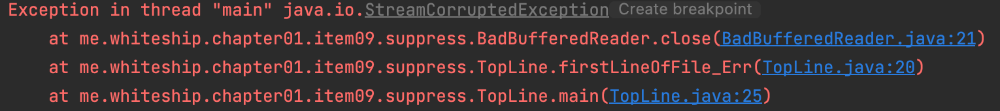
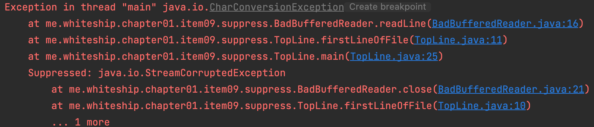

# Item09. Prefer try-with-resources to try-finally

- 자바 라이브리에는 close 메서드를 호출해 직접 닫아줘야 하는 자원이 많다.
- InputStream, OutputStream, java.sql.Connection 등이 좋은 예다.
- 자원 닫기는 클라이언트가 놓치기 쉬워서 예측할 수 없는 성능문제로 이어지기도 한다.
- 이런 자원 중 상당 수가 안전망으로 finalizer를 활용하고 있지만 finalizer는 그리 믿을만 하지 못하다(아이템 8)

## 전통적으로 자원이 제대로 닫힘을 보장하는 수단으로 try-finally가 쓰였다.

### try-catch 중첩 사용

~~~java
InputStream in = new FileInputStream(src);
try {
    OutputStream out = new FileOutputStream(dst);
    try {
        byte[] buf = new byte[BUFFER_SIZE];
        int n;
        while ((n = in.read(buf)) >= 0)
            out.write(buf, 0, n);
    } finally {
        out.close();
    }
} finally {
    in.close();
}
~~~

- 자원이 두개 이상이면 try-catch를 중첩해서 사용해야 하니, 복잡하다.

### 여러개 자원에대한 try-catch 주의사항

~~~java
InputStream in = new FileInputStream(src);
OutputStream out = new FileOutputStream(dst);
try {
    byte[] buf = new byte[BUFFER_SIZE];
    int n;
    while ((n = in.read(buf)) >= 0)
        out.write(buf, 0, n);
} finally {
    out.close();
    in.close();
}
~~~

- try-catch를 중첩하지 않고 사용하면, 가령 out.close() 에서 예외가발생한 경우,  in.close()는 시도도 하지 않아서 leak 발생 우려가 있다.
- [저자도 puzzler 라는 책에서 실수한 적이 있다.](./item09-puzzler.md)

### 여러 자원에 대한 try-with-resource 사용

~~~java
try (InputStream   in = new FileInputStream(src);
     OutputStream out = new FileOutputStream(dst)) {
    byte[] buf = new byte[BUFFER_SIZE];
    int n;
    while ((n = in.read(buf)) >= 0)
        out.write(buf, 0, n);
}
~~~

- 간결하고 보기좋다.
- Autocloseable 을 구현하 인스턴스만 가능하기 때문에 자원을 해제하기 좋다.

## try-catch 는 두번째 예외가 첫번째 예외를 집어삼킨다.

~~~java
public class BadBufferedReader extends BufferedReader {
    public BadBufferedReader(Reader in, int sz) {
        super(in, sz);
    }

    public BadBufferedReader(Reader in) {
        super(in);
    }

    @Override
    public String readLine() throws IOException {
        throw new CharConversionException();
    }

    @Override
    public void close() throws IOException {
        throw new StreamCorruptedException();
    }
}
~~~

### try-catch

~~~java
static String firstLineOfFile_Err(String path) throws IOException {
    BufferedReader br = new BadBufferedReader(new FileReader(path));
    try {
        return br.readLine();
    } finally {
        br.close();
    }
}
~~~

- readLine() 에서의 예외를 무시하고 마지막에 finally 의 close() 에대한 예외만 출력한다.

### try-with-resources

~~~java
static String firstLineOfFile(String path) throws IOException {
    try(BufferedReader br = new BadBufferedReader(new FileReader(path))) {
        return br.readLine();
    }
}
~~~

- 먼저 발생한 readline, 마지막에 발생한 close 에 대한 exception 스택을 잘 보여준다.

- 이러한 문제들은 자바7이 투척한 try-with-resource [JLS, 14.20.3] 덕에 모두 해결되었다.
- 이 구조를 사용하려면 해당 자원이 AutoCloseable 인터페이스를 구현해야 한다.
- [또한, 자바7에서 Throwable에 추가된 getSuppressed 메서드를 이용하면 프로그램 코드에서 가져올 수도 있다](./item09-suppressed.md).

### 정리

꼭 회수해야 하는 자원을 다룰때는 try-finally 말고 try-with-resources를 사용하자

예외는 없다. 코드는 더 짧고 분명해지고, 만들어지는 예외정보도 훨씬 유용하다.
try-finally로 작성하면 실용하지 못할만큼 코드가 지저분해지는 경우라도, try-with-resources로는 정확하고 쉽게 자원을 회수할 수 있다.

