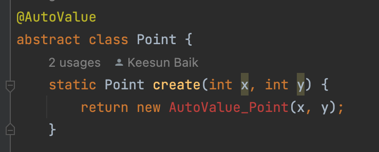

# Item 10. Obey the general contract when overriding equals

## 정의하지 않아도 될 때 (필요하지 않으면 재정이 하지 마라)

- **각 인스턴스가 본질적으로 고유하다.**
  값을 표현하는 게 아니라 동작하는 개체를 표현하는 클래스가 여기 해당한다.
  Thead가 좋은 예로, Object의 equals메서드는 이러한 클래스에 딱 맞게 구현되었다.
  **=> singleton, Enum**
- **인스턴스의 논리적 동치성(logical equality)을 검사할 일이 없다.**
  예컨대 java.util.regex.Pattern은 equals를 재정의해서 pattern의 인스턴스가 같은 정규표현식을 나타내는지를 검사하는, 즉 논리적 동치성을 검사하는 방법도 있다. 하지만 설계자는 클라이언트가 이 방식을 원하지 않거나 애초에 필요하지 않다고 판단할 수도 있다. 설계자가 후자로 판단했다면 Object의 기본 equals만으로 해결된다.
  **=> 문자열**

- **상위 클래스에서 재정의한 equals가 하위 클래스에도 딱 들어맞는다.**
  예컨대 대부분의 Set구현체는 **AbstractSet**이 구현한 equals를 상속받아 쓰고, List 구현체들은 AbstractList로부터 **AbstractList**로부터, Map 구현체들은 **Abstractmap**으로부터 상속받아 그대로 쓴다.
- **클래스가 private이거나 package-private이고 equals 메서드를 호출할 일이 없다.**
  여러분이 위험을 철저히 회피하는 스타일이라 equals가 실수로라도 호출되는 걸 막고 싶다면 Assert 등의 예외를 사용하자.

## equals를 재정의해야 할 때는 언제일까?

객체 식별성(object identity; 두 객체가 물리적으로 같은가)이 아니라 논리적 동치성을 확인해야 하는데,
상위 클래스의 equals가 논리적 동치성을 비교하도록 재정의되지 않았을 때다.
주로 [값 클래스](./item10-value-based-class.md)들이 여기 해당한다.

**값 클래스란 Integer와 String처럼 값을 표현하는 클래스**를 말한다.
두 값 객체를 equals로 비교한느 프로그래머는 객체가 같은지가 아니라 값이 같은지 알고 싶어할 것이다.

Enum(아이템 34)도 여기에 해당한다.
이런 클래스는 어차피 논리적으로 같은 인스턴스가 2개이상 만들어지지 않으니 논리적 동치성과 객체 식별성이 사실상 똑같은 의미가 된다.
따라서 Object 의 equals가 논리적 동치성까지 확인해준다고 볼 수 있다.

equals메서드를 재정의할 때는 반드시 일반규약을 따라야 한다.
다음은 Object명세에 적힌 규약이다.

**equals메서드는 동치관계(equivalence relation)를 구현하며, 다음을 만족한다.**

- 반사성(reflexivity) : null이 아닌 모든 참조값 x에 대해, x.equals(x)는 true다.
  - **A.equals(A) == true**

- 대칭성(symmetry): null이 아닌 모든 참조값 x,y에 대해, x.equals(y)가 true면 y.equals(x)도 true다.
  -  **A.equals(B) == B.equals(A)**

- 추이성(transitivity): null이 아닌 모든 참조값 x,y,z에 대해, x.equals(y) 가 true이고 y.equals(z) 도 true이면,
  x.equals(z) 도 true다.
  - **A.equals(B) && B.equals(C), A.equals(C)** 
  - Point, ColorPoint(inherit), CounterPointer, ColorPoint(comp) 

- 일관성(consistency): null이 아닌 모든 참조 값 x,y에 대해, x.equals(y)를 반복해서 호출하면 항상 true를 반환하거나 항상 false를 반환한다.
  - **A.equals(B) == A.equals(B)** 

- null-아님: null이 아닌 모든 참조 값 x에 대해, x.equals(null)은 false이다.
  - **A.equals(null) == false**

한 클래스의 인스턴스는 빈번히 다른곳으로 전달된다.
그리고 컬렉션 클래스들을 포함해 수많은 클래스는 전달받은 객체가 equals 규약을 지킨다고 가정하고 동작한다.

규약을 이해해 보자
Object명세에서 말하는 동치관계란 무엇일까?
집합을 서로 같은 원소들로 이뤄진 부분집합으로 나누는 연산이다.
이 부분집합을 동치류(equivalence class; 동치클래스)라고 한다.
equals메서드가 쓸모 있으려면 모든 원소가 같은 동치류에 속한 어떤 원소와도 서로 교환할 수 있어야 한다.

### 반사성

단순히 말하면 객체는 자기 자신과 같아야 한다는 뜻이다.
이 요건을 어긴 클래스의 인스턴스를 컬렉션에 넣은 다음 contains메서드를 호출하면 방금 넣은 인스턴스가 없다고 나온다.

### 대칭성

두 객체는 서로에 대한 동치여부에 똑같이 답해야 한다는 것이다. 

~~~java
@Override public boolean equals(Object o) {
    if (o instanceof CaseInsensitiveString)
        return s.equalsIgnoreCase(
                ((CaseInsensitiveString) o).s);
    if (o instanceof String)  // 한 방향으로만 작동한다.
        return s.equalsIgnoreCase((String) o);
    return false;
}
~~~

- CaseInsensitiveString의 equals 는 String을 알지만 String은 CaseInsensitiveString를 모르기에 equlas 호출 시대칭성이 위배된다.

~~~java
List<CaseInsensitiveString> list = new ArrayList<>();
list.add(cis);
System.out.println(list.contains(polish));
~~~

- jvm17 에서는 False가 나오지만, 구현방법에 따라 결과가 다르게 나올 것이다.

~~~java
  @Override public boolean equals(Object o) {
      if (o instanceof CaseInsensitiveString)
          return s.equalsIgnoreCase(((CaseInsensitiveString) o).s);
      return false;
  }
~~~

- string 비교를 제외하면 자연스레 해결된다.

### 추이성

첫 번째 객체와 두번째객체가 같고 두번째 각체와 세번째 객체가 같다면, 첫번째,세번째 객체가 같아야 한다.

### Pointer 상속 시 대칭성 위반

- ColorPoint 일 경우 색상까지 비교하도록 변경한다,

~~~java
@Override public boolean equals(Object o) {
    if (!(o instanceof ColorPoint))
        return false;
    return super.equals(o) && ((ColorPoint) o).color == color;
}
~~~

~~~java
Point p = new Point(1, 2);
ColorPoint cp = new ColorPoint(1, 2, Color.RED);
System.out.println(p.equals(cp) + " " + cp.equals(p));
~~~

- pointer는 좌표만 비교하기에 true 지만 ColorPoint일경우는 Pointer 를 검사할 수 없으므로 False 가 나온다.

### Pointer 상속 시 추이성 위반 코드

- 위 코드를 개선하여, Point 에 대한 경우, Pointer.equals 를 호출하도록 변경한다.

~~~java
@Override public boolean equals(Object o) {
    if (!(o instanceof Point))
        return false;

    // o가 일반 Point면 색상을 무시하고 비교한다.
    if (!(o instanceof ColorPoint))
        return o.equals(this);

    // o가 ColorPoint면 색상까지 비교한다.
    return super.equals(o) && ((ColorPoint) o).color == color;
}
~~~

~~~java
  ColorPoint p1 = new ColorPoint(1, 2, Color.RED);
  Point p2 = new Point(1, 2);
  ColorPoint p3 = new ColorPoint(1, 2, Color.BLUE);
  System.out.printf("%s %s %s%n",  p1.equals(p2), p2.equals(p3), p1.equals(p3));
~~~

- 첫번째 두번째는 좌표를 비교하므로 true 이지만
- 세번째는 색상까지 비교하게 되므로 false가 출력된다.

### 사실 이 현상은 모든 객체지향언어의 동치관계에서 나타나는 근본적인 문제다.

### 구체 클래스를 확장해 새로운 값을 추가하면서 equals규약을 만족시킬 방법은 존재하지 않는다.
객체지향적 추상화의 이점을 포기하지 않은 한은 말이다.

### 이말은 얼핏 equals안의 instanceof 검사를 getClass검사로 바꾸만 된따는 뜻으로 들린다.

~~~java
// Point 의 equals 재정의
@Override public boolean equals(Object o) {
    if (o == null || o.getClass() != getClass())
        return false;
    Point p = (Point) o;
    return p.x == x && p.y == y;
}
~~~

~~~java
public class CounterPoint extends Point {
    private static final AtomicInteger counter =
            new AtomicInteger();

    public CounterPoint(int x, int y) {
        super(x, y);
        counter.incrementAndGet();
    }
    public static int numberCreated() { return counter.get(); }
}
~~~

- Point 의 equals 를 그대로 상속받아 사용한다.

~~~java
public class CounterPointTest {
    // 단위 원 안의 모든 점을 포함하도록 unitCircle을 초기화한다. (58쪽)
    private static final Set<Point> unitCircle = Set.of(
            new Point( 1,  0), new Point( 0,  1),
            new Point(-1,  0), new Point( 0, -1));

    public static boolean onUnitCircle(Point p) {
        return unitCircle.contains(p);
    }

    public static void main(String[] args) {
        Point p1 = new Point(1,  0);
        Point p2 = new CounterPoint(1, 0);
//        Point p2 = new me.whiteship.chapter02.item10.composition.ColorPoint(1,0, Color.RED).asPoint();

        // true를 출력한다.
        System.out.println(onUnitCircle(p1));
        System.out.println(onUnitCircle(p2));
...
}
~~~

- true, false
- Set 에서 contains 를 비교할 때 타입을 비교하게 되는데, CounterPoint 는 equals 입장에서 Point와 같지 않기 때문에 false가 출력된다.
  추가적으로 [리스코프 원칙 위반](./item10-LSP.md) 코드이기도 하다.

리스코프치환원칙에 따르면, 어떤 타입에 있어 중요한 속성이라면 그 하위타입에서도 마찬가지로 중요하다. 따라서 그 타입의 모든 메서드가 하위타입에서도 똑같이 잘 동작해야 한다.

이는 앞서의 "Point의 하위클래스는 정의상 여전히 Point므로 어디서든지 Point로써 활용될 수 있어야 한다"를 말한다.

그런데 CounterPoint의 인스턴스를 onUnitCircle 메서드에 넘기면 어케될까
pOint 클래스의 equals를 getClass를 사용해 작성했다면 onUnitCircle은 무조건 false를 반환할 것이다.
우너인은 컬렉션 구현체에서 주어진 원소를 담고 있는지를 확인하는 방법에 있다.
onUnitCircle에서 사용한 Set을 포함하여 대부분의 컬렉션은 이 작업에 equals메서드를 이용하는데, CounterPoint 인스턴스는 어떤 Point와도 다르기 때문이다. 
반면 Point의 equals를 instanceof 기반으로 올바르게 구현했다면 CounterPoint인스턴스를 건네줘도 onUnitCircle 메서드가 제대로 동작할 것이다.ㄷ2

### java api 에서도 상속관계에 대한 대칭성이 깨져 있는상태이다.

~~~java
  long time = System.currentTimeMillis();
  Timestamp timestamp = new Timestamp(time); // nanoseconds 필드 추가 후 equals에 반영함.
  Date date = new Date(time);

  System.out.println(date.equals(timestamp));
  System.out.println(timestamp.equals(date));
~~~

- **상속한 클래스에서 필드가 추가되었을 경우, 해당 필드를 커버 하면서 equals 를 규약에 맞게 만들수 있는 방법은 없다.**

### **구체클래스의 하위 클래스에서 값을 추가할 방법은 없지만 괜찮은 우회 방법이 있다.**

- 상속 대신 **컴포지션을** 사용하라 는 **아이템 18**의 조언을 따르면 된다.

~~~java
public class ColorPoint {
    private final Point point; // 상속하지 않고 필드에 정의한다.
    private final Color color;

    public ColorPoint(int x, int y, Color color) {
        point = new Point(x, y); // 객체 생성 시 point를 생성한다.
        this.color = Objects.requireNonNull(color);
    }

    /**
     * 이 ColorPoint의 Point 뷰를 반환한다.
     */
    public Point asPoint() {
        return point;
    }

    @Override public boolean equals(Object o) {
        if (!(o instanceof ColorPoint))
            return false;
        ColorPoint cp = (ColorPoint) o;
        return cp.point.equals(point) && cp.color.equals(color);
    }

    @Override public int hashCode() {
        return 31 * point.hashCode() + color.hashCode();
    }
}
~~~

- 결과가 잘 나온다.

### 일관성

- 불변성 인경우 무조건 지켜져야 한다.
- 가변성인 경우

~~~java
        URL google1 = new URL("https", "about.google", "/products/");
        URL google2 = new URL("https", "about.google", "/products/");
        System.out.println(google1.equals(google2));
~~~

- 도메인으로 URL 을 생성한 경우, ipaddress 가 같을지는 알 수 없다. (복잡한 필드는 안하는 걸 권장)

### null-아님

- null-아님은 모든 객체가 null과 같지 않아야 한다는 뜻이다.
- null 체크는 할 필요 없이 인스턴스 체크 시 올바른 타입이 아니라면 false 를 리턴할 것이다.

~~~java
System.out.println(google1.equals(null)); // false
~~~

- null 은 false.

### equals 메서드 구현방법을 단계별로 정리해보겠따.

1. == 연산자를 사용해 입력이 자기 자신의 참조인지 확인한다.
   자기 자신이면 true를 반환한다. 이는 단순한 성능 최적화용으로, 비교작업이 복잡한 상황일 때 값어치를 할 것이다.
2. instanceof 연산자로 입력이 올바른 타입인지 확인한다.
   그렇지 않으면 false를 반환한다.

3. 입력을 올바른 타입으로 형변환한다.
   앞서 2번에서 instanceof 검사를 했기 때문에 이 단계는 100%성공한다.
4. 입력객체와 자기자신이 대응되는 핵심 필드들이 모두 일치하는지 하나씩 검사한다.
   모든 필드가 일치하면 true, 아니면 false.
   2단계에서 인터페이스를 사용했다면 입력의 필드값을 가져올 때도 그 인터페이스의 메서드를 사용해야 한다.
   타입이 클래스라면 (접근권한에 따라) 해당 필드에 직접 접근할 수도 있다.

### 부동소수점 equals <추가공부>

float, double을 제외한 기본타입 필드는 == 연산자로 비교하고, 참조타입 필드는 각각의 equals 메서드로, float와 double 필드는 각각 정적 메서드인 Float.compare(float, float)와 **Double.compare(double, double)**로 비교한다.
float와 double을 특별취급하는 이유는 Float.NaN, -0.0f, 특수한 부동소수 값 등을 다뤄야 하기 때문이다.

자세한 설명은 JLS 15.21.1 이나 Float.equals의 API문서를 참고하자.
Float.equals와 Double.equals 메서드를 대신 사용할 수 도 있지만 이 메서드들은 오토박싱을 수반할 수 있으니 성능이 좋지 않다.
배열 필드는 원소 각각을 앞서의 지침대로 비교한다.
배열의 모든 원소가 핵심 필드라면 Arrays.equals 메서드들 중 하나를 사용하자.

### Objects.equals

때론 null도 정상값으로 취급하는 참조타입필드도 있다.
이런 필드는 정적메서드인 Objects.equals(Object, Object)로 비교해 NPE 발생을 예방하자.

~~~java
Objects.equals(null, null); // true;
~~~

- equals를 재정의할 땐 hashcode도 반드시 재정의하자 (아이템 11)
- 너무 복잡하게 해결하려 들지 말자.
  필드들의 동치성만 검사해도 equals규약을 어렵지 않게 지킬 수 있다.
  별칭은 비교하지 않는게 좋다. 예를들어 File의 싦볼릭링크를 비교하는 건 안하는게 낫다 (실제로 안한다)
- Object외의 타입을 매개변수로 받는 equals메서드는 선언하지 말자. (@Override)

equals를 작성하고 테스트하는 일은 지루하고 뻔하다.
이걸 해주는게 구글의 **AutoValue** 프레임워크다.
클래스에 애너테이션 하나만 추가하면 AutoVAlue가 이 메서드들을 알아서 작성해준다.
IDE보다 좋다. 그런데 사람보다는 낫다.

- @AutoValue 가 equals, hashcode 코드를 구현해준다 (테스트도 지원해주느다) 

## 핵심정리

꼭 필요한 경우가 아니면 equals를 재정의하지 말자.
많은경우에 Object의 equals가 여러분이 원하는 비교를 정확히 수행해 준다.
재정의 할때는 그 클래스의 핵심필드 모두를 빠짐없이, 다섯가지 규약을 확실히 지켜가며 비교해야 한다.

