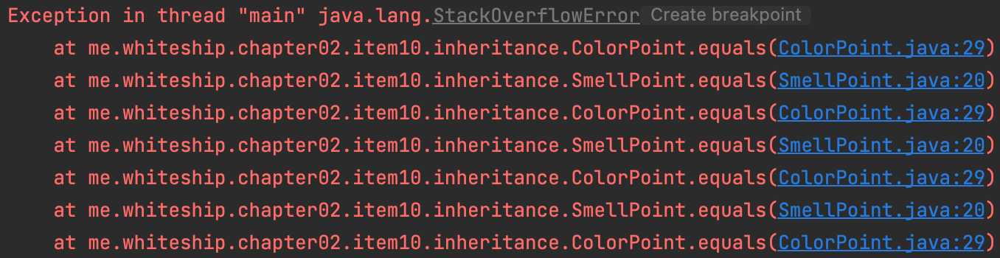
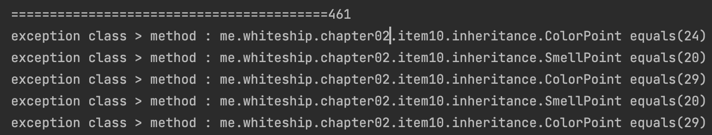
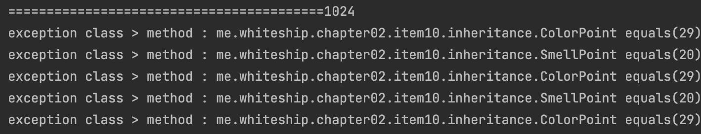

# Stackoverflow

- 스택은 스레드마다 사용할 수 있다.

​       **-> <추가학습> JVM 관점에서, 스레드관점에서 스택프레임 예제를 짜보자.**

- 메소드 호출시, 스택에 스택 프레임이 쌓인다.
- 스택 프레임에 들어있는 정보: 메소드에 전달하는 매개변수, 메소드 실행 끝내고 돌아갈 곳, 힙에 들어있는 객체에 대한 레퍼런스 등등.
  - 더이상 스택 프레임을 쌓을 수 없다면? StackOverflowError 발생.
- 스택의 사이즈를 조정하고 싶다면 -Xss1M 옵션을 추가한다.
- https://docs.oracle.com/cd/E13150_01/jrockit_jvm/jrockit/jrdocs/refman/optionX.html

## 추이성 위반 코드의 stackoverflow 취약점

- Point 의 상속 클래스 SmellPoint 를 추가하고, ColorPoint와 동일한 방식의 equals를 구현한다.
- 두 자식클래스의 인스턴스를 생성하고 equals로 서로를 비교한다.
- 인자가Point 가 아니고 자기자신도 아닐경우 다시 equals를 요청하므로 서로 무한 핑퐁하는 상태가 된다.

~~~java
public class ColorPoint extends Point {
  ...
	@Override public boolean equals(Object o) {
        if (!(o instanceof Point))
            return false;

        // o가 일반 Point면 색상을 무시하고 비교한다.
        if (!(o instanceof ColorPoint))
            return o.equals(this); // SmellPointd 의 equals 를 호출한다.

        // o가 ColorPoint면 색상까지 비교한다.
        return super.equals(o) && ((ColorPoint) o).color == color;
    }
  ...
}
~~~

~~~java
public class SmellPoint extends Point {
...
@Override public boolean equals(Object o) {
        if (!(o instanceof Point))
            return false;

        // o가 일반 Point면 색상을 무시하고 비교한다.
        if (!(o instanceof SmellPoint))
            return o.equals(this); // ColorPoint의 equals 를 호출한다.

        // o가 ColorPoint면 색상까지 비교한다.
        return super.equals(o) && ((SmellPoint) o).smell.equals(smell);
    } 
...
}
~~~

~~~java
public class SmellPointTest {

    public static void main(String[] args) {
        SmellPoint p1 = new SmellPoint(1, 0, "sweat");
        ColorPoint p2 = new ColorPoint(1, 0, Color.RED);
//        Thread.setDefaultUncaughtExceptionHandler(new CustomUncaughtExceptionHandler());

        p1.equals(p2);
    }
}

~~~

### stack trace test (jdk11)

- thread stack size를 최소단위 부터 늘려가며 테스트 했는데, 1024개 에서 늘어나지 않는다.
- **<추가학습> 이유를 찾아보자** 

- option: -Xss144k

~~~java
// 트레이스 출력을 커스텀한
Thread.setDefaultUncaughtExceptionHandler(new CustomUncaughtExceptionHandler());
~~~

- 461개

- option: -Xss10M
- 1024개

