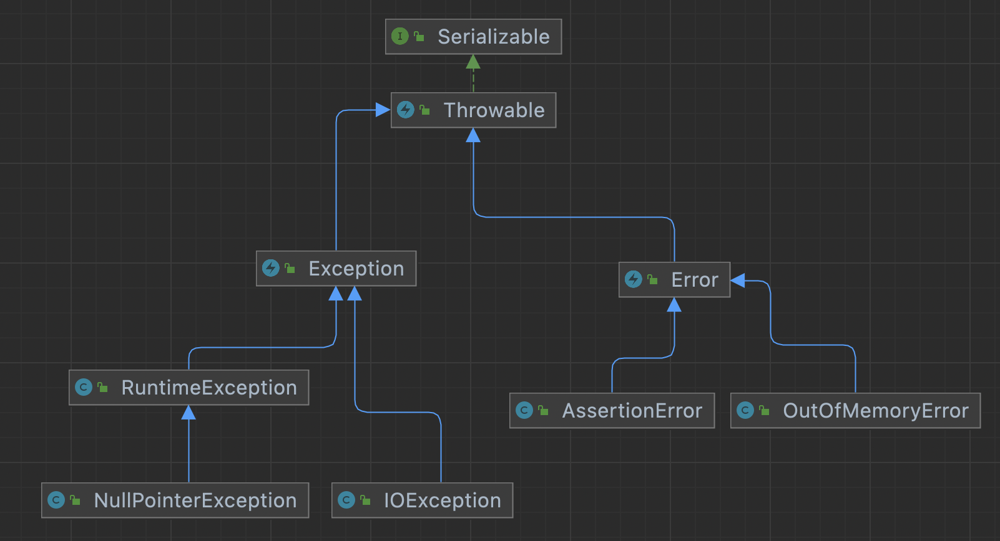

# Unchecked Exception

- checked/unchecked Exception 은 언제 사용하는가.

## unchecked exception

### RuntimeException

- RuntimeException 을 구현한 클래스를 throw 하면 unckecked exception 이 발생한다.

~~~java
class MyRuntime extends RuntimeException { }
~~~

~~~java
public void runtimeHello(String name) throws MyRuntime {
        throw new MyRuntime();
}
~~~

- throw new를 작성해도, 호출자에서 catch 의무가 없다.
  - catch를 안하게 되면 스레드가 종료된다.
- catch를 해서 예외를 처리할 수도 있다.

### Error

- Error 도 unchecked exception으로 동작한다.
- https://docs.oracle.com/javase/tutorial/essential/exceptions/runtime.html

## checked exception

- Exception 을 구현한 클래스를 throw 하면 ckecked exception 이 발생한다.

~~~java
class MyException extends Exception { }
~~~

~~~java
public void hello(String name) throws MyException {
	throw new MyException();
}
~~~

- throw new로 예외를 생성하면, try-catch 구문으로 처리하거나 throws 하여 호출자가 처리하도록 해야 한다.
- 호출자는 throws 된 예외를 catch 하여 처리해야 한다.

### 언제 사용하나 ?

- unchecked exception 은 예외를 처리하지 않아도 되서 편리하긴 하다. 하지만 편리해서 RuntimeException 을 쓰면 안된다.
- checked exception 은 client가 복구할 수 있는, 일종의 API 이다. 
  ( catch 에서 정보를 수정하고 재요청을 하거나 client가 특정 예외를 알게 하는 것이다. )
- 복구할 수 없다면 unchecked exception 으로 처리하자.
  - 코드가 복잡하지 않아서 좋음.
  - 어차피 복구할 방법이 없기에 catch가 무의미 하다.
- [예외처리를 남발하면 성능에 영향이 미칠 수 있으므로 주의해야 한다.](../../99-issue/checked-exception-performance.md)

