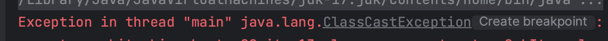

# Item 13. Override clone judiciously

- Cloneable 인터페이스가 있다. 내부에 clone() 가 없다. Object.java에 있다.
  - Cloneable의 경우에는 상위 클래스에 정의된 protected 메서드의 동작방식을 변경한 것이라고 한다.
- 그런데, Cloneable 없이 clone 를 구현하려하면 CloneNotSupportedException 가 발생하는 이상한 기능이 있다.

~~~java
// java.lang.Cloneable
public interface Cloneable { }
~~~

~~~java
// java.lang.Object
protected native Object clone() throws CloneNotSupportedException;
~~~

## clone 규약

- x.clone() != x 반드시 true 
- x.clone().getClass() == x.getClass() 반드시 true
- x.clone().equals(x) true가 아닐 수도 있다. (id 등) 
  - **애매한 규약이다**

## 불변객체 clone

### 불변 객체라면 다음으로 충분하다. 

- Cloenable 인터페이스를 구현하고 
- clone 메서드를 재정의한다. 이때 super.clone()을 사용해야 한다.
- Object를 자기자신 클래스로 바꾸어주고
- protected 를 public 으로 바꿔준다.

### clone을 기본 형태로 사용하지 않는 이유

~~~java
@Overrid
protected Object clone() throws CloneNotSupportedException {
    return super.clone();
}
~~~

~~~java
@Override
public PhoneNumber clone() {
    try {
        return (PhoneNumber) super.clone();
    } catch (CloneNotSupportedException e) {
        throw new AssertionError();  // 일어날 수 없는 일이다.
    }
}
~~~

- protected -> public
  - 보통 clone 을 사용하는건 외부 class일텐데, protected 제한은 기능이 상당히 제한될 것이다.
- return type 
  - java는  **공변 반환 타이핑 (covariant return typing)** 을 지원하므로 사용 가능하고(**override**)
  - clone을 호출한 쪽에서 형변환 하지 않아도 되므로 편리하다.
- throws CloneNotSupportedException
  - 해당 예외는 어차피 후처리 해줄 수 없으므로 RuntimeExecption 으로 다시 던져주는게 좋다.

### super.clone을 호출하지 않는 경우

~~~java
public class Item implements Cloneable {

    private String name;

    @Override
    public Item clone() {
        Item item = new Item();
        item.name = this.name;
        return item;
    }
}
~~~

~~~java
public class SubItem extends Item implements Cloneable {

    private String name;

    @Override
    public SubItem clone() { return (SubItem)super.clone(); }

    public static void main(String[] args) {
        SubItem item = new SubItem();
        SubItem clone = item.clone();
    }
}
~~~

- Item class 는 SubItem 으로 형변환할 수 없기 때문에 에러가 발생한다.

### super.clone 호출로 변경

~~~java
public class Item implements Cloneable {

    private String name;

    @Override
    public Item clone() {
        try {
            Item item = (Item) super.clone();
            return item;
        } catch (CloneNotSupportedException e) {
            throw new RuntimeException(e);
        }
     }
}
~~~

~~~java
public class SubItem extends Item implements Cloneable {

    private String name;

    public static void main(String[] args) {
        SubItem item = new SubItem();
        SubItem clone = (SubItem)item.clone();

        System.out.println(clone != item); // true
        System.out.println(clone.getClass() == item.getClass()); // true
        System.out.println(clone.equals(item)); // false
    }
}
~~~

- clone.getClass() == item.getClass() 가 true 이므로, clone 결과가 SubItem 으로 리턴되었다는 것이다.
- **clone  은 생성자를 거치지 않고 Object가 내부적으로 복제를 해주는 방식이다.**

## 가변객체 clone

- 인스턴트 내부에 값이 변경되는, 가령 배열이 존재한다고 할때의 clone사용에 대해 알아보자.

### 배열 copy

### 1. super.copy

~~~java
// stack
@Override public Stack clone() {
    try {
        Stack result = (Stack) super.clone();
        return result;
    } catch (CloneNotSupportedException e) {
        throw new AssertionError();
    }
}
~~~

- Object[] elements에 대해서 객체만 shallow copy 하기 때문에, 배열이 공유된다.

### 2. elements.clone

~~~java
// stack
@Override public Stack clone() {
  try {
      Stack result = (Stack) super.clone();
      result.elements = elements.clone();
      return result;
  } catch (CloneNotSupportedException e) {
      throw new AssertionError();
  }
}
~~~

- 배열을 clone 하면, 재귀적으로 모든 배열을 복사해준다.

- 하지만, 배열의 내용은 shallow copy 를 하기때문에, 내부에 값을 바꾸면 결국 의미가 없다.

  ~~~java
  System.out.println(stack.elements[0] == copy.elements[0]); // true
  ~~~

### 

## HashTable clone

~~~java
public class HashTable implements Cloneable {

    private Entry[] buckets = new Entry[10];

    private static class Entry {
        final Object key;
        Object value;
        Entry next;

        Entry(Object key, Object value, Entry next) {
            this.key = key;
            this.value = value;
            this.next = next;
        }
...
}
~~~

### shallow copy

~~~java
@Override
public HashTable clone() {
    HashTable result = null;
    try {
        result = (HashTable)super.clone();
        result.buckets = this.buckets.clone();
        return result;
    } catch (CloneNotSupportedException e) {
        throw  new AssertionError();
    }
}
~~~

복제본은 자신만의 버킷배열을 갖지만, shallow copy를 한다.
해결을 위해 버킷의 모든 연결리스트를 복사해야 한다.

### deep copy

~~~java
@Override
public HashTable clone() {
    HashTable result = null;
    try {
        result = (HashTable)super.clone();
        result.buckets = new Entry[this.buckets.length];

        for (int i = 0 ; i < this.buckets.length; i++) {
            if (buckets[i] != null) {
                result.buckets[i] = this.buckets[i].deepCopy();
            }
        }
        return result;
    } catch (CloneNotSupportedException e) {
        throw  new AssertionError();
    }
}
~~~

### deep copy - 재귀

~~~java
public Entry deepCopy() {
    return new Entry(key, value, next == null ? null : next.deepCopy());
}
~~~

- 재귀호출 때문에 리스트의 원소 수만큼 스텍 프레임을 소비하여, 리스트가 길면 stackoverflow가 발생할 수 있다.
  (반복자 사용으로 대체.)

###  deep copy - 반복자

~~~java
// Entry class 
public Entry deepCopy() {
    Entry result = new Entry(key, value, next);
    for (Entry p = result ; p.next != null ; p = p.next) {
        p.next = new Entry(p.next.key, p.next.value, p.next.next);
    }
    return result;
}
~~~

### 고수준 메서드 사용

super.clone 으로 얻은 객체 모든 필드를 초기상태로 설정한 다음
원본 객체의 상태를 다시 생성하는 고수준 메서드들을 호출해 내용이 같게 만들어준다.
장점은 우아한 코드를 얻는다 하지만 상대적으로 느리다.

또한 Cloneable 아키텍처의 기초가 되는 필드단위의 객체복사를 우회하기 때문에 전체Cloneable 아키텍처와는 어울리지 않는 방식이기도 하다.

## 주의사항

1. 클론 만들때 내부에서 사용하는  함수가 하위 클래스에서 재정의하도록 만들면 안된다.
   - 하위클래스가 오버라이딩 하면 동작이 바뀔수 있기때문에 막아야 한다 (final)
2. 상속을 의도한 계층구조로 만들 때 Cloneable 은 사용 안하는게 좋다.
   확장 시 고민에 빠지게 된다. 작성했다면,
   - 구현을 먼저 해줘서 하위 클래스에서 구현을 안해도 되게 하던가
   - final로 해서 재정의를 못하게 하면 좋다.
3. 멀티스레드에서 만들어야 한다면 clone 앞에 synchronization 있어야 함.

## 현실적으론 복사생성자를 사용하자.

- 인터페이스 기반 복사 생성자와 복사펙터리의 더 정확한 이름은 변환생성자(conversion constructure)와 변환팩터리 (conversion factory) 이다. 

- 생성자를 통해서 생성하게 됨. (클론은 생성자 없이 만듬)
- 생성자는 final 잇어도 됨. (클론은 final 이면 가변객체일때 변경을 못해줌.)
- **TreeSet**은 collections 하위 모든 타입을 받을 수 잇는게 장점

  ~~~java
  Set<String> hashSet = new HashSet<>();
  hashSet.add("one");
  hashSet.add("two");
  System.out.println("HashSet: " + hashSet);
  
  Set<String> treeSet = new TreeSet<>(hashSet);
  System.out.println("TreeSet: " + treeSet);
  ~~~

  ~~~java
  public TreeSet(Collection<? extends E> c) {
      this();
      addAll(c);
  }
  ~~~

  - 생성자 생성 후, copy를 진행한다. 즉, 복사생성자 방식임.

~~~java
public PhoneNumber(PhoneNumber phoneNumber) {
    this(phoneNumber.areaCode, phoneNumber.prefix, phoneNumber.lineNum);
}
~~~

- 일반적으론 위와같이 복사생성자를 만들면 좋다.

## 정리

- Cloneable이 몰고 온 모든 문제를 되집어봤을 때, 새로운 인터페이스를 만들 때는 절대 Cloneable을 확장해서는 안되며, 새로운 클래스도 이를 구현해서는 안된다.
- Final 클래스라면 Cloneable을 구현해도 위험이 크지 않지만, 성능 최적화 관점에서 검토하 후 별다른 문제가 없을때만 드물게 허용해야 한다 (아이템 67)
- 기본원칙은 복제기능은 생성자와 팩터리를 이용하는게 최고 라는 것이다.
- 단, 배열만은 clone 메서드 방식이 가장 깔끔한, 이 규칙의 합당한 예외라고 할 수 있다.

