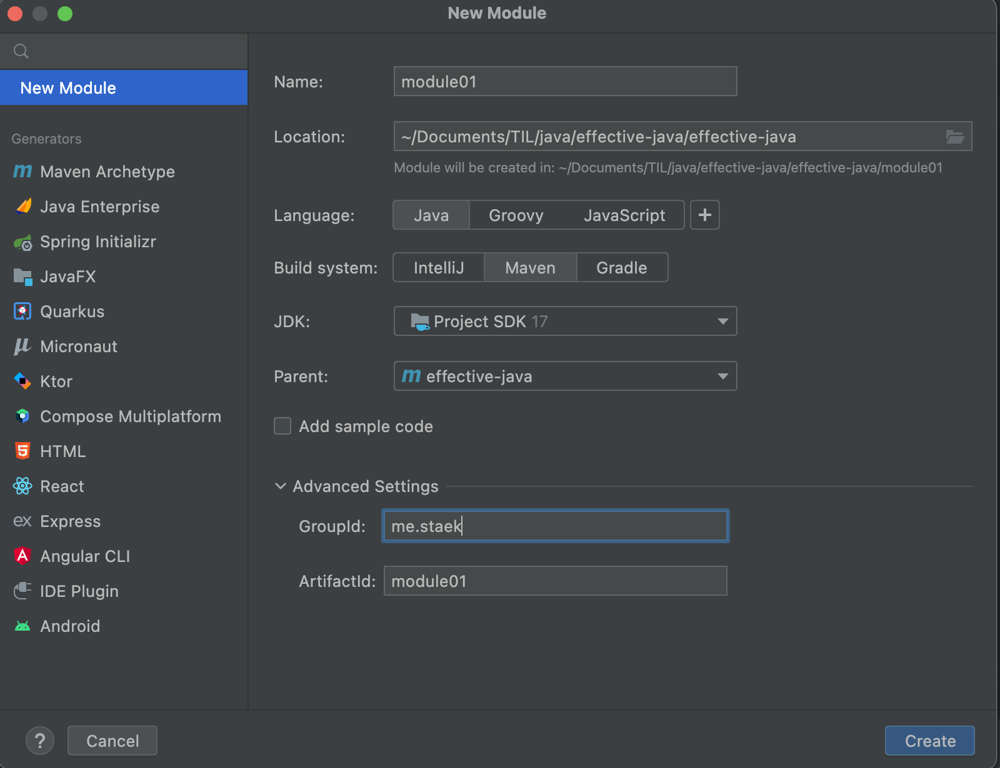

# java module

- java9에 등장한 module 을 만들어보자.
- module 2개를 만들어 module간의 의존성관계를 알아보자.
- module 과 module이 아닌 소스와의 의존성 관계를 알아보자.


- project 우클릭 > new > module 




## module01 생성

### module-info.java 생성

- src > main > java 에 module-info.java  생성 후 
- 모듈 이름을 아래와 같이 지정해준다.

~~~java
module module01 {
}
~~~


### 생성한 모듈 터미널에서 실행

- maven clean, install 진행

~~~sh
$ java --module-path module01/target/module01-1.0-SNAPSHOT.jar --module module01


# result
# module01의 main을 지정해주어야 한다.
module module01 does not have a ModuleMainClass attribute, use -m <module>/<main-class>

$ java --module-path module01/target/module01-1.0-SNAPSHOT.jar --module module01/me.staek.Module01

# result
hello module01
~~~


### pom.xml > build > plugin

- module의 main 을 지정해주면, 실행할 때 따로 지정 안해도 된다.

~~~xml
<plugin>
    <groupId>org.apache.maven.plugins</groupId>
    <artifactId>maven-jar-plugin</artifactId>
    <version>3.2.2</version>
    <configuration>
        <archive>
            <manifest>
                <mainClass>me.staek.Module01</mainClass>
            </manifest>
        </archive>
    </configuration>
</plugin>
~~~

~~~sh
$ java --module-path module01/target/module01-1.0-SNAPSHOT.jar --module module01

# result
hello module01
~~~


## module02 생성

- module01에서 module02의 인스턴스를 생성하여 메서드를 호출해보자.

### module-info.java 생성

- src > main > java 에 module-info.java  생성 후 
- 모듈 이름을 아래와 같이 지정해준다.

~~~java
module module02 {
}
~~~


### class 생성

```java
public class Module02 {
    public void helloModule02() {
        System.out.println("hello module02 !!");
    }
}
```


### pom.xml 수정 (module02)

~~~xml
<artifactId>module02</artifactId>
<groupId>me.staek</groupId>
<version>1.0-SNAPSHOT</version>
~~~


## module02 생성 및 의존성 테스트

- 테스트 시 maven clean, install 은 module02, module01 순서로 진행해준다.


### pom.xml 의존성 추가 (module01)

~~~xml
<dependencies>
    <dependency>
        <artifactId>module02</artifactId>
        <groupId>me.staek</groupId>
        <version>1.0-SNAPSHOT</version>
    </dependency>
</dependencies>
~~~


### module export 추가 (module02)

~~~java
module module02 {
    exports me.staek.module02;
}
~~~

### module requires 추가 (module01)

~~~java
module module01 {
    requires module02;
}
~~~


### 테스트 (module01)

~~~java
import me.staek.module02.Module02;

public class Module01 {
    public static void main(String[] args) {
        Module02 module02 = new Module02();
        module02.helloModule02();
        System.out.println("hello module01");
    }
}
~~~

~~~sh
# result
hello module02 !!
hello module01
~~~


### 터미널에서 실행

~~~sh
java --module-path module01/target/module01-1.0-SNAPSHOT.jar --module module01

# result
java.lang.module.FindException: Module module02 not found, required by module01
~~~

- 이전과 같은 명령어로 하면 module02를 찾을 수 없다.

~~~sh
java --module-path module01/target/module01-1.0-SNAPSHOT.jar:module02/target/module02-1.0-SNAPSHOT.jar --module module01 

# result
hello module02 !!
hello module01
~~~

- module02 jar classpath 를 추가하면 테스트 된다.


### 문제점

- module은 exports 하지 않으면 은닉이 된다고 설명 되어있지만
- module간 참조가 아닌 프로젝트에서 의존성만 추가해주면 사용가능한 문제가 있다.


### module export 삭제 (module02)

- 삭제 이후 maven clean, install

~~~java
module module02 {
}
~~~


### pom.xml 추가 (main source)

~~~xml
    <dependencies>
        <dependency>
            <artifactId>module02</artifactId>
            <groupId>me.staek</groupId>
            <version>1.0-SNAPSHOT</version>
        </dependency>
    </dependencies>
~~~


### main source 에 module02 호출 추가.

~~~java
public class CallModule02 {
    public static void main(String[] args) {
        Module02 module02 = new Module02();
        module02.helloModule02();
    }
}

~~~

~~~sh
# result
hello module02 !!
~~~

- 은닉이 안되고 참조가 된다.


