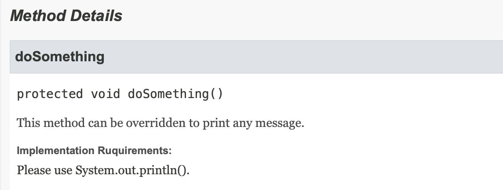

# item19. 상속을 고려해 설계하고 문서화하라. 그러지 않았다면 상속을 금지하라

## implSpec

### 상속용 클래스에 대한 내용을 문서로 남겨야 하는 이유

우선, 메서드를 재정의하면 어떤 일이 일어나는지를 정확히 정리하여 문서로 남겨야 한다.
달리 말하면, **상속용 클래스는 재정의할 수 있는 메서드들을 내부적으로 어떻게 이용하는지(자기사용) 문서로 남겨야 한다.**

클래스의 API로 공개된 메서드에서 클래스 자신의 또 다른 메서드를 호출할 수도 있다.
그런데 마침 호출되는 메서드가 재정의 가능 메서드라면 그 사실을 호출하는 메서드의 API 설명에 적시해야 한다.
덧붙여서 어떤 순서로 호출하는지, 각각의 호출결과가 이어지는 처리에 어떤 영향을 주는지도 담아야 한다.
('재정의가능' 이란 public과 protected 메서드 중 final이 아닌 모든 메서드를 뜻한다.) 
더 넓게 말하면, 재정의 가능 메서드를 호출할 수 있는 모든 상황을 문서로 남겨야 한다.
예를들어 백그라운드 스레드나 정적 초기화 과정에서도 호출이 일어날 수도 있다.

### implSpec API (@implSpec 태그)

- Inplementation Requirements: 메서드 내부동작방식을 설명

> public boolean remove(Object o)
>
> 주어진 원소가 이 컬렉션 안에 있다면 그 인스턴스를 하나 제거한다(선택적 동작).
> 더 정확하게 말하면, 이 컬렉션 안에 'Object.equals(o, e)가 참인 원소' e가 하나 이상 있다면 그 중 하나를 제거한다.
> 주어진 원소가 컬렉션 안에 있었다면 (즉, 호출결과 이 컬렉션이 변경됐다면) true 를 반환한다.
>
> Implementation Requirements: 이 메서드는 컬렉션을 순회하며 주어진 원소를 찾도록 구현되었다.
> 주어진 원소를 찾으면 반복자의 remove 메서드를 사용해 컬렉션에서 제거한다.
> 이 컬렉션이 주어진 객체를 갖고 있으나, 이 컬렉션의 iterator 메서드가 반환한 반복자가 remove 메서드를 구현하지 않았다면 UnsupportedOperationException을 던지니 주의하자.

이 설명에 따르면 iterator 메서드를 재정의하면 remove 메서드의 동작에 영향을 줌을 확실히 알 수 있다.
iterator 메서드로 얻은 반복자의 동작이 remove메서드의 동작에 주는 영향도 정확히 설명했다.
**아이템 18**에서는 HashSet을 상속하여 add를 재정의한 것이 addAll에까지 영향을 준다는 사실을 알 수 없었는데, 아주 대조적이다.

하지만 이런식은 "좋은 API문서란'어떻게' 가 아닌 '무엇'을 하는지를 설명해야 한다" 라는 격언과는 대치되지 않나?
그렇다. 상속이 캡슐화를 해치기 때문에 일어나는 안타까운 현실이다. 
클래스를 안전하게 상속할 수 있도록 하려면 (상속만 아니었다면 기술하지 않았어야 할) 내부 구현 방식을 설명해야만 한다.

### implSpec Test

- ~~~
  @implSpec 태그 활성화: -tag "implSpec:a:Implementation Requirements:"
  ~~~

~~~java
/**
 * This method can be overridden to print any message.
 *
 * @implSpec
 * Please use System.out.println().
 */
protected void doSomething() {
    System.out.println("hello");
}
~~~

~~~sh
javadoc -d target/apidoc src/main/java/me/whiteship/chapter04/item19/impespec/ExtendableClass.java -tag "implSpec:a:Implementation Ruquirements:" 
~~~

- 이처럼 내부 매커니즘을 문서로 남기는 것만이 상속을 위한 설계의 전부는 아니다.
- 효율적인 하위 클래스를 큰 어려움 없이 만들 수 있게 하려면 **클래스의 내부동작과정 중간에 끼어들 수 있는 훅(hook)을 잘 선별하여 protected 메서드 형태로 공개해야 할 수 도 있다.**

 

## 드물게는 protected 필드로 공개해야 할 수도 있다. java.util.AbstractList의 removeRange 메서드를 예로 살펴보자.

> 

> protected void removeRange(int fromIndex, int toIndex)
>
> fromIndex(포함)부터 toIntex(미포함)까지의 모든 원소를 이 리스트에서 제거한다.
> toIndex 이후의 원소들은 앞으로 (index만큼씩) 당겨진다. 이 호출로 리스트는 'toIndex - fromoIndex' 만큼 짧아진다.
> (toIndex == fromIndex라면 아무런 효과가 없다.)
>
> 이 리스트 혹은 이 리스트의 부분리스트에 정의된 clear연산이 이 메서드를 호출한다.
> 리스ㅡ 구현의 내부 구조를 활용하도록 이 메서드를 재정의하면 이 리스트와 부분리스트의 clear 연산 성능을 크게 개선할 수 있다.
>
> Implementation Requirements: 이 메서드는 fromIndex에서 시작하는 리스트 반복자를 얻어 모든 원소를 제거할 때까지
> ListIterator.next와 ListIterator.remove를 반복호출하도록 구현되었다.
> **주의: ListIterator.remove가 선형시간이 걸리면 이 구현의 성능은 제곱에 비례한다.**
>
> Parameters:
>   fromIndex 제거할 첫 원소의 인덱스
>   toIndex 제거할 마지막 원소의 다음 인덱스

List 구현체의 최종 사용자는 removeRange 메서드에 관심이 없다.
그럼에도 이 메서드를 제공한 이유는 단지 하위 클래스에서 부분리스트의 clear 메서드를 고성능으로 만들기 쉽게 하기 위해서다.
**removeRange 메서드가 없다면** 하위 클래스에서 clear메서드를 호출하면 (제거할 원소 수의) 제곱에 비례해 성능이 느려지거나 부분리스트의 매커니즘을 **밑바닥부터 새로 구현해야 했을 것이다**.

그렇다면 상속용 클래스를 설계할 때 어떤 메서드를 protected로 노출해야 할지는 어떻게 결정할까? 
안타깝게도 마법은 없다. 심사숙고해서 잘 예측해본 다음,  하위 클래스를 만들어 시험해보는 것이 최선이다.
Protected 메서드 하나하나가 내부 구현에 해당하므로 그 수는 가능한 한 적어야 한다.
한편으로는 너무 적게 노출해서 상속으로 얻는 이점마저 없애지 않도록 주의해야 한다.

### **상속용 클래스를 시험하는 방법은 직접 하위 클래스를 만들어보는것이 유일하다.**
꼭 필요한 protected 멤버를 놓쳤다면 하위 클래스를 작성할 때 그 빈자리가 확연히 드러난다.
거꾸로, 하위 클래스를 여러 개 만들때까지 전혀 쓰이지 않는 protected 멤버는 사실 private이었어야 할 가능성이 크다.

널리 쓰일 클래스를 상속용으로 설계한다면 여러분이 문서화한 내부 사용패턴과, protected 메서드와 필드를 구현하면서 선택한 결정에 영원히 책임져야 함을 잘 인식해야 한다.

## 상속용 클래스의 생성자는 직접적으로든 간접적으로든 재정의 가능 매서드를 호출해서는 안된다

- 프로그램이 오동작할 수 있다.
- 상위클래스 생성자가 먼저 실행되기에 하위클래스 인스턴스 생성 전에 재정의한 함수가 호출되어 오동작하게 되기 때문

~~~java
public class Super {
    public Super() {
        overrideMe();
    }
    public void overrideMe() { }
}
~~~

~~~java
public final class Sub extends Super {
    // 초기화되지 않은 final 필드. 생성자에서 초기화한다.
    private final Instant instant;

    Sub() {
        instant = Instant.now();
    }
    // 재정의 가능 메서드. 상위 클래스의 생성자가 호출한다.
    @Override public void overrideMe() {
        System.out.println(instant);
    }
    public static void main(String[] args) {
        Sub sub = new Sub();
        sub.overrideMe();
    }
}
~~~

- private, final, static 메서드는 재정의가 불가능하니 생성자에서 안심하고 호출해도 된다.

### clone과 readObject 메서드는 생성자와 비슷한 효과를 낸다. (새로운 객체를 만든다.)

- 둘 중 하나라도 구현한 클래스를 상속할 수 있게 설계하는 것은 일반적으로 좋지 않은 생각이다. (개발자에게 부담)
- clone과 readObject 모두 직접/간접적으로 재정의 가능 메서드를 호출해서는 안된다.
- 이 인터페이스들을 하위 클래스에서 구현하도록 하는 특별한 방법도 있다. (**아이템 13**, **아이템 86**)

**1. readobject경우 하위 클래스의 상태가 미처 다 역직렬화하기 전에 재정의한 메서드부터 호출하게 된다.**

Serializable을 구현한 클래스가 readResolve, writeReplace 메서드를 갖는다면 protected 로 선언해야 한다.
private으로 선언하면 하위클래스에서 무시되기 때문이다.

///////////////////////////////////////////////
///////////////////////////////////////////////
///////////////////////////////////////////////

**-> 테스트 못함 이해를 못함......**

///////////////////////////////////////////////
///////////////////////////////////////////////
///////////////////////////////////////////////

**2. clone의 경우 하위 클래스의 clone 메서드가 복제본의 상태를 수정하기 전에 재정의한 메서드를 호출한다.****

- clone은 원본데이터에도 피해를 줄수있다. (shallow copy)

~~~java
public class SuperClone implements Cloneable {

    private String name;

    protected void test() {
        System.out.println("call item");
    }

    @Override
    public SuperClone clone() {
        Object clone = null;
        try {
            /**
             * 자식클래스의 clone()이후 상태를 변경하기 전에
             * 자식클래스의 test() 가 호출된다.
             */
            test();
            clone = super.clone();
            return (SuperClone) clone;
        } catch (CloneNotSupportedException e) {
            throw new RuntimeException(e);
        }
    }
}
~~~

~~~java
public class SubClone extends SuperClone implements Cloneable {

    private String name;

    @Override
    public SubClone clone() {
        System.out.println("subitem clone before");
        SubClone clone = (SubClone) super.clone();
        // clone instance 상태 변경 작업 ...
        System.out.println("subitem clone after");
        return clone;
    }

    @Override
    protected void test() {
        System.out.println("call subitem test ");
    }

    public static void main(String[] args) {
        SubClone item = new SubClone();
        SubClone clone = item.clone();
    }
}
~~~

~~~sh
# result
subitem clone before
call subitem test 
subitem clone after
~~~

### 이제 클래스를 상속용으로 설계하려면 엄청난 노력이 들고 그 클래스에 안기는 제약도 상당함을 알았다.

- 추상클래스나 인터페이스의 골격구현 (**아이템20**)처럼 상속을 허용하는게 명백히 정당한 상황이 있고
- 불변클래스(**아이템 17**)처럼 명백히 잘못된 상황이 있다.
- 그렇다면 그 이외의 일반적인 구체클래스는 어떨까?
  - 실제 보통의 구체클래스를 내부만 수정했음에도 이를 확장한 클래스에서 문제가 생겼다는 버그리포트를 받는일이 드물지 않다.
    **이 문제를 해결하는 가장 좋은 방법은 상속용으로 설계하지 않은 클래스는 상속을 금지하는 것이다.**
  - 상속을 금지하는 방법은 두가지다.
    - final class
    - 모든 생성자를 private , package-private으로 선언하고 public 정적팩터리를 만들어준다.

### 핵심기능을 정의한 인터페이스가 있고 클래스가 그 인터페이스를 구현했다면 상속을 금지해도 개발하는데 어려움이 없을 것이다.

- Set, List, Map이 좋은 예다.
- **아이템 18** 에서 설명한 **래퍼클래스** 패턴 역시 기능을 증강할 때 상속을 대신 쓸 수 있는 더 나은 대안이라 하겠다.

### 구체클래스가 표준인터페이스를 구현하지 않았는데 상속을 하고 싶은 경우

- 상속을 꼭 해야하면 클래스 내부에서는 재정의 가능 메서드를 사용하지 않게 만들고 문서로 남긴다.
  - 재정의 가능 메서드를 호출하느 자기사용코드를 완벽히 제거하라는 것이다.

- 메서드를 재정의해도 다른 메서드의 동작에 아무영향을 주지 않게 된다.

## 정리

상속용 클래스를 설계하기란 어렵다.
클래스 내부에서 스스로를 **어떻게 사용하는지(자기사용 패턴) 모두 문서로 남겨야** 하며, 일단 문서화한 것은 그 클래스가 쓰이는 한 반드시 지켜야 한다. 그렇지 않으면 그 내부 구현방식을 믿고 활용하던 하위 클래스를 오동작하게 만들 수 있다. 
다른 이가 효율 좋은 하위 클래스를 만들 수 있도록 일부 메서드를 **protected로 제공**해야 할 수도 있다.
그러니 클래스를 확장해야 할 명확한 이유가 떠오르지 않으면 상속을 금지하는 편이 나을 것이다.
상속을 금지하려면 클래스를 final로 선언하거나 생성자를 외부에서 접근못하게 하면 된다.

