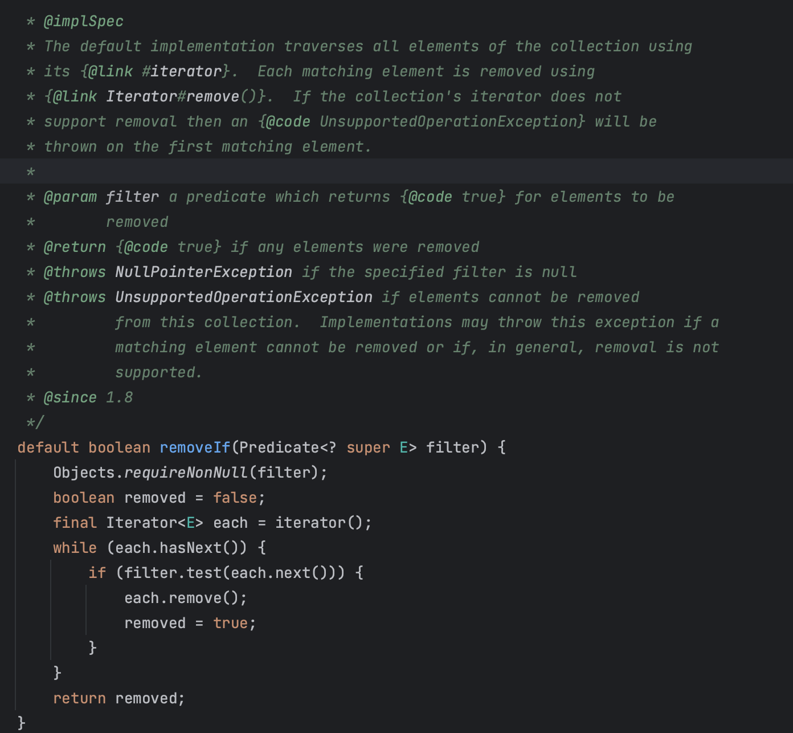
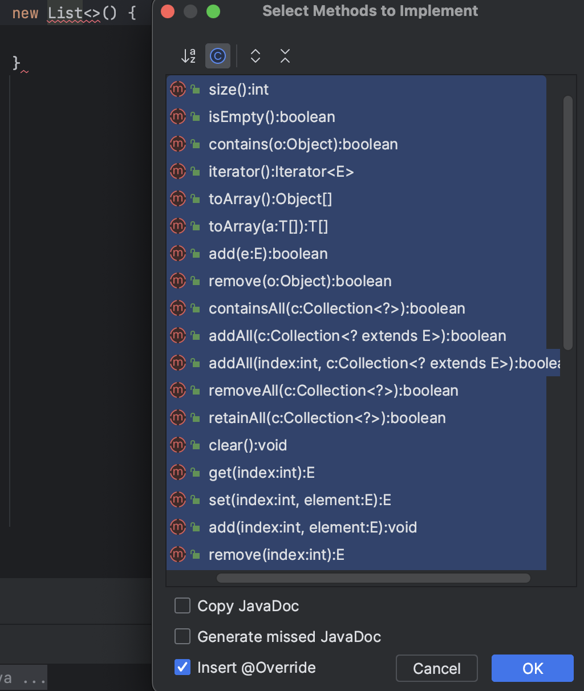

# 추상클래스보다는 인터페이스를 우선하라


> 자바가 제공하는 다중구현 메커니즘은 인터페이스와 추상클래스, 이렇게 두 가지다. 
> 자바8부터 인터페이스도 디폴트메서드를 제공할수 있게되어 이제는 두 메커니즘 모두 인스턴스 메서드를 구현형태로  제공가능하다.
>
> 한편 둘의 가장 큰 차이는 추상클래스가 정의한 타입을 구현하는 클래스는 반드시 추상클래스의 하위 클래스가 되어야 한다는 점이다.
>
> 자바는 단일 상속만 지원하니, 추상클래스 방식은 새로운 타입을 정의 하는데 커다란 제약을 안게 되는 셈이다.
> 반면 인터페이스가 선언한메서드를 모두 정의하고 그 일반규칙을 잘 지킨 클래스라면 어떤 클래스를 상속했든 같은 타입으로 취급된다.


### **기존 클래스에도 손쉽게 새로운 인터페이스를 구현해 넣을 수 있다,**

- 반면 기존 클래스위에 새로운 추상클래스를 넣기란 어렵다.
- 두개 클래스가 같은 추상클래스를 확장하길 원한다면 그 추상클래스는 계층구조상 두 클래스의 공통 조상이어야 한다. 

### **인터페이스는 mixin 정의에 안성맞춤이다.**

- Comparable은 자신이 구현한 클래스의 인스턴스끼리는 순서를 정할수 있다고 선언하는 믹스인 인터페이스이다.
- 이처럼 대상타입의 주된 기능에 선택적 기능을 혼합한다고해서 믹스인 이라고한다.
- 추상클래스는 불가능하다.

### **인터페이스는 계층구조가 없는 타입프레임워크를 만들 수 있다.**

~~~java
public interface Singer {

    AudioClip sing(Song song);
}

public interface Songwriter {

    Song compose(int shartPosition);
}

public interface SingerSongwriter extends Singer, Songwriter{
    AudioClip strum();
    void actSensitive();
}
~~~

- 같은 구조를 클래스로 만드려면 가능한 조합 전부를 각각의 클래스로정의한 고도비만 계층구조가 만들어질 것이다.


### **래퍼 클래스(아이템 18)**와 함께 사용하면 **인터페이스는기능을 향상시키는 안전하고 강력한 수단이 된다.**

- 타입을 추상클래스로 정의해두면 그 타입에 기능을 추가하는 방법은 상속뿐이다.
  상속해서 만든 클래스는 래퍼 클래스보다 활용도가 떨어지고 깨지기는 더 쉽다.

- 인터페이스의 메서드 중 구현방법이 명백한 것이 있다면, 그 구현을 디폴트메서드로 제공해 프로그래머들의 일감을 덜어줄 수 있다.
  **디폴트 메서드를 제공할 때는 상속하려는 사람을 위한 설명을 @implSpec 자바독 태그**를 붙여 문서화해야 한다.(**아이템 19**)



디폴트 메서드에도 제약은 있다. 많은 인터페이스가 equals와 hashcode 같은 Object 메서드를 정의하지만, 구현해서는 안된다.(컴파일에러)

```java
public interface MyInterface {

    default String toString() {
        return "myString";
    }

    default int hashCode() {
        return 10;
    }

    default boolean equals(Object o) {
        return true;
    }
}
```

~~~java
public Test extends Object implements MyInterface
~~~

- Test class 는 내부적으로 Object 를 상속한다. MyInterface 에 hashCode 등을 재정의한다면, Test코드는 두 클래스 중 어떤 메서드를 사용하게 되어야 하는가? 에서 이미 애매하다. 
- [디폴트메서드 사용목적](https://mail.openjdk.org/pipermail/lambda-dev/2013-March/008435.html) 참조


### **인터페이스와 골격구현 클래스를 함께 제공하는 식으로 인터페이스와 추상클래스의 장점을 모두 취하는 방법도 있다.**

- 인터페이스는 타입을 정의하고 필요하면 디폴드도 제공한다.
- 그리고 골격구현클래스는 나머지 메서드까지 구현한다.
- 이렇게 해두면 단순히 골격구현을 확장하는것만으로 인터페이스를 구현하는데 필요한 일이 대부분 완료된다.
-  바로 템플릿메서드 패턴이다,

~~~java
public abstract class FileProcessor {
...
public final int process() {
        try(BufferedReader reader = new BufferedReader(new FileReader(path))) {
            int result = 0;
            String line = null;
            while((line = reader.readLine()) != null) {
                result = getResult(result, Integer.parseInt(line));
            }
            return result;
        } catch (IOException e) {
            throw new IllegalArgumentException(path + "에 해당하는 파일이 없습니다.", e);
        }
    }
    protected abstract int getResult(int result, int number);
~~~

~~~java
public class Plus extends FileProcessor {
    public Plus(String path) {
        super(path);
    }

    @Override
    protected int getResult(int result, int number) {
        return result + number;
    }
}
~~~

~~~java
public static void main(String[] args) {
    FileProcessor fileProcessor = new Plus("number.txt");
    System.out.println(fileProcessor.process());
    ...
~~~


### 관례상 인터페이스 이름이 Interface 이면 골격구현클래스는 AbstractInterface 이다.
- (AbstractCollection, AbstractSet, AbstractList ...) 제대로 설계했다면 프로그래머의 일을 상당히 덜어준다. 
- 골격구현 클래스의 아름다움은 추상클래스처럼 구현을 도와주는 동시에, 추상클래스로 타입을 정의할때 따라오는 심각한 제약에서 자유롭다는 데있다.

~~~java
public class IntArrays {
    static List<Integer> intArrayAsList(int[] a) {
        Objects.requireNonNull(a);

        return new AbstractList<>() {
            @Override public Integer get(int i) {
                return a[i];
            }

            @Override public Integer set(int i, Integer val) {
                int oldVal = a[i];
                a[i] = val;
                return oldVal;
            }

            @Override public int size() {
                return a.length;
            }
        };
    }
}
~~~

- 만약 List 의 추상메서드가 없다면, 구현클래스는 아래의 함수를 모드 제작해야 한다.




### 골격구현 클래스 우회사용법

- 인터페이스를 구현한 클래스에서 해당 골격 구현을 확장한 private 내부클래스를 정의하고 각 메서드 호출을 내부클래스의 인스턴스에 전달하는 것이다.
- **아이템 18**에서 다룬 래퍼클래스와 비슷한 이 방식을 시뮬레이트 한 다중상속이라 한다

~~~java
public class User extends AbstractUser implements Role {

    private final MyRole role = new MyRole();
    @Override
    void userName() {
        System.out.println("my name is seongtaek");
    }

    @Override
    public void roleName() {
        this.role.roleName();
    }
    private static class MyRole extends AbstractRole {

        @Override
        public void roleName() {
            System.out.println("rolename is super");
        }
    }
}
~~~


### 골격 구현 작성

> Map.Entry 인터페이스나 그 하위 인터페이스로는 이 골격구현을 제공할 수 없다.
> 디폴트메서드는 equals,hashcode,tostring 같은 Object메서드를 재정의할 수 없기 때문이다.

~~~java
public abstract class AbstractMapEntry<K,V> implements Map.Entry<K,V> {
    // 변경 가능한 엔트리는 이 메서드를 반드시 재정의해야 한다.
    @Override public V setValue(V value) {
        throw new UnsupportedOperationException();
    }
    
    // Map.Entry.equals의 일반 규약을 구현한다.
    @Override public boolean equals(Object o) {
        if (o == this)
            return true;
        if (!(o instanceof Map.Entry))
            return false;
        Map.Entry<?,?> e = (Map.Entry) o;
        return Objects.equals(e.getKey(),   getKey())
                && Objects.equals(e.getValue(), getValue());
    }

    // Map.Entry.hashCode의 일반 규약을 구현한다.
    @Override public int hashCode() {
        return Objects.hashCode(getKey())
                ^ Objects.hashCode(getValue());
    }

    @Override public String toString() {
        return getKey() + "=" + getValue();
    }
}
~~~

~~~java
// java.util.Map.Entry
// 인터페이스에 동작방식을 정의해놓았다.
interface Entry<K, V> {
    K getKey();
    V getValue();
    V setValue(V value);
    boolean equals(Object o);
    int hashCode();

~~~

- 골격구현은 기본적으로 상속해서 사용하는걸 가정하므로 아이템19에서 이야기한 설계 및 문서화 지침을 따라야 한다.

- 간략히 보여주기 위해 앞의 코드에서는 문서화 주석을 생략했지만, 인터페이스에 정의한 디폴트 메서드든 별도의 추상클래스든 골격구현은 반드시 그 동작 방식을 잘 정리해 문서로 남겨야 한다.


### **단순구현은 골격구현의 작은 변종으로** AbstractMap.SimpleEntry 가 좋은 예다.

- 단순구현도 골겨국혀과 같이 상속을 위한 인터페이스를 구현한 것이지만, 추상클래스가 아니란 점이 다르다.

~~~java
    public static class SimpleEntry<K,V>
        implements Entry<K,V>, java.io.Serializable
    {
        @java.io.Serial
        private static final long serialVersionUID = -8499721149061103585L;

        @SuppressWarnings("serial") // Conditionally serializable
        private final K key;
        @SuppressWarnings("serial") // Conditionally serializable
        private V value;
        ...
~~~

- 구현체로서 동작한다.


## 핵심정리

일반적으로 다중구현용 타입으로는 인터페이스가 가장 적합하다.
복잡한 인터페이스라면 구현하는 수고를 덜어주는 골격구현을 함께 제공하는 방법을 꼭 고려해보자. 
골격구현은 가능한 한 인터페이스의 디폴트 메서드로 제공하여 그 인터페이스를 구현한 모든 곳에서 활용하도록 하는것이 좋다.
가능한 한 이라고 한 이유는 인터페이스에 걸려있는 구현상의 제약 때문에 골격 구현을 추상클래스로 제공하는 경우가 더 흔하기 때문이다.


