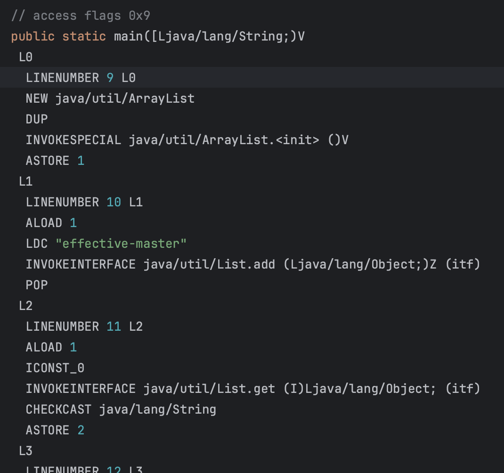
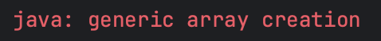
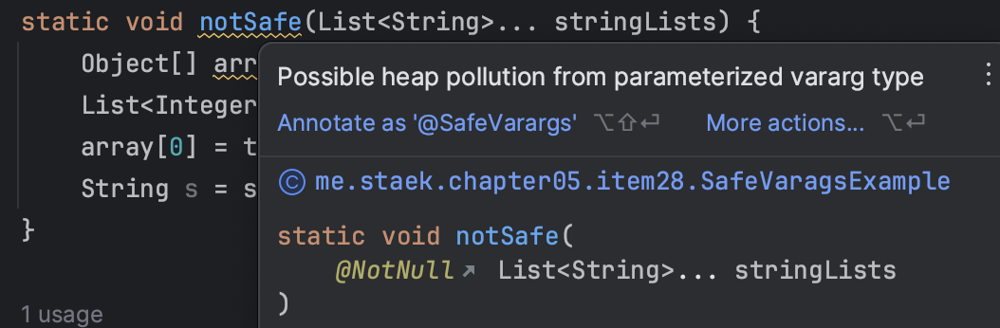

# item28 배열보다는 리스트를 사용하라

## 배열과 제네릭 타입에는 중요한 차이가 두 가지 있다. 

- 배열은 공변(covariant)이다. 
  - Sub가 Super의 하위타입이라면 배열 Sub[] 는 배열 Super[]의 하위 타입이 된다. (공변, 즉 함께 변한다는 뜻이다.)
- 반면 제네릭은 불공변이다.
  - 서로 다른 타입 type1, type2 가 있을 때 List<Type1>은 List<Type2> 의 하위타입도 아니고 상위타입도 아니다.

### 1. 정의한 타입과 다른 타입이 입력될 경우

### 배열 - 런타임에 실패한다.

~~~java
Object[] objectArray = new Long[1]; // Long은 Object 하위 타입이므로 컴파일 된다.
objectArray[0] = "타입달름"; // String은 Object 하위 타입이므로 컴파일된다. -> 이게 공변..
~~~

~~~sh
Exception in thread "main" java.lang.ArrayStoreException: java.lang.Integer
	at me.staek.chapter05.item28.IntegerToString.main(IntegerToString.java:11)
~~~

### 제네릭 - 컴파일에 실패한다.

~~~java
List<String> names = new ArrayList<>(); 
List<Object> objects = names; // objects는 List의 Object타입일 뿐이고, names는 List의 String 타입일 뿐이다. -> 불공변
~~~

~~~sh
java: incompatible types: java.util.List<java.lang.String> cannot be converted to java.util.List<java.lang.Object>
~~~

### 2. 배열은 실체화(reify) 된다. 제네릭은 소거(erasure)된다.

- 배열은 실체화(reify) 가된다. [JLS 4.7]
  - 배열은 런타임에도 자신이 담기로 한 원소 타입을 인지하고확인한다.
- 제네릭은 타입정보가 런타임에는 소거(erasure) 된다. [JLS 4.6]
  - 원소 타입을 컴파일타임에만 검사하며 런타임에는 알 수 없다.
  - 소거는 제네릭이 지원되기 전의 레거시 코드와 제네릭 타입을 함께 사용할 수 있게 해주는 메커니즘으로, 자바5가 제네릭으로 순조롭게 전환될 수 있도록 해주었다. (아이템 26)

### 제네릭과 erasure

~~~java
public static void main(String[] args) {
    List<String> studyName = new ArrayList<>();
    studyName.add("effective-master");
    String name = studyName.get(0);
    System.out.println(name);
}
~~~

- 위에 작성한 예제는 실제 런타임에서 아래와 같이 동작한다.

~~~java
List studyNameRuntime = new ArrayList<>();
studyNameRuntime.add("effective-master");
Object o = studyNameRuntime.get(0);
name = (String)o;
System.out.println(name);
~~~

-  javac -Xlint:unchecked MyGeneric.java 에서 warning 발생하는 raw타입 처럼 동작한다.
  - 물론, 컴파일을 통과했기 때문에 문제가 없다.

~~~sh
MyGeneric.java:33: warning: [unchecked] unchecked call to add(E) as a member of the raw type List
        studyNameRuntime.add("effective-master");
                            ^
  where E is a type-variable:
    E extends Object declared in interface List
1 warning
~~~

- bytecode로 보면 아래와 같다.

## 배열은 제네릭 타입, 매개변수화 타입, 타입매개변수로 사용할 수 없다.

- 즉 코드를 new List<E>[], new List<String>[], new E[] 식으로 작성하면 컴파일 할 때 제네릭 배열 생성 오류를 일으킨다.
- 제네릭 배열을 만들지 못하게 막은 이유가 무엇일까?
- 타입 안전하지 않기 때문이다. 이럴 허용하면 컴파일러가 자동생성한 형변환 코드에서 런타임에 ClassCastException이 발생할 수 있다.

### 제네릭과 배열이 같이 쓰인다면?

- 실제로는 컴파일에러가 발생한다.

- 만약 해당문법이 가능하게 된다면, 런타임에 에러가 발생할 것이므로 막는게 낫다. 아래 순서를 보자.

~~~java
List<String>[] stringLists = new ArrayList<String>[1]; // (1)
List<Integer> intList = List.of(42); // (2)
Object[] objects = stringLists; // (3)
objects[0] = intList; // (4)
STring s = stringLists[0].get(0); // (5)
~~~

- (2) 는 원소가 하나인 List<Integer> 를 생성한다.
- (3) 은 (1)에서 생성한 List<String> 의 배열을 Object 배열에 할당한다. **배열은 공변이니 가능하다.**
- (4) 는 (2)에서 생성한 List<Integer> 의 인스턴스를 Object 배열의 첫 원소로 저장한다.
  - objects 는 List<String>의 배열이고, intList는 List<Integer> 이니 가능하다.
  - 그런데 제네릭은 소거 방식으로 구현되어 있어서 List배열에 List를 넣는 꼴이 되어 성공한다.
  - 배열의 경우 **ArrayStoreException**가 발생한다.

- (5). 컴파일러는 첫번째원소를 꺼낼 때 String으로 형변환 하려한다. 실제로는 Integer가 담겨잇으므로 **ClassCastException** 가 발생할 것이다.

- **소거 매커니즘 때문에 매개변수화 타입 가운데 실체화 될 수 있는 타입은 List<?>와 Map<?,?> 같은 비한정적 와일드카드 타입일 뿐이다 (아이템 26) 배열을 비한정적 와일드카드 타입으로 만들수는 있지만 유용하진않다,**

- **배열을 제네릭으로 만들 수 없어 귀찮을 때도 있다.**
  **제네릭 컬렉션에서는 자신의 원소 타입을 담은 배열을 반환하는게 보통은 불가능하다. (아이템 33 에서 해결방안 소개)**

- **또한 제네릭 타입과 가변인수메서드 (아이템 53)를 함께쓰면 해석하기 어려운 경고를 받는다.**
  **가변인수 메서드 호출시 가변인수 매개변수를 담을 배열이 하나 만들어지는데, 이 때 그 배열의 원소가 실체화 불가타입이면 경고가 발생한다.**
  **문제는 @SafeVarargs 애너테이션으로 대처할 수 있다. (아이템 32)**

### @SafeVarags

- 제네릭 가변인자는 근본적으로 타입안전하지 않다.
- 가변인자의 내부데이터가 오염될 가능성이 있다.
- @SafeVarargs를 사용하면 가변인자에 대한 오염경고를 숨길 수 있다.
- **아이템 32** 참고

~~~java
@Documented
@Retention(RetentionPolicy.RUNTIME)
@Target({ElementType.CONSTRUCTOR, ElementType.METHOD})
public @interface SafeVarargs {}
~~~

- 내부데이터 오염으로 ClassCastException가 발생할 수 있다.

~~~java
static void notSafe(List<String>... stringLists) {
    Object[] array = stringLists; // 런타임에 List<String>... 은 List[]이 된다.
                                  // 배열은 공변이기 때문에 컴파일을 통과한다. (List[] to Object[])
    List<Integer> tmpList = List.of(42);
    array[0] = tmpList;     // Object[0] 에 List 타입이 할당.
                            // Semantically invalid, but compiles without warnings
    String s = stringLists[0].get(0); // ClassCastException at runtime.
}
~~~

## 배열을 제네릭으로

**배열로 형변환할 때** 제네릭 **배열 생성 오류나 비검사 형변환 경고가 뜨는 경우** 대부분은 **배열인 E[] 대신 컬렉션인 List<E>를 사용하면 해결된다.**
코드가 조금 복잡해지고 성능이 살짝 나빠질 수는 있지만 그 대신 타입 안전성과 상호운용성은 좋아진다.

### 제네릭 없이 구현한 버전

~~~java
public class Chooser_Array {
    private final Object[] choiceList;

    public Chooser_Array(Collection choices) {
        choiceList = choices.toArray();
    }

    public Object choose() {
        Random rnd = ThreadLocalRandom.current();
        return choiceList[rnd.nextInt(choiceList.length)];
    }

    public static void main(String[] args) {
        List<Integer> intList = List.of(1, 2, 3, 4, 5, 6);

        Chooser_Array chooser = new Chooser_Array(intList);

        for (int i = 0; i < 10; i++) {
            Number choice = (Number) chooser.choose();
            System.out.println(choice);
        }
    }
}

~~~

- 아래 처럼 변경되면,  java.lang.ClassCastException 가 발생한다.

~~~java
List<String> intList = List.of("aa","bb");
~~~

### 제네릭으로 변경한 예제

~~~java
public class Chooser_generic<T> {
    private final T[] choiceList;

    //@SuppressWarnings("unchecked")
    public Chooser_generic(Collection<T> choices) {
        choiceList = (T[]) choices.toArray();
    }

    public T choose() {
        Random rnd = ThreadLocalRandom.current();
        return choiceList[rnd.nextInt(choiceList.length)];
    }

    public static void main(String[] args) {
        List<Integer> intList = List.of(1, 2, 3, 4, 5, 6);
        List<String> intList = List.of("aa","bb");

        Chooser_generic chooser = new Chooser_generic<>(intList);

        for (int i = 0; i < 10; i++) {
            Number choice = (Number) chooser.choose();
            System.out.println(choice);
        }
    }
}

~~~

- T가 무슨 타입인지 알 수 없으니 컴파일러는 이 형변환이 런타임에도 안전한지 보장할 수 없다는 메세지 이다.
- 제네릭에서는 원소의 타입정보가 소거되어 런타임에는 무슨 타입인지 알 수 없음을 기억하자.

~~~java
Chooser_generic.java:14: warning: [unchecked] unchecked cast
        choiceList = (T[]) choices.toArray();
                                          ^
  required: T[]
  found:    Object[]
  where T is a type-variable:
    T extends Object declared in class Chooser_generic
1 warning
~~~

- 여전히 잘못된 타입을 입력하면 런타임에 에러가 발생한다.

~~~java
List<String> intList = List.of("aa","bb");
~~~

### 제네릭 리스트으로 변경

- 비검사 형변환 경고가 없다.
- 잘못된 타입을 입력하려 한다면, 컴파일단계에서 오류가 발생한다.
- 성능은 아주 살짝 감소하지만, 런타임에서 ClassCastException은 발생 안한다.

~~~java
public class Chooser_generic_list<T> {
    private final List<T> choiceList;

    public Chooser_generic_list(Collection<T> choices) {
        choiceList = new ArrayList<>(choices);
    }

    public T choose() {
        Random rnd = ThreadLocalRandom.current();
        return choiceList.get(rnd.nextInt(choiceList.size()));
    }

    public static void main(String[] args) {
        List<Integer> intList = List.of(1, 2, 3, 4, 5, 6);

        Chooser_generic_list<Integer> chooser = new Chooser_generic_list<>(intList);

        for (int i = 0; i < 10; i++) {
            Number choice = chooser.choose();
            System.out.println(choice);
        }
    }
}
~~~

## 정리

배열과 제네릭에는 다른 타입 규칙이 적용된다. 배열은 공변이고 실체화 되지만
제네릭은 불공변이고 타입정보가 소거된다.
그 결과 배열은 런타임에는 타입 안전하지만 컴파일타임에는 그렇지 않다.
제네릭은 반대다. 그래서 둘을 섞어쓰기 어렵다.
섞어쓰다가 컴파일 오류나 경고를 만나면, 먼제 배열을 리스트로 대체하도록 해보자.