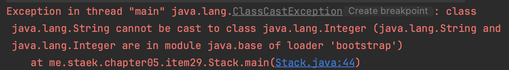
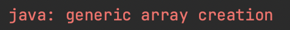
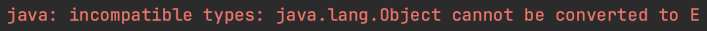

# item29 이왕이면 제네릭 타입으로 만들라

### Stack (아이템 7)

~~~java
public class Stack {
    private Object[] elements;
    private int size = 0;
    private static final int DEFAULT_INITIAL_CAPACITY = 16;

    public Stack() {
        elements = new Object[DEFAULT_INITIAL_CAPACITY];
    }
    ...
~~~

- 제네릭으로 만들어보자.

- 이 클래스를 제네릭으로 바꾼다고 해도 현재 버전을 사용하는 클라이언트에는 아무런 해가 없다.

- 오히려 지금 상태에서의 클라이언트는 스택에서 꺼낸 객체를 형변환해야 하는데, 이 때 런타임 오류가 날 위험이 있다.

  ~~~java
  public static void main(String[] args) {
      Stack stack = new Stack();
      for (String arg : List.of("a", "b", "c"))
          stack.push(arg);
      while (!stack.isEmpty())
          System.out.println(((Integer)stack.pop())); // error
  }
  ~~~

  

### Stack을 제네릭으로 바꾸는 두 가지 방법

~~~java
public class StackByObject<E> {
    private Object[] elements;
    private int size = 0;
    private static final int DEFAULT_INITIAL_CAPACITY = 16;
    
    public StackByObject() {
        elements = new E[DEFAULT_INITIAL_CAPACITY]; // error
    }

    public void push(E e) {
        ensureCapacity();
        elements[size++] = e;
    }
    ...
~~~

- 아이템 28의 E와 같은 실체화 불가타입으로는 배열을 만들 수 없다.
- 배열을 사용하는 코드를 제네릭으로 만드려 할 때는 이 문제가 항상 생길 것이다.

**해결책1**. 제네릭 배열생성을 금지하는 제약을 우회하는 방법이다.

- Object배열을 생성한 다음 제네네릭 배열로 형변환한다. (타입안전하지 않다.)

- ~~~java
  public StackByGeneric() {
          elements = (E[]) new Object[DEFAULT_INITIAL_CAPACITY];
  }
  ~~~

  컴파일러는 타입안전 여부를 모르지만 개발자는 안다.
  이 비검사 형변환이 타입안전하다는 것을 확인해야 한다.
  이후 @SuppresWarning 으로 경고를 숨긴다 (아이템 27)

**해결책2**. elements 필드의 타입을 E[]에서 Object[]로 바꾸는 것이다.

- 변경하면 아래와 같은 오류가 발생한다.

~~~java
public E pop() {
    if (size == 0)
        throw new EmptyStackException();
    E result =  elements[--size]; // error

    elements[size] = null; // 다 쓴 참조 해제
    return result;
}
~~~

- 위 코드를 (E) 로 형변환하면 경고로 변경되는데,
  E는 실체화 불가타입이므로 컴파일러는 런타임에 이뤄지는 형변환이 안전한지 증명할 수 없다.
  이번에도 우리가 확인하고 숨길 수 있다.

~~~java
public E pop() {
    if (size == 0)
        throw new EmptyStackException();

    // push에서 E 타입만 허용하므로 이 형변환은 안전하다.
    @SuppressWarnings("unchecked") E result = (E) elements[--size];

    elements[size] = null; // 다 쓴 참조 해제
    return result;
}
~~~

### 이상 두 가지 해결책의 장단점을 보자.

해결책1 : 제네릭 배열 (E[]) 대신에 Object 배열을 생성 후 제네릭 배열로 형번환한다.

- 배열 생성 시 형변환을 한번만 한다.
- 가독성 좋다.
- 힙 오염이 발생할 수 있다.(heap polution; 아이템 32)

해결책2: 제네릭 배열 대신에 Object배열을 사용하고, 배열이 반환한 원소를 E로 형변환한다.

- 원소를 읽을 때마다 형변환을 해줘야 한다.

~~~java
public static void main(String[] args) {
    StackByObject<String> stack = new StackByObject<>();
    for (String arg : List.of("a", "b", "c"))
        stack.push(arg);
    while (!stack.isEmpty())
        System.out.println(stack.pop().toUpperCase());
}
~~~

- stack에서 꺼낸 원소에서 String이 toUpperCase 메서드를 호출할 때 명시적형변환을 안하고 컴파일러가 진행한 형변환이 항상 성공함을 보장한다.
- 배열보다는 리스트를 우선하라 는 아이템 28과 모순되어 보인다.
- 사실 제네릭 타입 안에서 리스트를 사용하는게 항상 가능하지도 더 좋지도 않다.
- 자바가 리스트를 기본타입으로 제공하지 않으므로 **ArrayList같은 제네릭 타입도 결국 기본타입인 배열을 사용해 구현해야 한다.**
- **또 HashMap같은 제네릭 타입은 성능을 높일 목적으로 배열을 사용해야 하기도 한다.**
- 제네릭은 기본타입이 타입매개변수로는 불가함. 박싱된 타입(아이템61) 사용 해야함.

### 한정자

타입 매개변수에 제약을 두는 제네릭 타입도 있다.
다음은 java.util.concurrent.DelayQueue 이다.

~~~java
public class DelayQueue<E extends Delayed> extends AbstractQueue<E>
~~~

- 타입매개변수 목록인 <E extends Delayed>는 java.util.concurrent.Delayed 의 하위 타입만 받는다는 뜻이다.
- 이렇게 하여 DelayQueue 자신과 DelayQueue 를 사용하는 클라이언트는 DelayQueue의 원소에서 형변환없이 곧바로 Delayed 클래스의 메서드를 호출할 수 있다.
- ClassCastException 걱정은 할 필요가 없다.
- 이러한 타입 매개변수 E를 한정적 타입 매개변수 (bounded type parameter)라 한다.
- 모든 타입은 자기 자신의 하위타입이므로 [JLS, 4.10] DelayQueue<Delayed> 로도 사용할 수 있음을 기억해두자.

### Stack을 한정자로 변경

- 정의에 <E extends Number> 만 작성하면 문제가 발생한다.
- 원래 제네릭은 바이트코드에 실체화되지 않아 Object 로 생성되는데,
- 한정자로 바꾼 후에는, object가 아닌 Number로 변경된다.

~~~java
public class StackByBounded<E extends Number> {
    private E[] elements;
    private int size = 0;
    private static final int DEFAULT_INITIAL_CAPACITY = 16;

    public StackByBounded() {
        elements = new E[DEFAULT_INITIAL_CAPACITY];
    }

~~~

Object를 Number로 변환하려 해서 ClassCastExceptioin 발생함

~~~java
elements = (E[]) new Object[DEFAULT_INITIAL_CAPACITY];
~~~

- E를 Number 로변경하게 되면, 타입이 Number 이 되기 때문에 문제가 없다.

~~~java
public class StackByBounded<E extends Number> {
    private Number[] elements;
    private int size = 0;
    private static final int DEFAULT_INITIAL_CAPACITY = 16;

    public StackByBounded() {
        elements = new Number[DEFAULT_INITIAL_CAPACITY];
    }

    public void push(E e) {
        ensureCapacity();
        elements[size++] = e;
    }

    public E pop() {
        if (size == 0)
            throw new EmptyStackException();
        @SuppressWarnings("unchecked") E result = (E)elements[--size];
        elements[size] = null; // 다 쓴 참조 해제
        return result;
    }
  ...
~~~

## 정리

클라이언트에서 직접 형변환해야 하는 타입보다 제네릭 타입이 더 안전하고 쓰기 편하다.
그러니 새로운 타입을 설계할 때는 형변환 없이도 사용할 수 있도록 하라.
그렇게 하려면 제네릭 타입으로 만들어야 할 경우가 많다.
기존 타입 중 제네릭이 있어야 하는 게 있다면 제네릭 타입으로 변경하자.
기존 클라이언트에는 아무런 영향을 주지 않으면서, 새로운 사용자를 훨씬 편하게 해주는 길이다. (아이템 26)