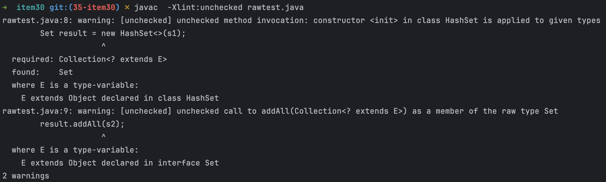

# item30 이왕이면 제네릭 메서드로 만들라

- 클래스와 마찬가지로 메서드도 제네릭으로 만들 수 있다.
- 매개변수화 타입을 받는 정적 유틸리티 메서드는 보통 제네릭이다.
- 예컨데 Collections의 알고리즘 메서드는 모두 제네릭이다.

## 제네릭 메서드

### raw type

~~~java
public static Set union(Set s1, Set s2) {
    Set result = new HashSet<>(s1);
    result.addAll(s2);
    return result;
}

public static void main(String[] args) {
    union(Set.of("a"), Set.of("a"));
}
~~~

경고 두개가 발생한다.

~~~java
public static void main(String[] args) {
    Set union = union(Set.of("a"), Set.of("b"));

    for(Object o: union)
        System.out.println((Integer)o);
}
~~~

- 출력 시 타입캐스팅을 잘못하면 ClasscastException이 발생할 수 있음.

### 제네릭 메서드 

- 경고를 없애려면 타입안전하게 만들어야 한다.
- **(타입 매개변수들을 선언하는) 타입 매개변수 목록은 메서드의 제한자와 반환타입 사이에 온다.**
- 타입 매개변수의 명명규칙은 제네릭 메서드나 제네릭 타입이나 같다. (아이템 29, 아이템68)

~~~java
// 타입 매개변수 목록은 <E> 이고 반환타입은 Set<E>
public static <E> Set<E> union(Set<E> s1, Set<E> s2) {
    Set<E> result = new HashSet<>(s1);
    result.addAll(s2);
    return result;
}
~~~

~~~java
public static void main(String[] args) {
    Set<String> guys = Set.of("톰", "딕", "해리");
    Set<String> stooges = Set.of("래리", "모에", "컬리");
    Set<String> all = union(guys, stooges);
    for (String o : all) {
        System.out.println(o);
    }
}
~~~

- 이를 한정적 와일드 타입 (**아이템 31**)을 사용해서 더 유연하게 개선할 수 있다고 한다

##  제네릭 싱글턴 패턴

- 때때로 불변객체를 여러 타입으로 활용할 수 있게 만들어야 할 때가 있다.

- 제네릭은 런타임에 타입정보가 소거(아이템 28) 되므로 하나의 객체를 어떤 타입으로든 매개변수화 할 수 있따.

- 하지만 이렇게 하려면 요청한 타입 매개변수에 맞게 매번 그 객체의 타입을 바꿔주는 정적 팩터리를 만들어야 한다.

- **이 패턴을 제네릭 싱글턴 패턴**이라 하며, Collections.reverseOrder 같은 함수 객체 (**아이템 42**) 나 이따금 Collections.emptySet 같은 컬렉션용으로 사용한다.

  ~~~java
  // java.util.Collections
  public static <T> Comparator<T> reverseOrder() {
      return (Comparator<T>) ReverseComparator.REVERSE_ORDER;
  }
  static final ReverseComparator REVERSE_ORDER = new ReverseComparator();
  ~~~

  

### 항등함수(identity function)

- 자바 라이브러리의 Function.identity 를 사용하면 되지만 (아이템 59) 공부를 위해서 직접 작성해 보자.

~~~java
// java.util.function.Function
static <T> Function<T, T> identity() {
    return t -> t;
}
~~~

~~~java
// 요청시 마다 생성됨
// 항등함수를 타입별로 구현함.
public static Function<String, String> stringIdentityFunction() {
    return new Function<String, String>() {
        @Override
        public String apply(String t) {
            return t;
        }
    };
}
public static Function<Number, Number> integerIdentityFunction() {
    return new Function<Number, Number>() {
        @Override
        public Number apply(Number t) {
            return t;
        }
    };
}
~~~

- 항등함수 객체는 상태가 없으니 요청할 대마다 새로 생성하는 것은 낭비다.
- 자바의 제네릭이 실체화 된다면 항등함수를 타입별로 하나씩 만들어야 했겠지만, 소거 방식을 사용한 덕에 제네릭 싱글턴 하나면 충분하다 .

~~~java
private static UnaryOperator<Object> IDENTITY_FN = (t) -> t;

@SuppressWarnings("unchecked")
public static <T> UnaryOperator<T> identityFunction() {
    return (UnaryOperator<T>) IDENTITY_FN;
}
~~~

- IDENTITY_FN을 UnaryOperator<T> 로 형변환하면 비검사 형변환 경고가 발생한다.
- T가 어떤 타입이든 UnaryOperator<Object> 는 UnaryOperator<T> 가 아니기 때문이다.
- 하지만 항등함수란 입력 값을 수정없이 그대로 반환하는 특별한 함수이므로, T가 어떤 타입이든 UnaryOperator<T>를 사용해도 타입안전하다.
- 우리는 이 사실을 알고 있으니 @SuppressWarnings 를 사용한다.

~~~java
// 사용 예제
public static void main(String[] args) {
    String[] strings = { "삼베", "대마", "나일론" };
    UnaryOperator<String> sameString = identityFunction();
    for (String s : strings)
        System.out.println(sameString.apply(s));

    Number[] numbers = { 1, 2.0, 3L };
    UnaryOperator<Number> sameNumber = identityFunction();
    for (Number n : numbers)
        System.out.println(sameNumber.apply(n));
}
~~~

## 재귀적 타입한정 (recursive type bound) 

- 상대적으로 드물긴 하지만 자기 자신이 들어간 표식을 사용하여 타입매개변수의 허용범위를 한정할 수 있다.
- 바로 재귀적 타입한정 (recursive type bound) 개념이다.
- 주로 타입의 자연적 순서를 정하는 Comparable 인터페이스 **(아이템 14)**와 함께 쓰인다.

~~~java
public interface Comparable<T> {
	int compareTo(T o);
}
~~~

- 여기서 타입매개변수 T는 Comparable<T>를 구현한 타입이 비교할 수 있는 원소의 타입을 정의한다.
- 실제 거의 모든 타입은 자신과 같은 타입의 원소만 비교가 가능하다.
- 따라서 Stirng 은 Comparable<String>을 구현하고 Integer는 Comparable<Integer>를 구현하는 식이다.

Comparable을 구현한 원소의 컬렉션을 입력받는 메서드들은 주로 그 원소들을 정렬 혹은 검색하거나, 최솟값이나 최댓값을 구하는 식으로 사용된다.
이 기능을 수행하려면 **컬렉션에 담긴 모든 원소가 상호비교될 수 있어야 한다.**

~~~java
public static <E extends Comparable<E>> E max(Collection<E> c);
~~~

- **타입한정인 <E extends Comparable<E>>  는 모든 타입 E는 자신과 비교할 수 있다.** 라고 읽을 수 있다.

~~~ java
public static <E extends Comparable<E>> E max(Collection<E> c) {
    if (c.isEmpty())
        throw new IllegalArgumentException("컬렉션이 비어 있습니다.");

    E result = null;
    for (E e : c)
        if (result == null || e.compareTo(result) > 0)
            result = Objects.requireNonNull(e);

    return result;
}
~~~

- 이 메서드에 빈 컬렉션을 건네면 IllegalArgumentException을 던지니, Optional<E>를 반환하도록 고치는 편이 나을 것이다 (아이템 55)

  ~~~java
  // Optional 로 변경
  // 아이템 7에서 잠깐 언급
  public static <E extends Comparable<E>> Optional<Object> max(Collection<E> c) {
      if (c.isEmpty())
          return Optional.empty();
  
      E result = null;
      for (E e : c)
          if (result == null || e.compareTo(result) > 0)
              result = Objects.requireNonNull(e);
  
      return Optional.of(result);
  }
  
  public static void main(String[] args) {
      List<String> argList = List.of("effective", "java");
  //        List<String> argList = new ArrayList<>();
      max(argList).ifPresent(System.out::println);
  }
  ~~~

  

- 재귀적 타입 한정은 훨씬 복잡해질 가능성이 있긴 하지만, 사실 잘 없다
- 이번 아이템에서 설명한 관용구, 여기에 **와일드카드를 사용한 번형(아이템 31)**, 그리고 시뮬레이트한 **셀프타입 관용구 (아이템 2)**를 이해하고 나면 실전에서 마주치는 대부분의 재귀적 타입 한정을 무리없이 다룰 수 있을 것이다.

## 정리

- 제네릭 타입과 마찬가지로, 클라이언트에서 입력 매개변수와 반홚값을 명시적으로 형변환해야 하는 메서드보다 제네릭 메서드가 더 안전하며 사용하기도 쉽다.
- 타입과 마찬가지로, 메서드도 형변환 없이 사용할 수 있는 편이 좋으며, 많은 경우 그렇게 하려면 제네릭 메서드가 되어야 한다.
- 역시 타입과 마찬가지로, 형변환을 해줘야하는 기존 메서드는 제네릭하게 만들자.
- 기존 클라이언트는 그대로 둔 채 새로운 사용자의 삶을 훨씬 편하게 만들어 줄 것이다. **(아이템 26)**