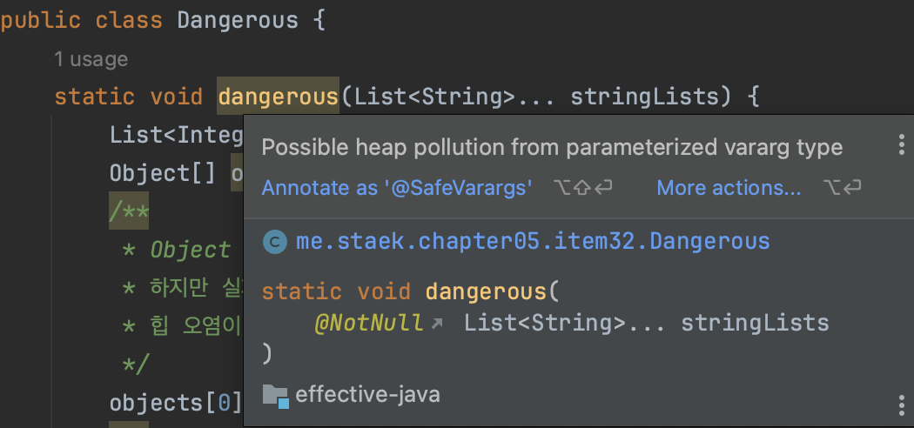

# item32 제네릭과 가인수를 함께 쓸 때는 신중하라

### 개요

가변인수는 메서드에서 넘기는 인수의 개수를 클라이언트가 조절할 수 있게 해주는데, 구현 방식에 허점이 있다.
가변인수 메서드를 호출하면 가변인수를 담기위한 배열이 자동으로 하나 만들어진다.
그런데 내부로 감춰야 했을 이 배열을 클라이언트에 노출하게 되었다.
그 결과 컴파일 경고가 발생한다.

모든 제네릭과 매개변수화 타입은 실체화되지 않는다. (아이템28)
메서드를 선언할 때 실체화 불가타입으로 varargs매개변수를 선언하면 경고가 발생한다.
가변인수 메서드를 호출할 때에도 varargs 매개변수가 실체화 불가타입으로 추론되면, 역시 경고가 발생한다.

- 매개변수화 타입 변수가 타입이 다른 객체를 참조하면 **힙 오염**이 발생한다. [JLS, 4.12.2] 
- 이 경우 형변환이 실패할 수 있으니 제네릭 타입 시스템이 약속한 타입 안정성이 흔들린다.

### 형변환 시 런타임 에러 사례

~~~java
static void dangerous(List<String>... stringLists) {
    List<Integer> intList = List.of(42);
    Object[] objects = stringLists;
    objects[0] = intList;
    String s = stringLists[0].get(0); // 내부적으로 형변환
}
~~~

- 제네릭 varargs 배열 매개변수에 값을 저장하는것은 안전하지 않다.

### 제네릭 배열을 프로그래머가 직접못하게 하면서, 제네릭 vargargs 매개변수는 가능한 이유는 무엇일까?

- 제네릭이나 매개변수화 타입의 varargs 매개변수를 받는 메서드가 실무에서 매우 유용하기 때문이다.
- 그래서 언어 설계자는 이 모순을 수용하기로 했다.

~~~java
// API에서 varargs 매개변수 이용
// 타입안전하게 만들었다.
Arrays.asList(T...)
Collections.addAll(Collection<? super T>) c, T... elements)
EnumSet.of(E first, E... rest)
~~~

### @SafeVarargs ?

- 자바7 에서 @SafeVarargs 가 추가되어 제네릭 가변인수 메서드 작성자가 경고를 숨길 수 있게 되었다.
  ( @SupperssWarnings("unchecked") 는 메서드 내부 모든 uncheched 를 숨기므로 문제가 있다.)

### 제네릭 varargs 매개변수 배열에 다른 메서드가 접근하도록 허용하면 안전하지 않다.

**예외2가지**

1. @SafeVarargs 인 또 다른 varargs 메서드에 넘기는 건 안전하다.

~~~java
@SafeVarargs
static <T> List<T> flatten(List<? extends T>... lists) {
    /**
     * 가변배열에서 값을 하나씩 꺼내서 result에 입력한다.
     * (값을 입력하기에 producer에 해당함.)
     */
    List<T> result = new ArrayList<>();
    for (List<? extends T> list : lists)
        result.addAll(list);
    return result;
}
~~~

2. 이 배열 내용의 일부 함수를 호출만 하는 (varargs를 받지 않는) 일반 메서드에 넘기는 것도 안전하다.

### @SafeVarargs 작성 전 체크할 사항

- varargs 매개변수 배열에 아무것도 저장하지 않는다. (힙오염 됨)
- 그 배열(혹은 복제본)을 신뢰할 수 없는 코드에 노출시키지 않는다. (안전성 보장X)

> @SafeVarargs 는 재정의할 수 없는 매서드에만 달아야 한다. (재정의 메서드가 안전한지 보장 못함)
> 자바8: 정적 메서드, final 인스턴스 메서드 허용
> 자바9: private 인스턴스 메서드 허용
>
> ~~~java
> // ImmutableCollections class는 listFromArray()는 재정의 불가하다.
> // ImmutableCollections는 package private 이기 때문.
> 
> class ImmutableCollections {
>   ...
>   @SafeVarargs
>   static <E> List<E> listFromArray(E... input) {
>       // copy and check manually to avoid TOCTOU
>       @SuppressWarnings("unchecked")
>       E[] tmp = (E[])new Object[input.length]; // implicit nullcheck of input
>       for (int i = 0; i < input.length; i++) {
>           tmp[i] = Objects.requireNonNull(input[i]);
>       }
>       return new ListN<>(tmp, false);
>   }
>   ...
> }
> ~~~
>
> 

### List를 이용한varargs 매개변수 힙오염 예방 방법

#### varargs대신 List를 사용하는 (item28) 하는 함수 생성

~~~java
static <T> List<T> flatten(List<List<? extends T>> lists) {
    List<T> result = new ArrayList<>();
    for (List<? extends T> list : lists)
        result.addAll(list);
    return result;
}
~~~

#### API 이용해서 List 리턴

- 가변인자를 받을수 밖에 없을 때, List.of()를 이용할 수 있다.

~~~java
static <T> List<T> pickTwo(T a, T b, T c) {
    switch(ThreadLocalRandom.current().nextInt(3)) {
        case 0: return List.of(a, b); 
        case 1: return List.of(a, c);
        case 2: return List.of(b, c);
    }
    throw new AssertionError();
}
~~~

### 정리

- 가변인수와 제네릭은 궁합이 좋지 않다.
- 가변인수 기능은 **배열을 노출하여 추상화가 완벽하지 못하고, 배열과 제네릭의 타입 규칙이 서로 다르기 때문이다.**
- 제네릭 varargs 매개변수는 타입안전하지는 않지만, 허용된다.
- 메서드에 제네릭 (혹은 매개변수화된) varargs 매개변수를 사용하고자 한다면, 먼저 그 **메서드가 타입안전한지 확인**한 다음@SafeVarargs 애너테이션을 달아 사용하는데 불편함이 없게끔 하자.