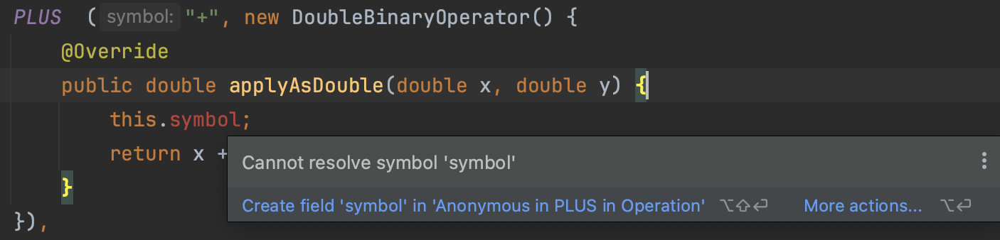

# item42 익명클래스보다는 람다를 사용하라

익명클래스 방식은 코드가 너무 길어 자바는 함수형 프로그래밍에 적합하지 않않다.

자바8

- 추상메서드가 하나인 인터페이스가 함수형 인터페이스가 되었다.
- 람다식을 사용해 만들 수 있게 되었다.

## 람다식 사용

### 람다식을 함수 객체로 사용 (익명 클래스 대체)

- 컴파일러는 람다 식에서 매개변수, 반환값 타입을 추론한다.
- [타입추론 규칙 JLS,18](https://docs.oracle.com/javase/specs/jls/se8/html/jls-18.html)

~~~java
// 상황에 따라 컴파일러가 추론하지 못하는 경우도 있다. (명시적 형변환 필요)
Collections.sort(words,
        (s1, s2) -> Integer.compare(s1.length(), s2.length()));
~~~

~~~java
Collections.sort(words,
        new Comparator<String>() {
            @Override
            public int compare(String s1, String s2) {
                return Integer.compare(s1.length(), s2.length());
            }
        });
~~~

- Collections.sort 구현체

~~~java
@SuppressWarnings({"unchecked", "rawtypes"})
public static <T> void sort(List<T> list, Comparator<? super T> c) {
    list.sort(c);
}
~~~

### 타입추론

컴파일러가 타입을 추론하는데 필요한 정보는 제네릭이 준다.
제네릭 정보를 제공하지 않으면 타입추론이 불가하다. (명시적으로 해야함)

~~~java
// 람다 사용 시 s1이 String인지 알 수 어 명시적으로 캐스팅 해야한다.
List words = Arrays.asList("car","apple", "banana");
Collections.sort(words,
        (s1, s2) -> Integer.compare(((String)s1).length(), ((String)s2).length()));
System.out.println(words);
Collections.shuffle(words);
~~~

~~~java
// 혹은 익명클래스로 작성해야 한다.
Collections.sort(words,
      new Comparator<String>() {
          @Override
          public int compare(String s1, String s2) {
              return Integer.compare(s1.length(), s2.length());
          }
      });
~~~

## 열거타입과 람다

### 상수별 클래스 몸체 구현 (item34)

~~~java
// item34 example
public enum Operation2 {
    PLUS("+") {
        public double apply(double x, double y) { return x + y; }
    },
    MINUS("-") {
        public double apply(double x, double y) { return x - y; }
    },
    public abstract double apply(double x, double y);
  ...
~~~

### 열거타입과 람다

- 열거타입에 인스턴스 필드(람다)는 상수별 클래스 몸체구현 보다 명료하다.

**주의사항**

- 람다는 이름도 없고 문서화도 못 한다.
- 따라서 코드 자체로 동작이 명확히 설명되지 않거나 코드 줄 수가 많아지면 람다를 쓰지 말아야 한다. (1~3줄)

- 열거타입 생성자에 넘겨지는 인수들의 타입도 컴파일타임에 추론된다.
  - 따라서 열거타입 생성자 안의 람다는 열거타입의 인스턴스 맴버에 접근할 수 없다 (인스턴스는 런타임에 생성되기 때문)
  - 따라서 상수별 동작이 간단하지 않거나, 인스턴스필드나 메서드를 사용해야 한다면 상수별 클래스 몸체를 사용해야 한다.
  - 

~~~java
public enum Operation {
    PLUS  ("+", new DoubleBinaryOperator() {
        @Override
        public double applyAsDouble(double x, double y) {
            return x + y;
        }
    }),
    MINUS ("-", (x, y) -> x - y),
    TIMES ("*", (x, y) -> x * y),
    DIVIDE("/", (x, y) -> x / y);

    private final String symbol;
    private final DoubleBinaryOperator op;

    Operation(String symbol, DoubleBinaryOperator op) {
        this.symbol = symbol;
        this.op = op;
    }

    @Override public String toString() { return symbol; }

    public double apply(double x, double y) {
        return op.applyAsDouble(x, y);
    }
}
~~~

~~~java
@FunctionalInterface
public interface DoubleBinaryOperator {
    double applyAsDouble(double left, double right);
}
~~~

> 이 코드에서 열거타입상수의 동작을 표현한 람다를 DoubleBinaryOperator 인터페이스 변수에 할당했다.
> DoubleBinaryOperator는 java.util.function 패키지가 제공하는 다양한 함수 인터페이스(아이템 44) 중
> 하나이다.

### 익명 클래스를 써야 하는 경우

- 람다는 함수형 인터페이스에서만 사용된다.
- 추상클래스의 인스턴스를 만들 때 람다를 쓸 수 없다.
- 추상 메서드가 여러개인 인터페이스의 인스턴스를 만들 때.
- 람다는 자신을 참조할 수 없다. (this 는 바깥 인스턴스를 가리킴)

### 직렬화

- 람다도 익명클래스처럼 직렬화 형태가 구현별로 다를 수 있다. 
- 따라서 람다를 직렬화하는 일은 극히 삼가야 한다.(익명클래스의 인스턴스도 마찬가지.)
- 직렬화 해야 하는 함수가 있다면(Comparator) private 정적 중첩 클래스(item24) 인스턴스 활용

## 정리

자바가 8로 판올림되면서 작은 ㅎ마수 객체를 구현하는 데 적합한 람다가 도입되었다.
**익명클래스는 (함수형 인터페이스가 아닌) 타입의 인스턴스를 만들 때만 사용하라.**

