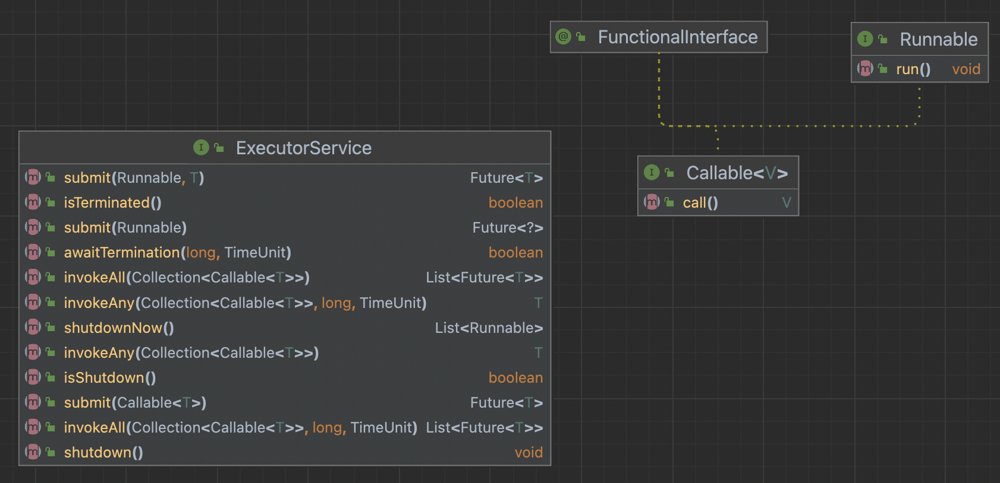

# item44 표준함수형 인터페이스를 사용하라

람다를 지원하면서 템플릿 메서드 패턴 매력이 줄었다.

-> 이후에는 같은 효과의 함수객체를 받는 정적 팩터리나 생성자를 제공하는 것으로 변화했다.

-> 일반화 해서 말하면 함수 객체를 매개변수로 받는 생성자와 메서드를 더 많이 만들어야 한다.
     이 때 함수형 매개변수 타입을 올바르게 선택해야 한다.

LinkedHashMap 을 생각해보자.

removeEldestEntry 를 재의하면 캐시로 사용할 수 있다.

~~~java
protected boolean removeEldestEntry(Map.Entry<K,V> eldest) {
    return false;
}
~~~

- 다시 구현한다면 함수객체를 받는 정적 팩터리나 생성자를 제공했을 것이다.
- removeEldestEntry 가 인스턴스 메서드라 size() 호출 가능

~~~java
// 재정의
protected boolean removeEldestEntry(Map.Entry<K,V> eldest) {
    return size() > 100;
}
~~~

- 생성자에 넘기는 함수객체는 이 맵의 인스턴스 메서드가 아니다.
  팩터리나 생성자를 호출할때는 인스턴스가 없기 때문. 그래서 자기 자신을 같이 넘긴다.

~~~java
@FunctionalInterface
interface EldestEntryRemovalFunction<K,V> {
	boolean remove(Map<K,V> map, Map.Entry<K,V> eldest);
}
~~~

- 자바 API로도 이용이 가능하다.

~~~java
@FunctionalInterface
public interface <T, U> {
}
~~~

## java.util.function

- 아래 6개 기본형을 필두로 총 43개가 존재함.

| 인터페이스          | 함수 시그니처         | 예                    |
| ------------------- | --------------------- | --------------------- |
| `UnaryOperator<T>`  | `T apply(T t)`        | `String::toLowerCase` |
| `BinaryOperator<T>` | `T apply(T t1, T t2)` | `BigInteger::add`     |
| `Predicate<T>`      | `boolean test(T t)`   | `Collection::isEmpty` |
| `Function<T>`       | `R apply(T t)`        | `Arrays::asList`      |
| `Supplier<T>`       | `T get()`             | `Instant::now`        |
| `Consumer<T>`       | `void accept(T t)`    | `System.out::println` |

### 함수형인터페이스 코드를 직접 작성해야 할 때.

구조적으로 ToIntBiFunction<T,U> 와 Comparator<T> 는 동일하다.
그럼에도 Comparator를 사용하는 이유는 아래와 같다.

1. API에서 자주 사용되는데, 이름이 용도를 잘 설명한다.
2. 구현하는 쪽에서 반드시 지켜야 할 규약을 담고 있다.
3. 비교자들을 변환하고 조합해주는 유용한 디폴트 메서드가 많다.

### @FunctionalInterface

- 해당 클래스의 코드나 설명 문서를 읽을 이에게 그 인터페이스가 람다용을 설계된 것임을 알려준다.
- 해당 인터페이스가 추상 메서드를 오직 하나만 가지고 있어야 컴파일이 된다
- 유지보수 과정에서 실수로 메서드 추가가 불가능하다.

### 다중정의 주의점

서로 다른 함수형 인터페이스를 같은 위치의 인수로 받는 메서드들을 다중정의해서는 안된다. (모호함 발생)

- 올바른 메서드를 알려주기 위해 형변환을 해야 할 때가 생긴다 (item52)

~~~java
public interface ExecutorService extends Executor {
    <T> Future<T> submit(Callable<T> task);
        Future<?> submit(Runnable task);
...
}
~~~

- 호출하는 함수와 매개변수 모두 다중정의 했다면, 다중정의 해소 알고리즘은 동작하지 않는다.
- 이 경우 명시적 형변환이 필요하다.

~~~java
class Duplicate {
    public static void dup(char c) {}
    public static void dup() {}
}
~~~

~~~java
public class AmbiguousOverload {
    public static void main(String[] args) {
        ExecutorService executorService = Executors.newFixedThreadPool(1);
        executorService.submit(Duplicate::dup); // 컴파일 에러
    }
}
~~~

## 정리

API 설계시 람다를 염두해 두어야 한다.
입력,반환값에 함수형 인터페이스 타입을 활용하라.
java.util.function 패키지를 잘 활용하라.

