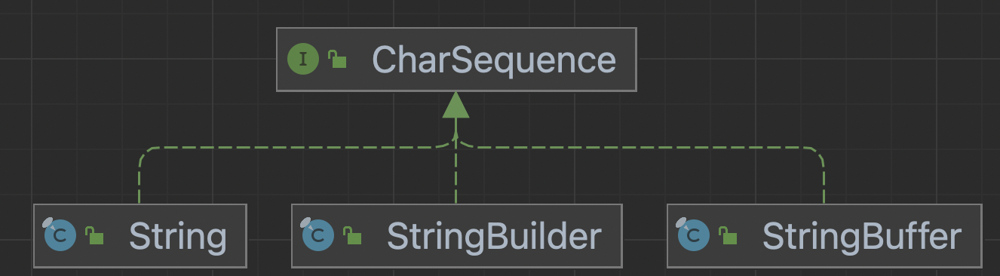

# item52 다중정의는 신중히 사용하라.

## 다중정의와 재정의 차이와 혼란

- 아래 코드는 모두 `String classify(Collection<?> c)` 메서드를 호출한 결과가 출력된다.
- 다중정의된 classify 메서드는 어느 메서드를 호출 할 지가 컴파일 타임에 정해지기 때문.

~~~java
public class CollectionClassifier {
    public static String classify(Set<?> s) {
        return "Set";
    }

    public static String classify(List<?> lst) {
        return "List";
    }

    public static String classify(Collection<?> c) {
        return "Unknown Collection";
    }

    public static void main(String[] args) {
        Collection<?>[] collections = {
                new HashSet<String>(),
                new ArrayList<BigInteger>(),
                new HashMap<String, String>().values()
        };

        for (Collection<?> c : collections)
            System.out.println(classify(c));
    }
}
~~~

아래처럼 코드로 명시해야 의도한 결과가 출력된다.

1. 컴파일타임에 체크할 수 있도록 타입을 명시적으로 작성

~~~java
@SuppressWarnings("unchecked")
HashSet<String> collection = (HashSet<String>) collections[0];
System.out.println(classify(collection));
~~~

2. 런타임에 체크할 수 있도록 classify 메서드를 수정

~~~java
public static String classify(Collection<?> c) {
    return c instanceof Set  ? "Set" :
            c instanceof List ? "List" : "Unknown Collection";
}
~~~

- 재정의한 메서드는 동적으로 선택되고, 다중정의한 메서드는 정적으로 선택된다.
- 따라서 아래는 우리가 생각한 결과가 출력된다.

~~~java
class Wine {
    String name() { return "wine"; }
}

class SparklingWine extends Wine {
    @Override String name() { return "sparkling wine"; }
}

class Champagne extends SparklingWine {
    @Override String name() { return "champagne"; }
}

public class Overriding {
    public static void main(String[] args) {
        List<Wine> wineList = List.of(
                new Wine(), new SparklingWine(), new Champagne());

        for (Wine wine : wineList)
            System.out.println(wine.name());
    }
}
~~~

## 다중정의가 혼동을 일으키는 상황을 피해야 한다.

- API 사용자가 매개변수를 넘기면서 어떤 다중정의 메서드가 호출될지 모른다면 오동작할 수 있다.

### 다중정의 혼란  - 메서드 이름을 다르게 하자

- 안전하고 보수적으로 가려면 매개변수 수가 같은 다중정의는 만들지 말자.
- 가변인수를 사용하는 메서드라면 다중정의를 아예 하지 말아야 한다 (예외 item53)

다중정의 하는 대신 메서드 이름을 다르게 지어줄 수 있다.

~~~java
public class ObjectOutputStream
    extends OutputStream implements ObjectOutput, ObjectStreamConstants
{
  ...
		public void writeBoolean(boolean val) throws IOException {
        bout.writeBoolean(val);
    }

    public void writeByte(int val) throws IOException  {
        bout.writeByte(val);
    }

    public void writeShort(int val)  throws IOException {
        bout.writeShort(val);
    }

    public void writeChar(int val)  throws IOException {
        bout.writeChar(val);
    }
	...
}
~~~

### 다중정의 혼란  - 다중정의 생성자

- 대안: 정적팩터리 활용 (item01) 
- 생성자는 재정의 불가하므로 다중정의와 혼용될 우려는 없다.

### 다중정의 혼란 - 매개변수 수가 같은 다중정의 메서드

- 매개변수 중 하나이상이 근본적으로 다르다(radically different)면  헷갈리지 않는다.
  - 형변환되지 않는다는 뜻

- 주의사항: Autoboxing 

  - Set의 remove는 Object로 오토박싱하여 데이터가 삭제되지만
    List 의 remove 메서드 는 인덱스로 인식되어 처리된다.
  - 헷갈린다.

  ~~~java
  public class SetList {
      public static void main(String[] args) {
          Set<Integer> set = new TreeSet<>();
          List<Integer> list = new ArrayList<>();
  
          for (int i = -3; i < 3; i++) {
              set.add(i);
              list.add(i);
          }
          for (int i = 0; i < 3; i++) {
              set.remove(i);
              list.remove(i);
  //            list.remove(Integer.valueOf(i));
          }
          System.out.println(set + " " + list);
      }
  }
  ~~~

  ~~~java
  // java.util.List
  E remove(int index);
  boolean remove(Object o);
  ~~~

  

### 다중정의 혼란 - 람다와 메서드참조

- 2번에서 컴파일에러가 발생한다.

  - println 은 부정확한 메서드 참조 (JLS, 15.13.1) 에 해당.
  - 암시적 타입 람다식 이나 부정확한 메서드 참조 같은 인수 표현식은 목표타입이 선택되기 전에는 의미가 정해지지 않아
    적용성 테스트에서 무시된다. (JLs, 15.12.2)
  - 쉽게이야기하면 호출 함수 가 다중정의되어있고, 호출 인자도 다중정의 되어있으면 타겟 매칭이 안되서 컴파일 에러남.

  

- item44 표준함수형 인터페이스를 사용하라 에서 다루었다.

~~~java
// 1
new Thread(System.out::println).start();

// 2
ExecutorService exec = Executors.newCachedThreadPool();
exec.submit(System.out::println);
~~~

- 다중정의된 메서드들이 함수형 인터페이스를 인수로 받을 때 비록 서로 다른 함수형 인터페이스라도 인수 위치가 같으면 혼란이 생길 수 있다.
- 코드는 me.staek.chapter07.item44.AmbiguousOverload 참조

### 다중정의 혼란 - 위임

- String class 에는 `public boolean contentEquals(StringBuffer sb)` 가 있었다.
- 버전업하며 비슷한 클래스의 공통인터페이스 CharSequence 가 생겼고, 
  `public boolean contentEquals(CharSequence cs)` 도 생겼다.
- 자바는, 이전 contentEquals 메서드가 호출되면, CharSequence 를 인자로 받는 메서드로 위임해주어 혼동을 최소화 하였다.

~~~java
public class CharSequenceEx {
    public static void main(String[] args) {
        String test = new String("test");
        StringBuffer sb = new StringBuffer();
        StringBuilder sb2 = new StringBuilder();
        sb.append("seongtki");
        sb2.append("test");
        System.out.println(test.contentEquals(sb));
        System.out.println(test.contentEquals(sb2));
    }
}
~~~

~~~java
// String.java
public boolean contentEquals(StringBuffer sb) {
    return contentEquals((CharSequence)sb);
}
~~~

## 정리

자바가 꼭 다중정의를 활용해야 하는 건 아니다.

매개변수 수가 같을 때는 다중정의를 피하는 게 좋다.

- 생성자는 힘들 수 있는데, 헷갈릴만한 매개변수를 형변환해서 정확한 다중정의 메서드가 선택되도록 하는 게 좋다.
- 이게 힘들다면, 같은 객체를 입력받는 다중정의 메서드들이 모두 동일하게 동작하도록 만들어야 한다.

그렇지 못한다면, 의도대로 프로그래밍하기 힘들것이다.

