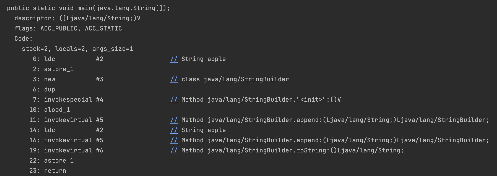
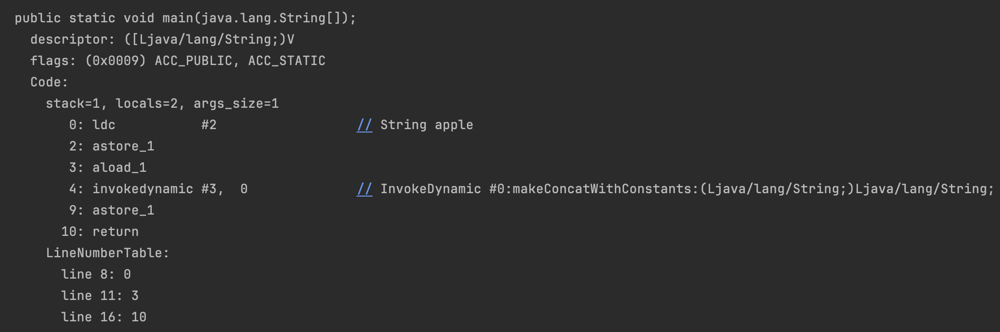

# item63 문자열은 느리니 주의하라

문자열 연결연산자 (+) 는 편하지만 성능이슈가 있다.

문자열 연결 연산자로 문자열 n개를 잇는 시간은 n^2에 비례한다.

문자열은 불변이므로 양쪽 내용을 모두 복사해야 하기 때문이다.

그러니 StringBuilder 혹은 StringBuffer 를 사용하자. (버퍼를 두기 때문에 더 빠르다)

### StringBuffer vs StringBuilder

- StringBuffer 는 멀티스레드에서 안전함 StringBuilder는 안전하지 않음

## + 연산의 내부상황

- java8 

- StringBuilder 를 생성한다.

  - 아래처럼 동작하게 된다.

  ~~~java
   ret = new StringBuilder(ret).append("LOVE").toString()
  ~~~

- java9 부터
- [StringConcatFactory](https://docs.oracle.com/javase/9/docs/api/java/lang/invoke/StringConcatFactory.html) 의 makeConcatWithConstants 에서 동작한다.

