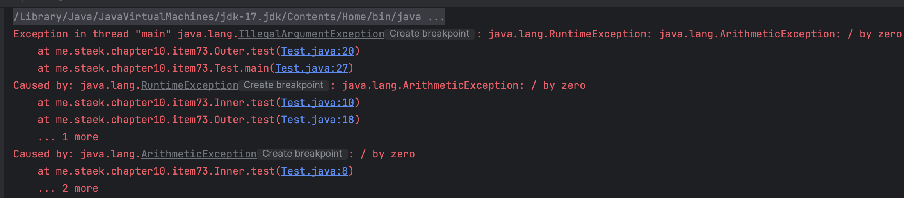

# item73 추상화수준에 맞는 예외를 던지라

### 예외 번역(Exception translation)

- 저수준 메서드에서 적절한 예외처리 하지 않고 던질 때, 고수준 메서드에서 명세되지 않은 예외가 발생할 수 있다.
- 이를 피하기 위해서 전파된 저수준 예외를 잡아 자신의 추상화 수준에 맞는 예외로 바꾼뒤 던지는데, 
  이를 예외 번역(exception translation)이라 한다. 

~~~java
try {
	... // 저수준 추상화 이용
} catch(LowLevelException e) {
	//추상화 수준에 맞게 번역한다.
	throw new HigherLevelException(...);
}
~~~

- API Example
- AbstractSequentialList class get method 보면 추상화 수준에 맞는 IndexOutOfBoundsException로 번역하여 예외를 던진다.

~~~java
/**
 * Returns the element at the specified position in this list.
 *
 * 
This implementation first gets a list iterator pointing to the
 * indexed element (with {@code listIterator(index)}).  Then, it gets
 * the element using {@code ListIterator.next} and returns it.
 *
 * @throws IndexOutOfBoundsException {@inheritDoc}
 */
public E get(int index) {
    try {
        return listIterator(index).next();
    } catch (NoSuchElementException exc) {
        throw new IndexOutOfBoundsException("Index: "+index);
    }
}
~~~

- List 인터페이스를 보면 예외는 IndexOutOfBoundsException 로 명세되어 있다.

~~~java
/**
 * Returns the element at the specified position in this list.
 *
 * @param index index of the element to return
 * @return the element at the specified position in this list
 * @throws IndexOutOfBoundsException if the index is out of range
 *         ({@code index < 0 || index >= size()})
 */
E get(int index);
~~~

### 예외 연쇄(exception chaining)

- 예외를 번역해서 상위로 전파할 때 번역할 저수준 예외가 디버깅에 도움이 된다면 예외 연쇄를 사용할 수 있다.
- 이 예외 연쇄란 문제의 원인(cause)를 고수준 예외에 실어 보내는 방식으로, **상위 계층에서는 필요하면 저수준 예외를 꺼내어 확인할 수 있다.** 

~~~java
try {
	... // 저수준 추상화 이용
} catch(LowLevelException e) {
	// 저수준 예외(e)를 고수준 예외에 실어 보낸다. 
	throw new HigherLevelException(e);
}
~~~

~~~java
package me.staek.chapter10.item73;

class Inner {
    public void test() {
        try {
            int a = 1/0;
        } catch (ArithmeticException e) {
            throw new RuntimeException(e);
        }
    }
}
class Outer {

    public void test() {
        try {
            new Inner().test();
        } catch (RuntimeException e) {
            throw new IllegalArgumentException(e);
        }
    }
}
public class Test {
    public static void main(String[] args) {
        Outer outer = new Outer();
        outer.test();
    }
}
~~~

### 예외 번역도 남용해선 안된다. 

- 저수준의 예외를 무작정 바깥으로 전파해서 생기는 문제는 해결할 수 있지만, 그렇다고 이를 남용해서는 안된다.
- 이에 대한 차선책 두개를 책에서 소개한다
  1. 상위 계층에서 인수를 전달하기 전에 미리 검사한다. 
  2. java.util.logging의 로깅 기능등을 이용해 기록해두어 클라이언트에게 전파하지 않고 프로그래머가 로그 분석 및 조치를 취할 수 있게 한다. 

## 정리

- 아래 계층의 예외를 예방하고나 스스로 처리할 수 없고, 그 예외를 상위 계층에 그대로 노출하기 곤란하다면 예외 번역을 사용하라
- 이때 예외 연쇄를 이용하면 상ㅇ휘계층에는 맥락에 어울리는 고수준 예외를 던지면서 근본 원인도 함께 알려주어 오류를 분석하기에 좋다. (item75)