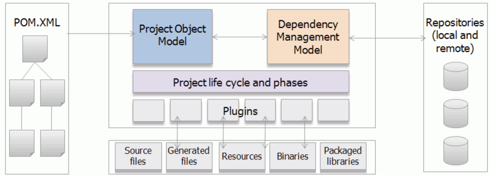
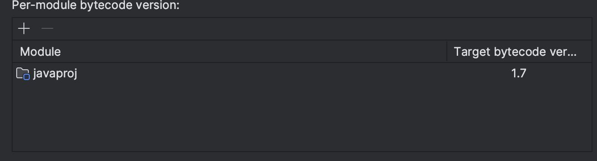
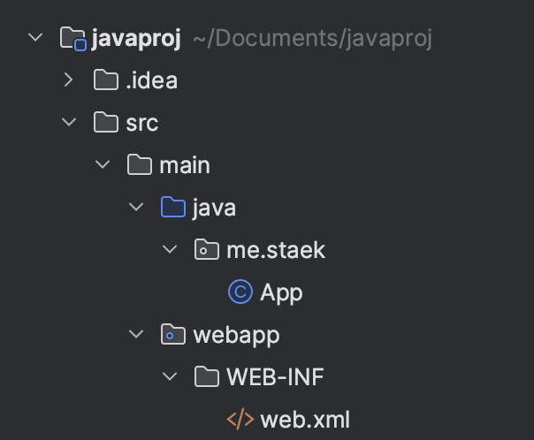

# Maven

- maven 은 빌드도구다.
- [Apache Maven Project](https://maven.apache.org)





### 프로젝트 생성

~~~sh
$ mvn archetype:generate -DgroupId=me.staek -DartifactId=javaproj -DarchetypeArtifactId=maven-archetype-quickstart
~~~

~~~sh
[INFO] Scanning for projects...
[INFO]
[INFO] ------------------< org.apache.maven:standalone-pom >-------------------
[INFO] Building Maven Stub Project (No POM) 1
[INFO] --------------------------------[ pom ]---------------------------------
[INFO]
[INFO] >>> archetype:3.2.1:generate (default-cli) > generate-sources @ standalone-pom >>>
[INFO]
[INFO] <<< archetype:3.2.1:generate (default-cli) < generate-sources @ standalone-pom <<<
[INFO]
[INFO]
[INFO] --- archetype:3.2.1:generate (default-cli) @ standalone-pom ---
[INFO] Generating project in Interactive mode

[INFO] Using property: groupId = me.staek
[INFO] Using property: artifactId = javaproj2
Define value for property 'version' 1.0-SNAPSHOT: : [INFO] Using property: package = me.staek
Confirm properties configuration:
groupId: me.staek
artifactId: javaproj2
version: 1.0-SNAPSHOT
package: me.staek
 Y: :
[INFO] ----------------------------------------------------------------------------
[INFO] Using following parameters for creating project from Old (1.x) Archetype: maven-archetype-quickstart:1.0
[INFO] ----------------------------------------------------------------------------
[INFO] Parameter: basedir, Value: /Users/staek/Documents
[INFO] Parameter: package, Value: me.staek
[INFO] Parameter: groupId, Value: me.staek
[INFO] Parameter: artifactId, Value: javaproj2
[INFO] Parameter: packageName, Value: me.staek
[INFO] Parameter: version, Value: 1.0-SNAPSHOT
[INFO] project created from Old (1.x) Archetype in dir: /Users/staek/Documents/javaproj2
[INFO] ------------------------------------------------------------------------
[INFO] BUILD SUCCESS
[INFO] ------------------------------------------------------------------------
[INFO] Total time:  19.261 s
[INFO] Finished at: 2023-09-15T17:47:18+09:00
[INFO] ------------------------------------------------------------------------
~~~


## Build Lifecycle

| 명칭     | comment                                                      |
| -------- | ------------------------------------------------------------ |
| clean    | 빌드 시 생성된 파일 모두 삭제                                |
| validate | 프로젝트 올바른지 체크하고 필요한 모든 정보를 사용 할 수 있는지 확인 |
| compile  | 소스코드 컴파일                                              |
| test     | 단위테스트 실행                                              |
| package  | 컴파일된 코드와 리소스들을 jar, war 등으로 아카이빙          |
| verify   | 통합 테스트결과에 대한 검사를 실행하여 품질기준을 충족하는지 확인 |
| install  | 패키지를 로컬저장소에 설치                                   |
| site     | 프로젝트 문서와 사이트 생성                                  |
| deploy   | 만들어진 패키지를 원격저장소에 release                       |


### complile

- v3.9.4 기준 java v1.7 이 기본버전이다.
- pom.xml 파일에 아래와 같이 추가하면 적용된다.

~~~xml
<properties>
  <maven.compiler.source>17</maven.compiler.source>
  <maven.compiler.target>17</maven.compiler.target>
</properties>
~~~

~~~sh
$ mvn compile # target 에 class 파일이 생성됨
~~~


### package

~~~sh
$ mvn package # jar 파일 생성
~~~

~~~sh
[INFO] Results:
[INFO]
[INFO] Tests run: 1, Failures: 0, Errors: 0, Skipped: 0
[INFO]
[INFO]
[INFO] --- jar:3.3.0:jar (default-jar) @ javaproj ---
[INFO] Building jar: /Users/staek/Documents/javaproj/target/javaproj-1.0-SNAPSHOT.jar
~~~


### 실행

~~~sh
$ java -cp target/javaproj-1.0-SNAPSHOT.jar me.staek.App

Hello World!
~~~


### 엘리먼트

- `<groupId>` : 프로젝트의 패키지 명칭

- `<artifactId>` : artifact 이름, groupId 내에서 유일해야 한다.

  ```
    <groupId>org.springframework</groupId>
    <artifactId>spring-webmvc</artifactId>
  ```

- `<version>` : artifact 의 현재버전 ex. 1.0-SNAPSHOT

- `<name>` : 어플리케이션 명칭

- `<packaging>` : 패키징 유형(jar, war 등)

- `<distributionManagement>` : artifact가 배포될 저장소 정보와 설정

- `<parent>` : 프로젝트의 계층 정보

- `<dependencyManagement>` : 의존성 처리에 대한 기본 설정 영역

- `<dependencies>` : 의존성 정의 영역

- `<repositories>` : 이거 안쓰면 공식 maven 저장소를 활용하지만, 사용하면 거기 저장소를 사용

- `<build>` : 빌드에 사용할 플러그인 목록을 나열

- `<reporting>` : 리포팅에 사용할 플러그인 목록을 나열

- `<properties>` : 보기좋게 관리가능, 보통 버전에 많이 쓴다.

  ```
    <!-- properties 에 이렇게 추가하면 -->
    <spring-version>4.3.3.RELEASE</spring-version>
  
    <!-- dependencies 에 이렇게 쓸수 있다. -->
    <version>${spring-version}</version>
  ```


### plugin

단계별 실행 프로그램이 따로 존재한다.

| Phase | Plug-in | Goal |
| ----- | ------- | ---- |
|       |         |      |


- 단계별로 실행할수 있는 프로그램을 플러그인 이라고 함
  - 플로그인은 pom에서 설정가능함


- not define 은 단계에 대한 플로그인이 연결되지 않은 상태

~~~sh
 mvn help:describe -Dcmd=compile
~~~

~~~sh
It is a part of the lifecycle for the POM packaging 'jar'. This lifecycle includes the following phases:
* validate: Not defined
* initialize: Not defined
* generate-sources: Not defined
* process-sources: Not defined
* generate-resources: Not defined
* process-resources: org.apache.maven.plugins:maven-resources-plugin:3.3.1:resources
* compile: org.apache.maven.plugins:maven-compiler-plugin:3.11.0:compile
* process-classes: Not defined
* generate-test-sources: Not defined
* process-test-sources: Not defined
* generate-test-resources: Not defined
* process-test-resources: org.apache.maven.plugins:maven-resources-plugin:3.3.1:testResources
* test-compile: org.apache.maven.plugins:maven-compiler-plugin:3.11.0:testCompile
* process-test-classes: Not defined
* test: org.apache.maven.plugins:maven-surefire-plugin:3.1.2:test
* prepare-package: Not defined
* package: org.apache.maven.plugins:maven-jar-plugin:3.3.0:jar
* pre-integration-test: Not defined
* integration-test: Not defined
* post-integration-test: Not defined
* verify: Not defined
* install: org.apache.maven.plugins:maven-install-plugin:3.1.1:install
* deploy: org.apache.maven.plugins:maven-deploy-plugin:3.1.1:deploy
~~~

- [maven support plugin](https://maven.apache.org/plugins/index.html)


### goal 이 실질적인 플러그인 역할을 한다.

- 같은 플러그인 내에 comile, testComile 두개의 goal로 나뉘어짐.

~~~sh
* compile: org.apache.maven.plugins:maven-compiler-plugin:3.11.0:compile
* test-compile: org.apache.maven.plugins:maven-compiler-plugin:3.11.0:testCompile
~~~


### 컴파일러 플러그인과 jdk 버전 변경

- Plugin tag에서 version 선택이 가능하다.



~~~xml
<build>
  <plugins>
    <plugin>
      <artifactId>maven-compiler-plugin</artifactId>
      <version>3.8.1</version>
      <configuration>
        <source>17</source>
        <target>17</target>
      </configuration>
    </plugin>
  </plugins>
</build>
~~~


### 디렉토리 구조

| 파일                | comment                                    |
| ------------------- | ------------------------------------------ |
| /pom.xml            | project object model. 프로젝트 정보를 기술 |
| /src/main.java      | 소스파일 위치                              |
| /src/main/resources | 리소스                                     |
| /src/main/webapp    | 웹 어플리케이션 파일 위치(WEB-INF)         |
| /src/test/java      | 테스트 케이스 java 소스                    |
| /src/test/resources | 테스트 케이스 리소스                       |
| /target             | 빌드 시 생성된 리소스 위치                 |


### 웹 프로젝트로 변경

```xml
<packaging>war</packaging>
```




### 라이브러리 설정

~~~xml
<dependency>
  <groupId>org.apache.tomcat</groupId>
  <artifactId>tomcat-jsp-api</artifactId>
  <version>11.0.0-M11</version>
</dependency>
~~~

- **의존성 분석 순서** 

  1. 로컬 저장소에서 의존성 확인
  2. 원격 저장소 리스트에서 의존성 확인
  3. 1과 2가 실패하면 의존성 에러 보고

   

- **의존성<dependency> 필수 선언 항목**

  <groupId>: 부분적인 프로젝트나 조직에서의 라이브러리 집합을 식별하기 위해 제공한다.

  <artifactId>: 프로젝트의 실제 이름으로 groupId와 합쳐져 프로젝트 식별에 쓰인다.

  <version>: 선언한 의존성 artifact의 버전으로 프로젝트 내에서 사용하는artifcat의 일관성을 추구할 수 있다.

 


## 다른 툴과 차이점

### ant

1. Ant가 비교적 자유도가 높다. 전처리, 컴파일, 패키징, 테스팅, 배포 가능
2. Maven은 정해진 라이프사이클에 의하여 작업 수행하며, 전반적인 프로젝트 관리 기능까지 포함하고 있음. (Build Tool + Project Management)

### gradle

1. XML 대신 groovy 스크립트를 사용하여 동적인 빌드 가능.
2. maven은 멀티프로젝트에서 상속구조인데, gradle은 주입 방식이다. 멀티프로젝트에서 gradle이 더 적합하다.


https://bumday.tistory.com/120

https://sjh836.tistory.com/131


## [dependencyManagement](https://vicki.tistory.com/1268)

https://vicki.tistory.com/1268

https://darkstart.tistory.com/238


