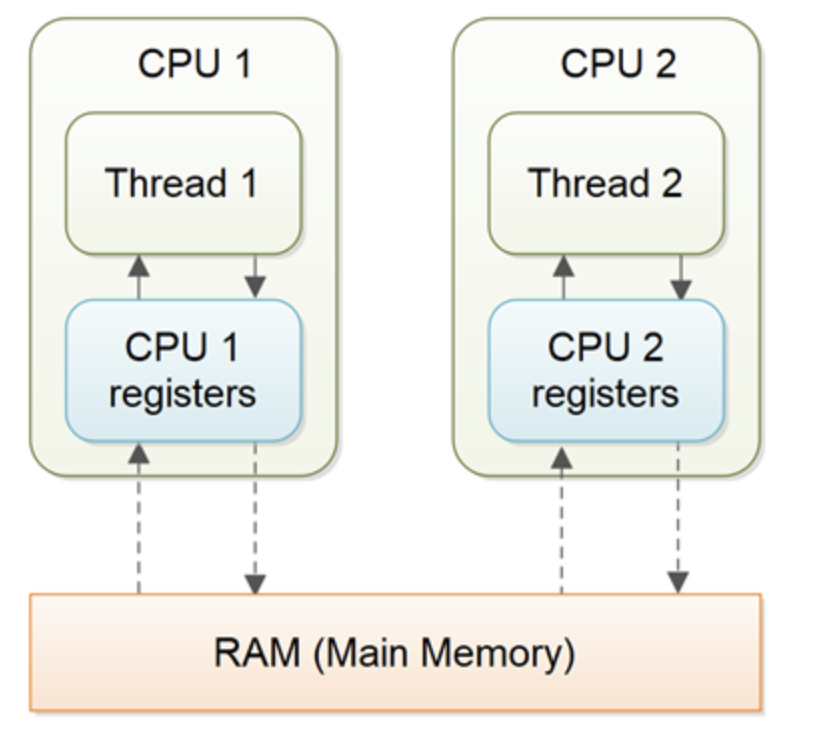
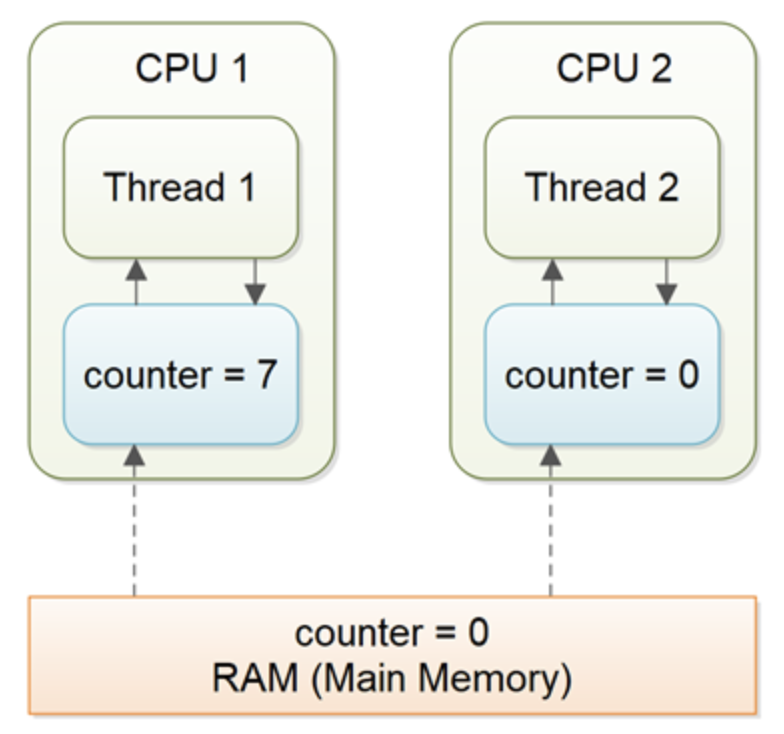

# volatile

- `volatile` keyword는 Java 변수를 Main Memory에 추가,변경,읽기 하겠다는 의미이다.
- 스레드가 작업을 처리할 때, CPU cache에 read/write가 아닌 Main Memory에서 read/write 한다.

### non volatile

- 값을 읽어올 때 우선 캐시에 해당 값이 있는지 확인하고 없는 경우에만 메인 메모리에서 읽어온다.
- 메모리에 저장된 변수의 값이 변경되었는데도 캐시에 저장된 값이 갱신되지 않아 메모리에 저장된 값과 다를 수 있다.

- thread는 cache 에 값을 확인하고 없으면 main memory를 확인한다.

- 공유자원인 counter 변수를 캐시에서만 처리하게 되어 다른 스레드에서 동기화되지 않은 counter 값을 cache로부터 읽어들일 수 있다.

### volatile 과 sync

- Multi Thread 환경에서 여러개의 Thread가 공유자원을 사용한다면, volatile 으로는 thread safe 하지 않다..
- main memory 에 값을 저장한다고 하더라도 race condition 은 발생하기 때문이다.
- 동기화를 위해선 공유자원의 원자성을보호하면서 volatile을 사용해야 한다.

### reference

https://jenkov.com/tutorials/java-concurrency/volatile.html#java-volatile-tutorial-video

