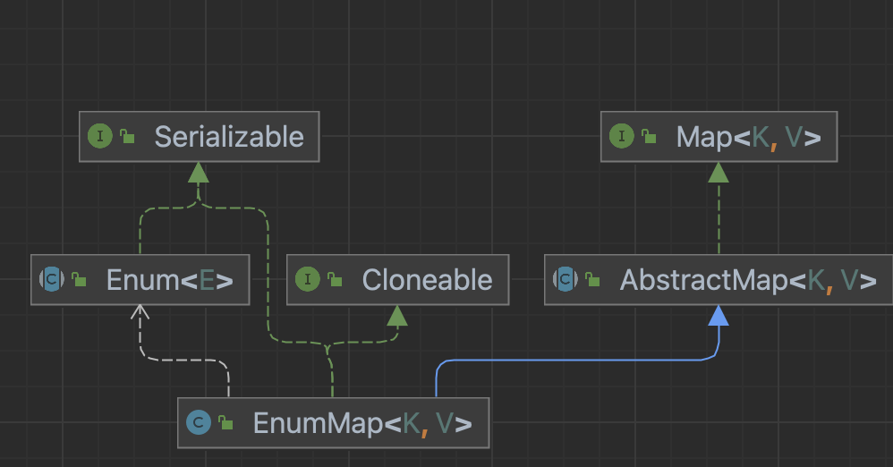

# EnumMap

- Map을 사용하는데 Key가 Enum이라면 EnumMap을 고려하자.

- Enum은 컴파일 시점에 전체 요소의 개수를 계산할 수 있고, 생성자를 제공하지 않으므로, 개수가 고정임
- EnumMap은 데이터의 관리에 배열을 사용할 수 있어 메모리관리에 효율적.
- 값에 접근할때 인덱스로 직접 배열에 접근하므로 CRUD 모두 O(1)의 시간 복잡도.

### 생성자

- 정해진 크기의 배열을 생성한다.

~~~java
public EnumMap(Class<K> keyType) {
    this.keyType = keyType;
    keyUniverse = getKeyUniverse(keyType);
    vals = new Object[keyUniverse.length];
}
~~~

### put

- EnumMap은 키의 선언순서인 ordinal을 인덱스로 사용한다.
- EnumMap의 삽입연산은 항상 O(1)이다.

~~~java
public V put(K key, V value) {
    typeCheck(key);

    int index = key.ordinal();
    Object oldValue = vals[index];
    vals[index] = maskNull(value);
    if (oldValue == null)
        size++;
    return unmaskNull(oldValue);
}
~~~

### get

- 단순히 해당 키의 ordinal을 인덱스로 사용해 배열에서 값을 꺼내 리턴한다.

~~~java
public V get(Object key) {
    return (isValidKey(key) ? unmaskNull(vals[((Enum<?>)key).ordinal()]) : null);
}
~~~

