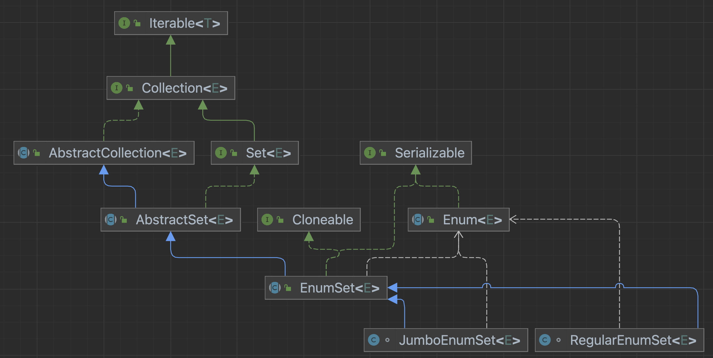

# EnumSet

EnumSet의 모든 메서드는 비트 연산을 사용하고 있으며 64개 이하라면 하나의 long 비트만을 사용합니다. 각 계산에 대해 하나의 비트만 검사하는 EnumSet과 해시 코드를 계산해야 하는 HashSet을 비교한다면 당연히 EnumSet이 빠릅니다.

`HashSet` 같은 다른 `Set` 구현체보다 빠르다고 볼 수 있습니다. 올바른 데이터를 찾기 위해 `hashCode`를 찾을 필요조차 없습니다.




1. 열거형 값만 포함 할 수 있으며, 모든 값은 동일한 열거형이어야 한다.
2. null을 추가할 수 없다.
3. 스레드에 안전하지 않으므로, 필요할 경우 외부에서 동기화한다.
4. 복사본에 fail-safe iterator(장애 발생시 작업을 중단하지 않음) 를 사용하여 컬렉션을 순회할 때, 컬렉션이 수정되어도 ConcurrentModificationException이 발생하지 않는다.


### noneOf

- Enum 개수 64개 이하는 long 변수 한개로 비트연산을 한다.

~~~java
public static <E extends Enum<E>> EnumSet<E> noneOf(Class<E> elementType) {
    Enum<?>[] universe = getUniverse(elementType);
    if (universe == null)
        throw new ClassCastException(elementType + " not an enum");

    if (universe.length <= 64)
        return new RegularEnumSet<>(elementType, universe);
    else
        return new JumboEnumSet<>(elementType, universe);
}
~~~


### universe?

- 캐싱해두고 있는 enum 배열을 가져오는 듯 한데 정확히 모르겠다..

~~~java
private static <E extends Enum<E>> E[] getUniverse(Class<E> elementType) {
    return SharedSecrets.getJavaLangAccess()
                                    .getEnumConstantsShared(elementType);
}
~~~


### 64개 이하

### RegularEnumSet

~~~java
class RegularEnumSet<E extends Enum<E>> extends EnumSet<E> {
    @java.io.Serial
    private static final long serialVersionUID = 3411599620347842686L;
    /**
     * Bit vector representation of this set.  The 2^k bit indicates the
     * presence of universe[k] in this set.
     */
    private long elements = 0L;

    RegularEnumSet(Class<E>elementType, Enum<?>[] universe) {
        super(elementType, universe);
    }

    void addRange(E from, E to) {
        elements = (-1L >>>  (from.ordinal() - to.ordinal() - 1)) << from.ordinal();
    }

    void addAll() {
        if (universe.length != 0)
            elements = -1L >>> -universe.length;
    }
    public boolean removeAll(Collection<?> c) {
      if (!(c instanceof RegularEnumSet<?> es))
          return super.removeAll(c);

      if (es.elementType != elementType)
          return false;

      long oldElements = elements;
      elements &= ~es.elements;
      return elements != oldElements;
    }
}
~~~


### complementOf

 해당 EnumSet의 여집합을 구하는 메서드.


### EnumSet.allOf(null);  

- NullPointerEsception 발생

~~~java
public static <E extends Enum<E>> EnumSet<E> noneOf(Class<E> elementType) {
    Enum<?>[] universe = getUniverse(elementType);
    if (universe == null)
        throw new ClassCastException(elementType + " not an enum");

    if (universe.length <= 64)
        return new RegularEnumSet<>(elementType, universe);
    else
        return new JumboEnumSet<>(elementType, universe);
}
~~~

~~~java
// Enumset.java
private static <E extends Enum<E>> E[] getUniverse(Class<E> elementType) {
    return SharedSecrets.getJavaLangAccess()
                                    .getEnumConstantsShared(elementType);
}
~~~

```java
// System.java
public <E extends Enum<E>>
E[] getEnumConstantsShared(Class<E> klass) {
    return klass.getEnumConstantsShared();
}
```

~~~java
// Thread.java
private void dispatchUncaughtException(Throwable e) {
    getUncaughtExceptionHandler().uncaughtException(this, e);
}
~~~


#### 1. 사용자 편의성 - (사용자는 어떤 구현 객체가 적합한지 몰라도 상관없다)

`RegularEnumSet`은 원소의 갯수가 적을 때 적합하고, `JumboEnumSet`은 원소의 갯수가 많을때 적합하지만, 이는 EnumSet의 구현체들을 모두 알고 있는 사용자가 아니라면 난해한 선택지가 될 수도 있습니다. 하지만 EnumSet을 가장 잘 알고 있는 EnumSet 개발자가 적절한 구현 객체를 반환해준다면 EnumSet을 사용하는 입장에서는 어떤 구현체가 적합한지 고려하지 않아도 됩니다.

 

#### 2. 사용자 편의성2 - (사용자는 빈번하게 발생되는 EnumSet초기화 과정을 간단히 진행할 수 있다.)

EnumSet이 다루는 Enum의 모든 원소들을 Set에 담는 행위는 빈번하게 수행될 것으로 예상되는 일입니다. 이러한 경우를 대비하여서 EnumSet의 `allOf`라는 메소드를 사용하면 모든 Enum 원소가 담겨있는 EnumSet을 쉽게 반환받고 사용 할 수 있습니다. 

 

#### 3. EnumSet의 확장성과 유지보수의 이점

EnumSet을 유지보수하는 과정에서 `RegularEnumSet`과 `JumboEnumSet` 이외에 다른 경우를 대비하는 구현 클래스가 추가 된다고 하여도 내부에 감추어져 있기 때문에, EnumSet을 사용하던 기존의 코드에는 전혀 영향이 없습니다. 심지어 `RegularEnumSet`이 삭제된다 하더라도 사용자에게 영향이 없습니다. 이는 EnumSet의 확장성의 큰 이점으로 작용할 수 있습니다.


