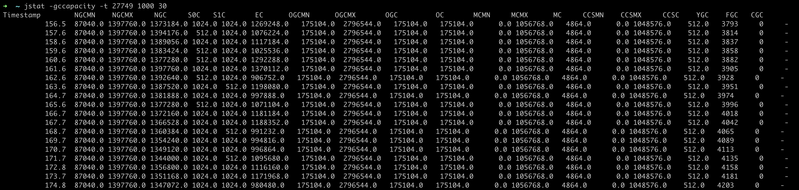

# GC monitoring


## VM option

~~~
java -verbosegc Test1 # GC 실행 시마다 로그가 남겨진다.
14.754: [GC (Allocation Failure)  84341K->38498K(251392K), 0.0516745 secs]


// GC type 선택하여 실행한다.
java -XX:+UseSerialGC Test2
java -XX:+UseG1GC Test2

java -XX:+PrintCommandLineFlags -version
~~~


### Java 1.8

`-XX:+UseParallelGC`로 출력 된다. Java 1.8의 기본 GC는 `ParallelGC`이다.

```
-XX:InitialHeapSize=534731584 -XX:MaxHeapSize=8555705344 -XX:+PrintCommandLineFlags -XX:+UseCompressedClassPointers -XX:+UseCompressedOops -XX:-UseLargePagesIndividualAllocation -XX:+UseParallelGC
java version "1.8.0_251"
Java(TM) SE Runtime Environment (build 1.8.0_251-b08)
Java HotSpot(TM) 64-Bit Server VM (build 25.251-b08, mixed mode)
```

### Java 11

`-XX:+UseG1GC`로 출력 된다. Java 11의 기본 GC는 `G1GC`이다.

```
-XX:G1ConcRefinementThreads=4 -XX:GCDrainStackTargetSize=64 -XX:InitialHeapSize=134217728 -XX:MaxHeapSize=2147483648 -XX:+PrintCommandLineFlags -XX:ReservedCodeCacheSize=251658240 -XX:+SegmentedCodeCache -XX:+UseCompressedClassPointers -XX:+UseCompressedOops -XX:+UseG1GC
openjdk version "11.0.3" 2019-04-16 LTS
OpenJDK Runtime Environment Zulu11.31+11-CA (build 11.0.3+7-LTS)
OpenJDK 64-Bit Server VM Zulu11.31+11-CA (build 11.0.3+7-LTS, mixed mode)
```


## Monitoring

### jstat (in jvm)

- jstat -gcutil -t "pid" "ms" "count"


- jstat -gccapacity -t "pid" "ms" "count"




### jconsole (in jvm)


- 명시적인 GC 가 가능하다.


### VisualVM (intellij plugin)


- GC type (Serial, Parallel, G1) 에 따른 UI를 제공한다.
- Eden, Old Gen, S0, S1 등 항목이 시각화 되어있다.


### Custom GC Monitor

- java에서 제공하는 GarbageCollectorMXBean 를 이용해서 해당 jvm 버전의 GC Collector를 조회할 수 있고,
- GC 실행개수정보 등을 받아서 FullGC 개수를 출력할 수 있다.
- jconsole 을 통해서 -verbosegc 에서 FullGC 로그와 비교 테스트해 볼 수 있다.

```sh
javac jvm/src/main/java/me/staek/gc/*.java -d ./
java -verbosegc -XX:+UseSerialGC me/staek/gc/GCMonitor
```


## Reference

jstat : https://mobicon.tistory.com/254

메모리누수 : https://junghyungil.tistory.com/133

GC 종류 : https://memostack.tistory.com/229#article-3-2--parallel-gc-(-xx:+useparallelgc)


## 공부해야 할거

- GC type 구조 공부
- 성능 테스트
- 메모리누수 케이스 학습
