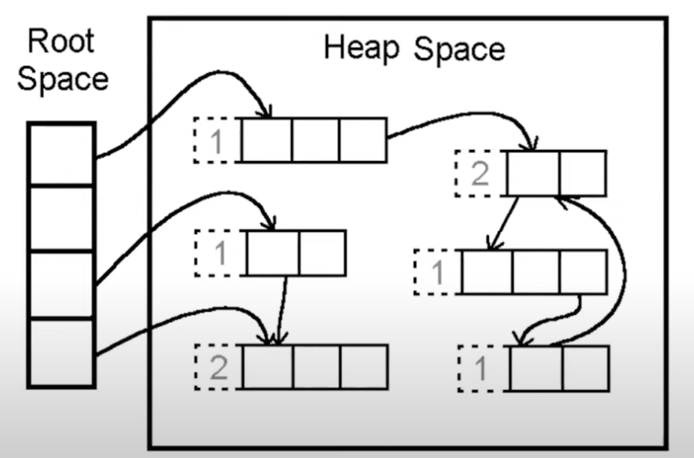
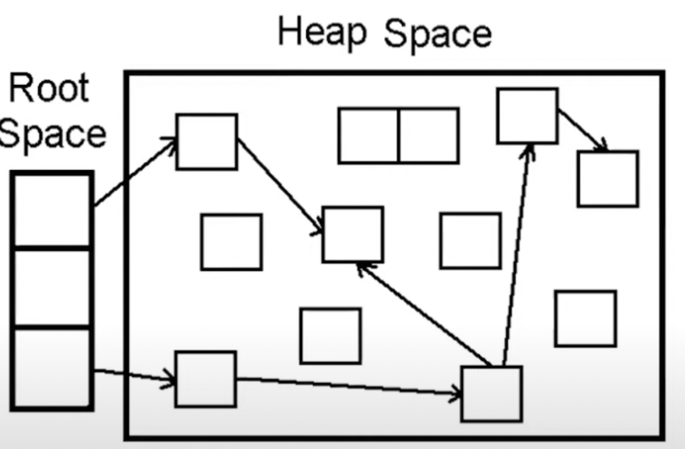
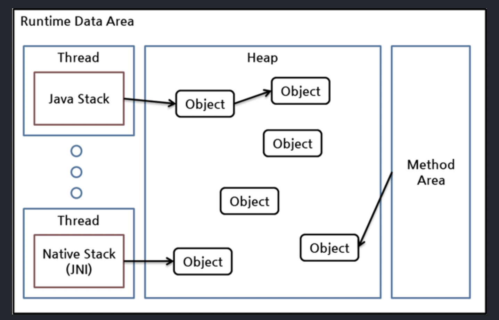
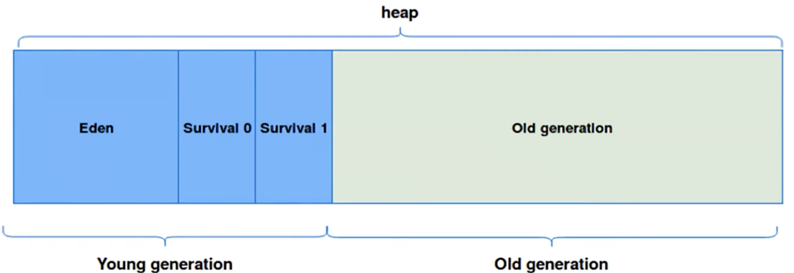

# GC Structure

- GC : 프로그램이 동적으로 할당한 메모리 영역 중 필요없게 된 영역을 해제하는 기능
- GC작업은 순수 오버헤드가 발생함.
- 개발자는 언제 GC가 메모리를 해제하는지 모름

## GC 구조

### Root space ?

- 스택변수, 전역변수 등 영역참조를 담은 변수.

몇가지 방법으로 해당 객체에 접근할 수 있는지를 Reerence Counting으로 표현한다.
숫자가 없다면 gc 대상이 된다. 
순환참조 문제 있다.

### Mark And Sweep

- 의도적으로 GC를 실행시켜야 한다.
- 어플리케이션 실행과 GC실행을 병행함.
- 최적화가 어렵다.

**루트에서 접근가능한지를 해제 기준으로 삼음 (그래픽순회)**

`Mark`: 접근 가능한 객체(reachable)에 Mark하여 표시
`Sweep`: Mark되지 않은 객체(unreachable)들을 제거하는 과정
`Compact`: Sweep 과정에 의해 삭제되면 메모리 단편화가 발생하는데, Compact를 통해 빈자리들을 채워줌

### Root Space 영역

- stack의 로컬 변수(thread 별로 생성됨)
  - 스텍프레임, 로컬변수, 중간연산결과 저장
- native method stack의 JNI 참조 (thread 별로 생성됨)
- method area의 static 변수 (모든 thread가 공유하는 영역)
  - (메서드 코드, 프로그램클래스구조)

### Heap Space 영역

- HEAP (모든 thread가 공유하는 영역)

### Heap 내용

사용하고 있는 신규객체 : Eden에 할당됨. 꽉차면, minorGC 일어남 (mark and sweep)
리처블은 s0 으로 옮겨지고 나머지는 해제된다.

minorGC 가 반복될 때마다 Eden에서 S0 혹은 S1 로 반복해서 전달된다. (S0, S1 둘중 하나는 완전히 비어있어야 한다.)
전달될 때마다 age-bit가 하나씩 늘어난다. (S0에 할당된 객체정보는 S1로 이동)
age-bit은 해당 GC가 설정한 값 이상으로 올라가면 old gen에 옮겨짐 (**promotion**)
old gen 이 꽉차면 magorGC 발생(mark and sweep, minorGC보다 오래걸린다.)

### GC type

참조 : https://memostack.tistory.com/229#article-3-2--parallel-gc-(-xx:+useparallelgc) 

- GC는 Old Gen 으로 넘어가는 객체 최소화, Major GC 짧게 유지 의 목표를 가지며 업그레이드 되어왔다.

