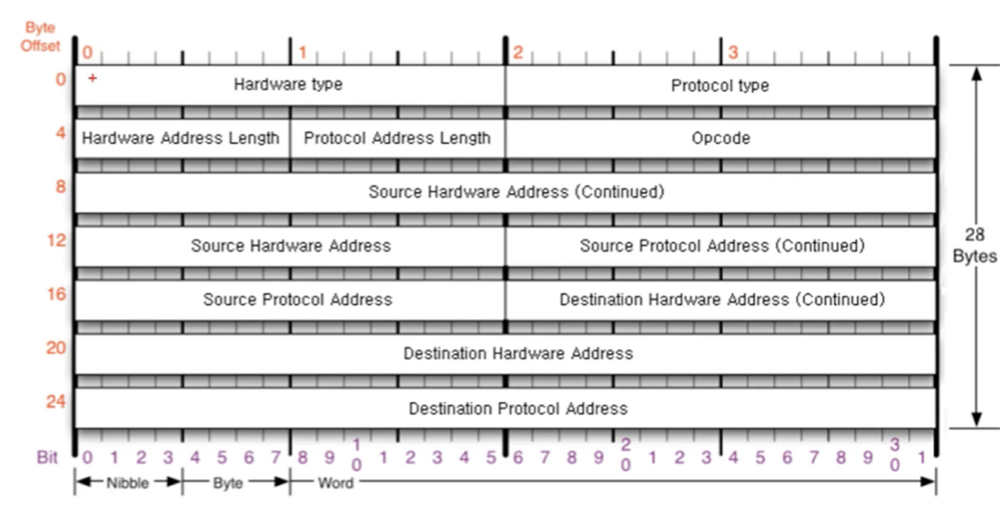
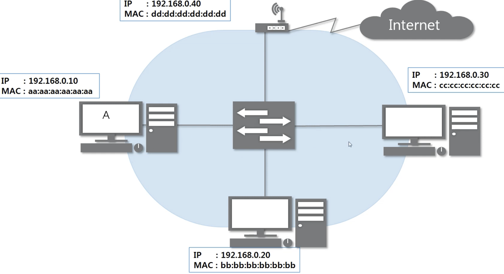
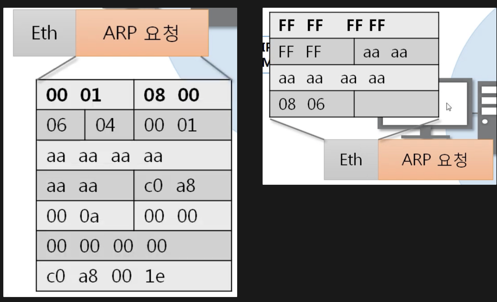
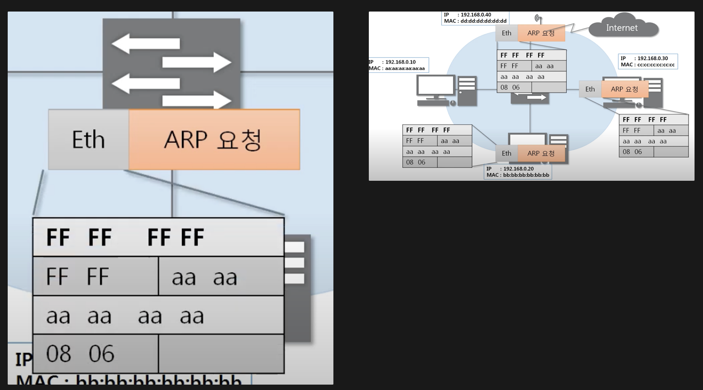
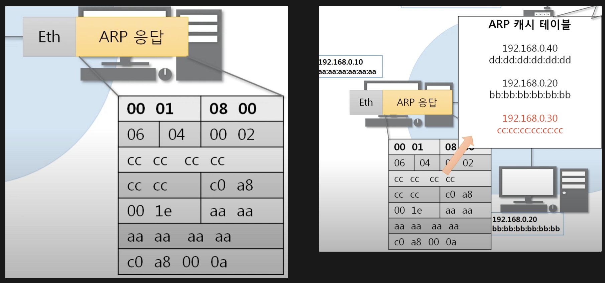

# ARP

### ARP ?

- ARP 프로토콜은 같은 같은 네트워크 대역에서 통신을 하기 위해 필요한 MAC주소를 IP주소를 이용해서 알아오는 프로토콜이다.

- 같은 네트워크 대역에서 통신을 한다고 하더라도 데이터를 보내기 위해서는 7계층부터 캡슐화를 통해 데이터를 보내기 때문에 IP주소와 MAC주소가 모두 필요하다.

- 이 때 IP주소는 알고 MAC주소는 모르더라도 ARP를 통해 통신이 가능하다.

  

### ARP 프로토콜의 구조

### 

| 항목                                | 내용                                                         |      |
| ----------------------------------- | ------------------------------------------------------------ | ---- |
| **Hardware type** (2 byte)          | 2계층에서 사용하는 프로토콜 타입 우리는 2계층을 ethernet 만 배우기 때문에 0x0001만 들어온다.  값 : 0x0001 |      |
| **Protocol type**(2 byte)           | ipv4 type 값 : 0x0800                                   |      |
| **Hardware Address Length**(1 byte) | : mac 길이 → 값 : 0x06                                       |      |
| **Protocol Address Length**(1 byte) | : ipv4길이 → 0x04                                            |      |
| **Opcode (operation code)**(2 byte) | → ARP는 상대방의 mac주소를 알아오는 프로토콜이다. 요청 : 0x0001 응답 : 0x0002 |      |
| **Source Hardware Address**         | 출발지 맥주소 : 6byte                                        |      |
| **Source Protocol Address**         | 출발지 Ipv4 주소 4byte                                       |      |
| **Destination Hardware Address**    | 목적지 맥주소 : 6byte                                        |      |
| **Destination Protocol Address**    | 목적지 ipv4 주소 4byte                                       |      |

## ARP 프로토콜의 통신과정

### IP주소로 MAC주소를 알아오는 과정

### Step 1

- 목적지 단말기의 mac주소를 알아오기 위해 arp프로토콜 요청을 보낸다.
- arp 프로토콜의 목적지 mac주소는 모르므로 0x000000000000로 세팅.
- ethernet 프로토콜의 목적지 mac주소는 0xFFFFFFFFFFFF 로 세팅 (모두 1로 세팅하는 것은 브로드 케스팅의 의미로, 스위치에서 해당 lan 에 해당하는 모든 단말에 같은 요청을 보낸다.(2계층 장비이기 때문에 2계층 까지만 분석한다. arp분석 안함)
- arp는 같은 네트워크 대역에서만 보낸다. (라우터에서는 브로드캐스트를 받기만하고 밖으로(다른 대역으로) 보내지 않는다)

### Step 2

- 스위치는 2계층 기계이므로, 2계층 프로토콜만 분석한다.
- ethernet 프로토콜에서 목적지 mac 주소가 브로드캐스트 이므로, 같은 대역에 있는 모든 단말에 같은 요청을 보낸다.
- 각 단말기는 arp프로토콜의 목적지 ip주소가 본인의 ip주소와 다르면 패킷을 폐기한다.

### Step 3

- 목적지 ip가 본인 ip와 같은 단말기는, 응답 operand (0x0002) 로 apr응답을 보낸다. (본인의 mac주소 채워서)
- 응답받은 단말기는 ARP 캐시테이블에 (ip, mac) 을 저장한다.

- arp table

