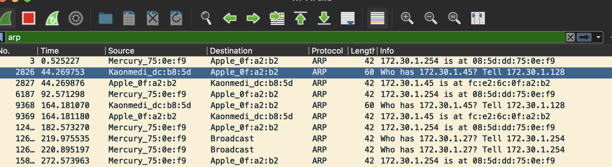
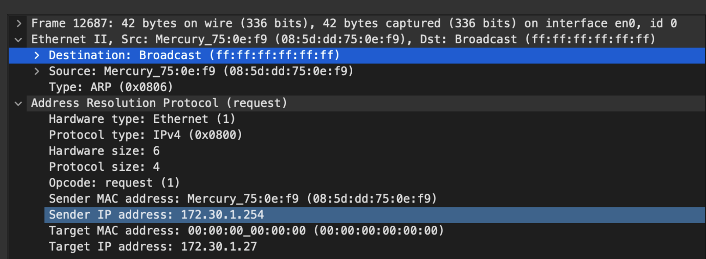
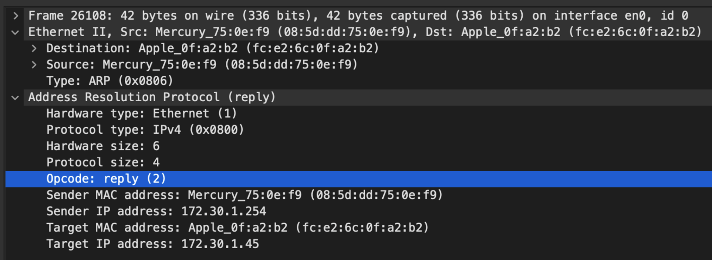

# ARP test

3계층 장비에 브로드캐스드를 보내면 3계층 내부에서만 통신한다. (다른 대역에 내보내지 않는다)

- info 필드 값중 ip뒤에 ?가 붙은건 apr 요청, 없는건 응답 이다.

  (Who has "상대ip"? Tell "나의ip" )

### arp 요청 패킷 확인

- 이더넷에 목적지 mac 주소는 broadcast로 되어 있다.
- arp의 요청코드는 0x0001로 되어 있다.
- 프레임의 최소길이는 60바이트이다. 최대는 바뀔수도 있는데 일반적으로 1514바이트 이다.
- 이더넷 : 14byte, arp은 28 = 42byte, 나머지는 패딩으로 0을 붙인다.
- 없는패킷도 있는데 이건, wireshark가 패딩이 붙기 전에 캡처해서 없어 보이는것임. (실제론 존재함)

### arp 응답 패킷

- 응답이기 때문에 unicast로 통신한다.
- arp 프로토콜의 opcode는 0x0002