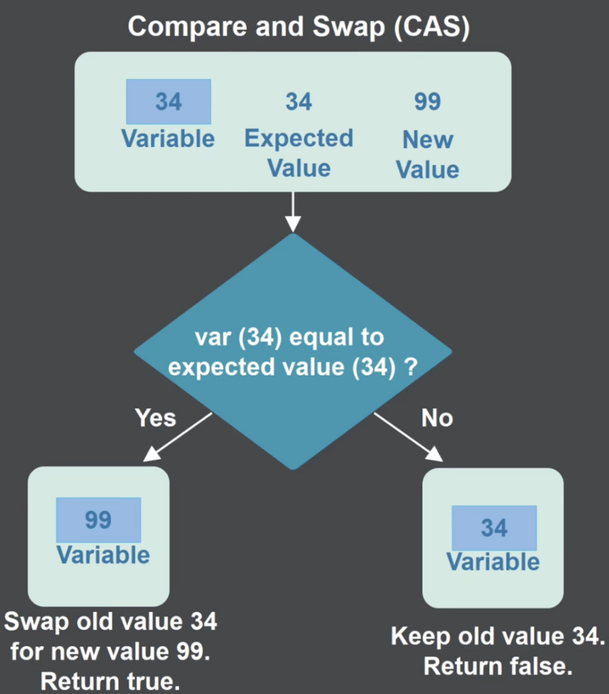
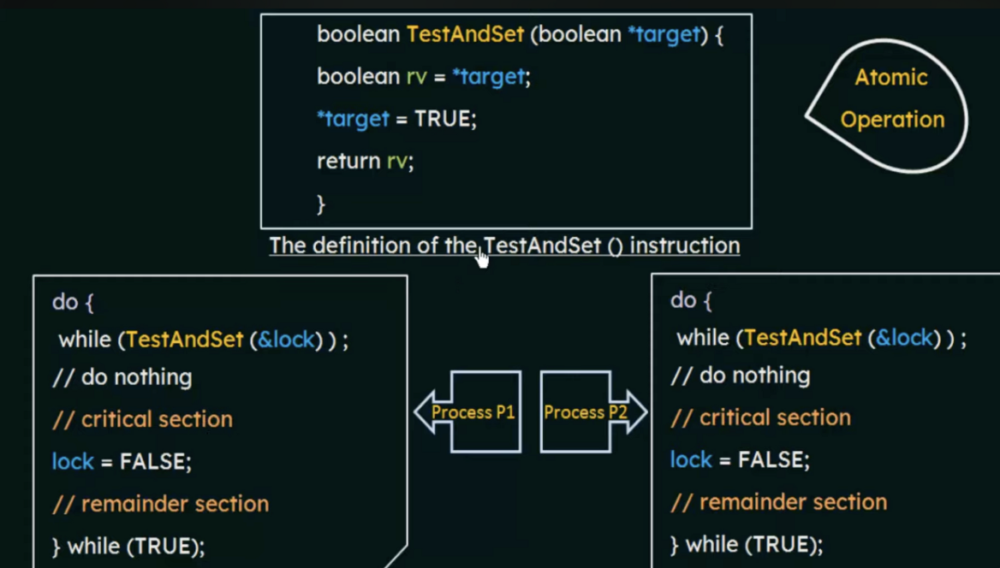
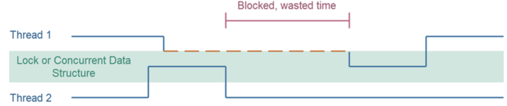
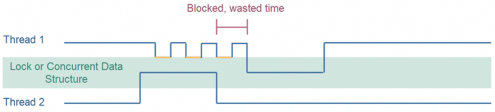

# atomic

- peterson알고리즘이 구현애 대한 보증이 없어서 코드를 잘 짰음에도 불구하고 register instruction 수행 중 context switch가 발생하였다.
- 이를 해결하기 위해 hardware support 방법으로 register instruction을 하나로 묶어 사용할 수 있도록 하였다.
- 그 대표적인 예가 compare and swap, test and set 이다.
- 아래는 CAS, TAS 와 lock(mutex 등)의 차이점, 구현 방법등을 작성하였다.


### CAS



### TAS




### blocked thread와 compare and swap 속도 차이

- blocking thread
- synchronized lock을 이용한 blocked 테스트



```java
import java.util.concurrent.atomic.AtomicBoolean;
import java.util.concurrent.locks.ReentrantLock;

// synchronized
 class ProblematicLock	 {

    private volatile boolean locked = false;

    public synchronized void lock() {

        while(this.locked) {
            // busy wait - until this.locked == false
        }

        this.locked = true;
    }

    public void unlock() {
        this.locked = false;
    }

}

class RunnableTwo implements Runnable {
    static int count = 0;
    ProblematicLock lock;
    public RunnableTwo(ProblematicLock lock) {
        this.lock = lock;
    }

    @Override
    public void run() {
        for (int i = 0; i < 1000000; i++)
        {
            lock.lock();
            count++;
            lock.unlock();
        }
    }
}

public class CompareAndSwap {

    public static void main(String[] args) throws Exception {
        ProblematicLock lock =new ProblematicLock();
        RunnableTwo run1 = new RunnableTwo(lock);
        RunnableTwo run2 = new RunnableTwo(lock);
        Thread t1 = new Thread(run1);
        Thread t2 = new Thread(run2);
        t1.start(); t2.start();
        t1.join(); t2.join();
        System.out.println("Result: " + run1.count );
    }
}
```


- compare and swap
- atomic 을 이용한 blocked 테스트




```java
import java.util.concurrent.atomic.AtomicBoolean;
import java.util.concurrent.locks.ReentrantLock;

// atomic 
class CompareAndSwapLock {

    private AtomicBoolean locked = new AtomicBoolean(false);

    public void unlock() {
        this.locked.set(false);
    }

    public void lock() {
        while(!this.locked.compareAndSet(false, true)) {
            // busy wait - until compareAndSet() succeeds
        }
    }
}

class RunnableTwo implements Runnable {
    static int count = 0;
    CompareAndSwapLock lock;
    public RunnableTwo(CompareAndSwapLock lock) {
        this.lock = lock;
    }

    @Override
    public void run() {
        for (int i = 0; i < 1000000; i++)
        {
            lock.lock();
            count++;
            lock.unlock();
        }
    }
}

public class CompareAndSwap {

    public static void main(String[] args) throws Exception {
        CompareAndSwapLock lock =new CompareAndSwapLock();
        RunnableTwo run1 = new RunnableTwo(lock);
        RunnableTwo run2 = new RunnableTwo(lock);
        Thread t1 = new Thread(run1);
        Thread t2 = new Thread(run2);
        t1.start(); t2.start();
        t1.join(); t2.join();
        System.out.println("Result: " + run1.count );
    }
}
```


### compare_and_swap을 이용한 count 증가 테스트

```java
import java.util.concurrent.atomic.AtomicBoolean;
import java.util.concurrent.atomic.AtomicLong;

class OptimisticLockCounter{

    private AtomicLong count = new AtomicLong();

    public void inc() {

        boolean incSuccessful = false;
        while(!incSuccessful) {
            long value = this.count.get();
            long newValue = value + 1;

            incSuccessful = this.count.compareAndSet(value, newValue);
        }
    }

    public long getCount() {
        return this.count.get();
    }
}

class RunnableOne implements Runnable {

    OptimisticLockCounter counter;
    public RunnableOne(OptimisticLockCounter counter) {
        this.counter = counter;
    }

    @Override
    public void run() {
        for (int i = 0; i < 1000000; i++)
        {
            counter.inc();
        }
    }
}

public class CompareAndSwapInc {

    public static void main(String[] args) throws Exception {
        OptimisticLockCounter counter =new OptimisticLockCounter();
        RunnableOne run1 = new RunnableOne(counter);
        RunnableOne run2 = new RunnableOne(counter);
        Thread t1 = new Thread(run1);
        Thread t2 = new Thread(run2);
        t1.start(); t2.start();
        t1.join(); t2.join();
        System.out.println("Result: " + run1.counter.getCount() );
    }
}
```

**java의 atomic은 어디서 구현하였나 ?**

- java native  code : 속도 등을 이유로 c, c++등으로 구현한 실행파일을 참조하는 코드.
- 아래 코드는 c++에서 구현한 라이브러리를 참조하고 있는 듯 하다.

```java
/**
     * Atomically updates Java variable to {@code x} if it is currently
     * holding {@code expected}.
     *
     * <p>This operation has memory semantics of a {@code volatile} read
     * and write.  Corresponds to C11 atomic_compare_exchange_strong.
     *
     * @return {@code true} if successful
     */
    @HotSpotIntrinsicCandidate
    public final native boolean compareAndSetLong(Object o, long offset,
                                                  long expected,
                                                  long x);
```


### c++ atomic_compare_exchange_strong 예제

```cpp
#include <iostream>
#include <string>
#include <thread>
#include <chrono>
#include <mutex>
#include <atomic>

using namespace std;

//mutex mtx;  //mutual exclusion

//int shared_memory(0); // race condition
atomic<int> shared_memory(0);
int main(void)
{
    auto count_func  =[]() {
        for (int i=0 ; i<1000000 ; i++)
        {
            //this_thread::sleep_for(chrono::microseconds(1));
            //mtx.lock();
            //shared_memory++;
            //mtx.unlock();

            bool incSuccessful = false;
            while(!incSuccessful) {
                int value = shared_memory;
                int newValue = value + 1;

                incSuccessful = shared_memory.compare_exchange_strong(value, newValue);
                //if (!incSuccessful)
                //    cout << value << endl;
            }

        }
    };

    thread t1 = thread(count_func);
    thread t2 = thread(count_func);
    thread t3 = thread(count_func);
    thread t4 = thread(count_func);
    thread t5 = thread(count_func);
    thread t6 = thread(count_func);
    thread t7 = thread(count_func);
    thread t8 = thread(count_func);
    thread t9 = thread(count_func);
    thread t10 = thread(count_func);

    t1.join();
    t2.join();
    t3.join();
    t4.join();
    t5.join();
    t6.join();
    t7.join();
    t8.join();
    t9.join();
    t10.join();

    cout << "After" << endl;
    cout << shared_memory << endl;

    return (0);
}
```


### CAS Reference

[Test-and-set - Wikipedia](https://en.wikipedia.org/wiki/Test-and-set)

[Test and set instruction](https://www.ibm.com/docs/en/ztpf/1.1.0.15?topic=configuration-test-set-instruction)

[Test and Set Lock](https://www.youtube.com/watch?v=5oZYS5dTrmk&list=PLBlnK6fEyqRiVhbXDGLXDk_OQAeuVcp2O&index=59)

[Compare and Swap](https://jenkov.com/tutorials/java-concurrency/compare-and-swap.html#compare-and-swap-tutorial-video)

