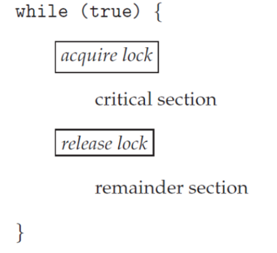

# mutex

- peterson 알고리즘이 3가지 동기화조건을 모두 만족하여 유용하지만, n개의 스레드 경합이 일어났을 때 로직이 매우 복잡하여 현실적으로 사용할 수 없다.
- 따라서 실제로는 상호배제를 우선 만족하는 로직을 만들고, 교착,기아상태는 예외처리를 처리하는 방식을 따른다.
- 첫번 째 조건인 상호배제를 만족하기 위한 대표적인 알고리즘이 뮤텍스와 세마포어 이다.

## 




```java
global int v = 1;
lock()
{
    while(1)
    {
        if (v==1)
            break;
    }
    v = 0;
    return 1;
}

unlock()
{
    v = 1;
    break;
}
```


### **Busy waiting**:

- Any other process trying to enter its critical section must *loop continuously* in the call to acquire().

- Busy waiting is clearly a 

  problem

   in a real multiprogramming system,

  - where a single CPU core is shared among many processes.
  - *wastes CPU cycles* for some other processes to use productively.

### **Spinlock**:

- the type of mutex lock using the method of *busy waiting*.
- the process *spins* while waiting for the lock to become available.
- However, spinlocks do have an *advantage*,
  - in that *no context switch* is required waiting on a lock.
  - a context switch may take considerable time.
- In certain circumstances *on multicore systems*,
  - spinlocks are the *preferable* choice for locking.
  - Onet hread can *spin on one process ingcore*
  - while another thread performs its critical section *on another core*
- **뮤텍스가 바쁜대기를 하는걸로 보이지만, 실제로는 block 처리된다.** 


[Atomic instructions and Mutex Locks to solve critical section problem, detailed explanation.](https://www.youtube.com/watch?v=q_Af4I6JH7s)

- 뮤텍스 알고리즘 설명 :  바쁜대기가 문제가 될 수 있다고 설명.

[뮤텍스 개체 - Win32 apps](https://learn.microsoft.com/ko-kr/windows/win32/sync/mutex-objects)

- 실제 c에서 사용하는 경우 바쁜대기가 아닌듯(?) 하다.


### mutex example

~~~c
#include <stdio.h>
#include <pthread.h>

int sum = 0; // shared variable 
pthread_mutex_t mutex;

void *counter(void *param)
{
        int k; 
        for(k=0;k<10000;k++)
        {
                /* entry section */
                pthread_mutex_lock(&mutex);
                /* critical section */
                sum++;
                /* exit section */
                pthread_mutex_unlock(&mutex);
                /* remainder section */
        }
        pthread_exit(0);
}

int main(void)
{
        pthread_t tid1, tid2;
        pthread_mutex_init(&mutex, NULL);
        pthread_create(&tid1, NULL, counter, NULL);
        pthread_create(&tid2, NULL, counter, NULL);
        pthread_join(tid1, NULL);
        pthread_join(tid2, NULL);
        printf("sum = %d\n",sum);        
}
~~~

~~~
sum = 20000
~~~

