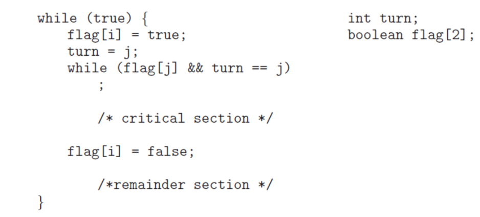
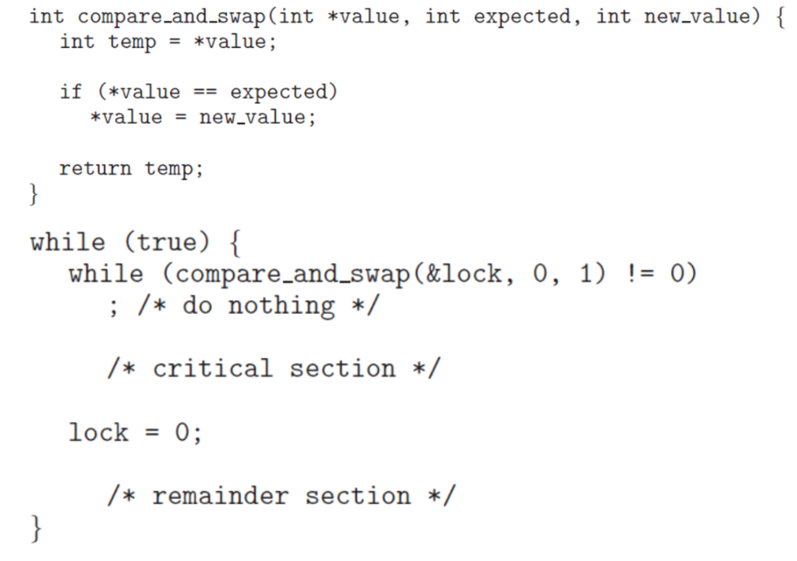
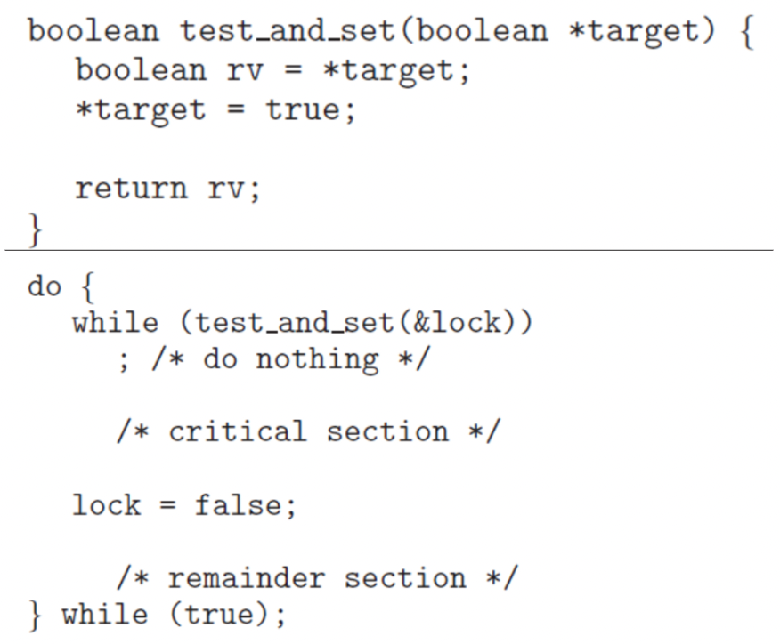

# Peterson algoritthm


아래는 mutual exclusion (상호배제), progress (데드락 예방), boundary waiting (기아 예방)
위 세가지를 만족하는 peterson 알고리즘이다.



- **코드**

  ```c
  #include <stdio.h>
  #include <pthread.h>
  
  #define true 1
  #define false 0
  
  int sum = 0;
  
  int turn;
  int flag[2];
  
  void *producer(void *param)
  {
  	int k;
  	for (k = 0 ; k < 10000; k++)
  	{
  		flag[0] = true;
  		turn = 1;
  		while (flag[1] && turn == 1)
  			;
  		sum++;
  
  		flag[0] = false;
  	}
  	pthread_exit(0);
  }
  
  void *consumer(void *param)
  {
  	int k;
  	for (k = 0 ; k < 10000; k++)
  	{
  		flag[1] = true;
  		turn = 0;
  		while (flag[0] && turn == 0)
  			;
  		sum--;
  
  		flag[1] = false;
  	}
  	pthread_exit(0);
  }
  int main(void)
  {
  	pthread_t tid1, tid2;
  	pthread_create(&tid1, NULL, producer, NULL);
  	pthread_create(&tid2, NULL, consumer, NULL);
  	pthread_join(tid1, NULL);
  	pthread_join(tid2, NULL);
  	printf("sum = %d\\n", sum);
  }
  ```

  - peterson 알고리즘을 구현했으나 여전히 race condition이 발생하는 듯 하다
  - race condition 발생이유
    - flag를 세팅하고 조건을 체크하는 과정에서 context switch되어 다른 스레드가 가로챌 수 있다.
    - **peterson은 구현에 대해 no guarantee 가 되어 있어 하드웨어적인 개선이 필요하다.**


### hardware support for synchronization

- **compare_and_swap**




- **test_and_set**




- 코드 (적용 전)

  ```java
  public class Peterson1 {
      static int count = 0;
      static int turn = 0;
      static boolean[] flag = new boolean[2];
  
      public static void main(String[] args) throws Exception {
          Thread t1 = new Thread(new Producer());
          Thread t2 = new Thread(new Consumer());
          t1.start();
          t2.start();
          t1.join();
          t2.join();
          System.out.println(Peterson1.count);
      }
  
      static class Producer implements Runnable {
          @Override
          public void run() {
              for (int k = 0; k < 10000; k++) {
                  /* entry section */
                  flag[0] = true;
                  turn = 1;
                  while (flag[1] && turn == 1)
                      ;
                  /* critical section */
                  count++;
                  /* exit section */
                  flag[0] = false;
                  /* remainder section */
              }
          }
      }
  
      static class Consumer implements Runnable {
          @Override
          public void run() {
              for (int k = 0; k < 10000; k++) {
                  /* entry section */
                  flag[1] = true;
                  turn = 0;
                  while (flag[0] && turn == 0)
                      ;
                  /* critical section */
                  count--;
                  /* exit section */
                  flag[1] = false;
                  /* remainder section */
              }
          }
      }
  }
  ```

- 코드 (적용 후)

  ```java
  import java.util.concurrent.atomic.AtomicBoolean;
  
  public class Peterson2 {
      static int count = 0;
      static int turn = 0;
      static AtomicBoolean[] flag;
  
      static {
          flag = new AtomicBoolean[2];
          for (int i = 0; i < flag.length; i++) {
              flag[i] = new AtomicBoolean();
          }
      }
  
      public static void main(String[] args) throws Exception {
          Thread t1 = new Thread(new Producer());
          Thread t2 = new Thread(new Consumer());
          t1.start();
          t2.start();
          t1.join();
          t2.join();
          System.out.println(Peterson1.count);
      }
  
      static class Producer implements Runnable {
          @Override
          public void run() {
              for (int k = 0; k < 100000; k++) {
                  /* entry section */
                  flag[0].set(true);
                  turn = 1;
                  while (flag[1].get() && turn == 1)
                      ;
                  /* critical section */
                  count++;
                  /* exit section */
                  flag[0].set(false);
                  /* remainder section */
              }
          }
      }
  
      static class Consumer implements Runnable {
          @Override
          public void run() {
              for (int k = 0; k < 100000; k++) {
                  /* entry section */
                  flag[1].set(true);
                  turn = 0;
                  while (flag[0].get() && turn == 0)
                      ;
                  /* critical section */
                  count--;
                  /* exit section */
                  flag[1].set(false);
                  /* remainder section */
              }
          }
      }
  }
  ```

  - AtomicBoolean class는 필요한 연산을 hardware 단위인 operand 하나로 해결할 수 있게 만들어 racecondition이 발생되지 않게 되었다.