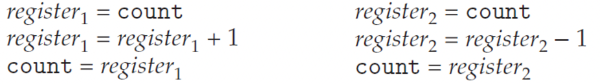
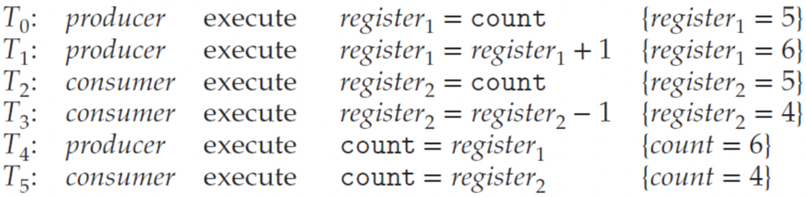

# Race Condition

- shared data에 concurrent access 하는 프로세스 혹은 스레드가 존재할 때,
  data inconsistency가 발생하여 integrity of data가 불가능할 수 있다.
- 이러한 상황을 race condition이라고 한다.

cpu의 operation 관점에서 보면, 두개의 register가 shared data인 count변수를 연산에 사용할 때,
연산하나의 opcode가 여러개일 경우, count 결과가 우리가 예상한 값과 다르게 나올 수 있게 된다.

### 테스트1

~~~c
#include <stdio.h>
#include <pthread.h>

int sum;

void *run1(void *param)
{
    int i;
    for (i = 0; i < 10000 ; i++)
        sum++;
    pthread_exit(0);
}

void *run2(void *param)
{
    int i;
    for (i = 0; i < 10000 ; i++)
        sum--;
    pthread_exit(0);
}

int main(void)
{
    pthread_t tid1, tid2;
    pthread_create(&tid1, NULL, run1, NULL);
    pthread_create(&tid2, NULL, run2, NULL);
    pthread_join(tid1, NULL);
    pthread_join(tid2, NULL);
    printf("result: %d\n", sum);
    return (0);
}
~~~

~~~
result: -9087
~~~

### 테스트2

- count 공용변수가 아니므로, 예상한 값이 그대로 출력된다.

~~~java
public class RaceCondition1 {
    public static void main(String[] args) throws Exception {
        RunnableOne run1 = new RunnableOne();
        RunnableOne run2 = new RunnableOne();
        Thread t1 = new Thread(run1);
        Thread t2 = new Thread(run2);
        t1.start(); t2.start();
        t1.join(); t2.join();
        System.out.println("Result: " + run1.count + ", " + run2.count);
        } 
}

class RunnableOne implements Runnable {
    int count = 0;
    @Override
    public void run() {
        for (int i = 0; i < 10000; i++)
            count++;
    }
}
~~~

~~~
Result: 10000, 10000
~~~

### 테스트3

~~~java
public class RaceCondition2 {
    public static void main(String[] args) throws Exception {
        RunnableTwo run1 = new RunnableTwo();
        RunnableTwo run2 = new RunnableTwo();
        Thread t1 = new Thread(run1);
        Thread t2 = new Thread(run2);
        t1.start(); t2.start();
        t1.join(); t2.join();
        System.out.println("Result: " + run1.count + ", " + run2.count);
        } 
}

class RunnableTwo implements Runnable {
    static int count = 0;
    @Override
    public void run() {
        for (int i = 0; i < 10000; i++)
            count++;
    }
}
~~~

~~~
Result: 12160, 12160
~~~

